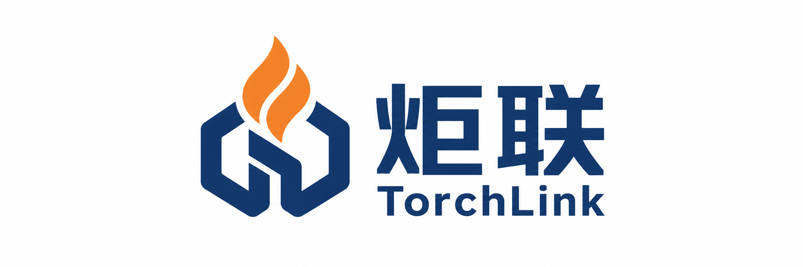

# 炬联 TorchLink

<p align="center">
  
</p>

<p align="center"><strong>连接设备，感知安全。</strong></p>

面向消防与设备运维的独立 IoT 平台，采用 Go API、Vue 3、Naive UI 和 Vite，支持本地开发、在线部署及离线交付。

## 平台能力

| 能力 | 用途 |
| --- | --- |
| 设备与接入 | 产品、设备、主子设备关系；HTTP / MQTT、TCP / UDP、Modbus 接入；主动连接与定时查询 |
| 协议开发 | Go 源码上传、离线编译、样例验证、版本发布及回滚；JSON / HEX 映射和 Excel / CSV 点表生成 |
| 报文与告警 | 原文归档、诊断、下载及回放；规则与设备主动告警、部件状态、确认和恢复 |
| AI 与知识库 | 告警研判、设备巡检、规则草稿、协议辅助和对话；Ollama、DeepSeek 及兼容接口 |
| 运维与权限 | 用户、角色、菜单和操作授权、用户设备范围、健康检查、审计及设备数据备份 |
| 运维中心 | 平台内原生查看与管理 Prometheus 指标、Loki 日志、Grafana 仪表盘、Alertmanager 告警与通知，见 [运维中心](docs/OPS_CENTER.md) |
| 视频集成 | 摄像头元数据、设备关联与外部视频事件；视频服务由外部平台提供 |

典型流程：发布协议 → 创建产品 → 登记设备和配置接入网关 → 上报并核对原文、解析与告警 → 配置规则及用户权限。普通用户需分配设备范围，主设备与子设备分别授权。

## 快速运行

要求 Go 1.25.5 或更高版本；Node.js 版本须满足 `^20.19.0 || >=22.12.0`。准备脚本会检查运行依赖、安装 Go/npm 依赖并准备本地环境；Docker 准备行为及远程依赖模式见 [技术详情](docs/TECHNICAL_DETAILS.md)。以下命令均从本仓库根目录执行。

Windows 首次准备：

```powershell
powershell -ExecutionPolicy Bypass -File .\scripts\setup-local.ps1
```

Linux / macOS：

```bash
bash ./scripts/setup-local.sh
```

准备完成后，在两个终端分别启动后端和前端：

```bash
go run ./cmd/iot-platform --env-file .env.local
```

```bash
cd iot_front
npm run dev
```

访问 `http://localhost:5173`，使用环境配置中的管理员账户登录；Vite 默认代理 API 到 `http://localhost:8081`。Windows 遇到 npm 执行策略限制时使用 `npm.cmd`。真实环境文件与运行数据不提交到仓库。

| 环境 | 配置与操作入口 |
| --- | --- |
| 本地开发 | `compose.local.yaml`、`.env.local`、`scripts/setup-local.*` |
| 在线部署 | `compose.yaml`、`.env.online`、`scripts/deploy-online.*`；见 [部署维护](docs/DEPLOYMENT.md) |
| 离线交付 | `scripts/package-offline.*`、`scripts/deploy-offline.*`、包内 `.env.offline`；见 [离线部署](docs/OFFLINE_DEPLOYMENT.md) |

## 目录与架构

| 目录 | 内容 |
| --- | --- |
| `cmd/` | API、接入网关、备份服务、设备模拟器和负载工具入口 |
| `internal/` | HTTP API、业务逻辑、协议运行时、存储适配器及后端回归测试 |
| `iot_front/` | Vue 管理端、公共组件和前端行为测试 |
| `protocol-packages/gb26875-dahua/` | 完整 Go 协议 module 示例 |
| `dev/` | 六个独立消防协议包源码与样例测试，见 [协议包说明](dev/README.md) |
| `scripts/` | 环境准备、部署、打包、演示数据与部署冒烟测试 |
| `deploy/`、`ops/` | Harness / Dify 扩展、容器与监控配置 |
| `docs/` | 当前开发、接入和运维指南，见 [文档索引](docs/README.md) |

```text
设备 → 接入 → 原文归档 / 幂等索引 → 内部队列 → 解析 → 属性 / 事件 → 规则 / 告警
                                                           ↓
                                                   管理端 / AI 工作流
```

PostgreSQL 保存业务数据和索引，ClickHouse 按配置承载原文及遥测；Redis 提供缓存，Kafka / Redpanda 承载内部消息，EMQX 负责 MQTT。MinIO 保存备份制品，Ollama、Weaviate 和 Harness 提供模型、知识检索与工作流。

原文先归档再解析，只有成功解析的数据才对外发布结果。Go Worker 以服务账户权限运行，协议源码应来自可信开发者；AI 规则草稿默认禁用，确认后启用。设备数据导出不替代数据库、配置及凭据备份。

## 开发检查

```bash
# 仓库根目录：正式后端包，避免扫描 data/ 中的本地临时 Go 程序
go test ./cmd/... ./internal/...

# 独立协议 module（根 module 的测试不会覆盖它们）
cd protocol-packages/gb26875-dahua
go test ./...
```

前端在 `iot_front` 中运行 `npm test` 和 `npm run build`；`dev/` 下各协议包需分别运行 `go test ./...`。部署和扩展检查入口见 [技术详情](docs/TECHNICAL_DETAILS.md)。测试与模拟器验证不能替代真实设备和目标环境验收。

仓库保留可复用指南与行为回归，历史验收报告、一次性检查脚本和生成 ZIP 不作为源码维护；旧版本可从 Git 历史查找。协作约定见 [AGENTS.md](AGENTS.md)。
