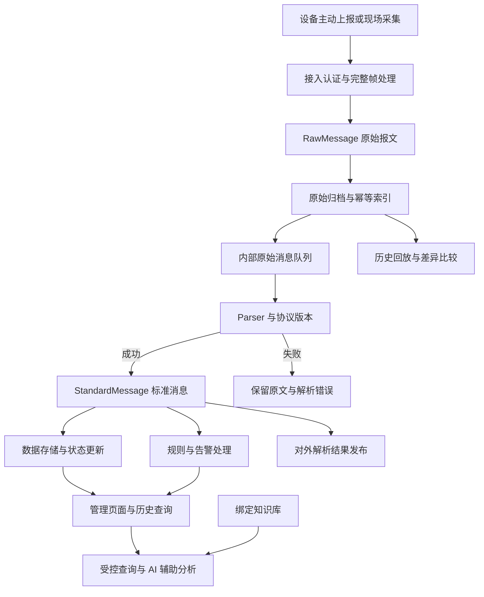

# 炬联 TorchLink

> 连接设备，感知安全。

[技术详情与快速启动](docs/TECHNICAL_DETAILS.md) · [部署维护](docs/DEPLOYMENT.md) · [设备接入](docs/UNIFIED_DEVICE_ONBOARDING.md) · [Go 协议包](docs/GO_PROTOCOL_PACKAGES.md)

本文介绍项目定位、功能与平台差异；安装、配置、命令和开发检查统一见技术详情。

[功能体系](#3-功能体系) · [技术架构](#4-技术架构与数据链路) · [项目优势](#5-炬联的主要优势) · [JetLinks 对比](#6-与-jetlinks-的详细比较) · [能力边界](#9-当前能力边界与待完善方向)

**炬联 TorchLink** 是面向消防设备联网、运行监测与辅助运维的物联网平台。平台以设备数据为基础，将多协议接入、协议源码与可信分发、原始报文归档、标准化解析、规则告警、设备影子与拓扑、知识检索和 AI 辅助分析连接起来，帮助实施人员接好设备、帮助值守人员理解告警、帮助开发人员追溯和修正协议问题。

| 项目 | 说明 |
| --- | --- |
| 中文名称 | 炬联 |
| 英文名称 | TorchLink |
| 推荐全称 | 炬联消防物联网平台 |
| 产品定位 | 以设备接入、数据追溯和 AI 辅助运维为重点的消防 IoT 平台 |
| 品牌含义 | “炬”代表照明与守护，“联”代表设备、数据和业务的连接 |
| 主要技术 | Go API、Vue 3 管理端、消息驱动的数据处理、可配置模型服务 |
| 主要交付形态 | 源码部署、Docker 在线部署、离线安装包；可选独立接入网关与现场节点 |

**功能核对日期：2026-09-10。** 功能说明依据当前仓库源码与配置，包括现场节点、受控升级、设备影子与拓扑、可信目录和企业私有协议市场。外部平台对比沿用 **2026-09-09** 查阅的官方资料，商业产品说明与社区版源码分开表述。源码具备相应实现不代表目标环境已验收；本文不作为性能测试报告或生产验收证明。

## 1. 项目解决什么问题

消防设备联网项目的难点，往往同时存在于设备侧和业务侧：厂商报文不一致、旧设备需要现场采集、故障报文难以复现、告警与设备状态不同步、知识手册与实时数据分散，以及内网项目交付和后续升级不方便。

炬联围绕这些实际问题组织功能：

| 常见问题 | 炬联的处理方式 | 直接价值 |
| --- | --- | --- |
| 同类设备来自不同厂商，协议各不相同 | 标准上报、点表采集与独立 Go 协议包并行支持，解析为统一消息 | 上层告警和查询可以复用同一套业务逻辑 |
| 配置保存成功，但不知道设备是否真的接通 | 接入向导提供预览、适用协议的实际读取测试，以及保存后的连接和解析状态 | 把配置存在、连接成功、数据解析成功分开观察 |
| 设备出现异常，只有解析结果，没有原始证据 | 原始报文独立归档，保存实际协议版本和必要解析上下文 | 能回到具体报文定位错误 |
| 协议升级后历史数据无法解释 | 不可变版本、产品绑定、回滚以及历史回放对比 | 协议变更有依据，问题可以复现 |
| 设备主动报警，但平台没有配置匹配规则 | 保留设备来源告警，规则匹配时再沿规则链路处理 | 避免把规则配置误当成设备告警存在的前提 |
| 值守人员需要同时查状态、历史告警和手册 | AI 工作流通过受控工具查询业务数据和绑定知识库 | 减少跨页面、跨文档查找的步骤 |
| 现场网络不稳定，中心难以直接访问设备 | 现场 Agent 执行已支持的采集任务，并通过磁盘队列补传 | 支持受限条件下的现场采集和恢复上传 |
| 项目要求内网或无外网运行 | 提供离线镜像、模型与安装脚本的打包路径 | 便于按目标环境组织可重复交付 |

## 2. 面向的用户与应用场景

### 2.1 主要用户

- **消防系统集成商与实施团队**：统一接入不同厂商终端，保存联调证据，维护协议与点表。
- **园区、楼宇和厂区的运维人员**：查看设备状态、处理告警、查询历史数据并开展辅助巡检。
- **协议开发人员**：独立开发 Go 协议源码，使用样例验证，在平台发布和回滚版本。
- **企业信息化团队**：在已有 IT 环境中部署系统，通过 API 和受控 MCP 工具集成业务数据。
- **项目维护团队**：管理模型配置、知识文档、数据备份以及现场节点的运行状态。

### 2.2 适合切入的业务

炬联适合从消防主机和终端数据接入、烟感与温度等状态监测、消防水系统相关点位监测、设备故障分析、协议联调及内网运维辅助等场景切入。具体设备能否接入，取决于其协议、点表、身份认证和现场网络条件；场景名称本身不代表已经预置所有厂商驱动。

现有 GB26875 大华协议包提供了消防终端接入示例；工业与楼宇设备则可按已支持的 Modbus、OPC UA、SNMP、BACnet/IP 子集选择接入方式。

## 3. 功能体系

### 3.1 产品、设备与统一接入

平台以产品组织同类设备，通过产品协议绑定和设备接入配置，连接设备身份、通信方式与解析逻辑。

主要功能包括：

- 产品与设备登记、编辑、启停，以及协议和接入配置关联。
- 产品物模型与元数据，声明属性类型、可写性、事件和功能，为规则与影子期望值校验提供依据。
- 通过“添加设备”向导选择接入方式，填写参数并检查预览结果。
- 展示设备连接说明、最近通信和解析结果，查看连接错误与已有成功数据。
- 设备凭据生成、轮换和禁用，以及设备级上报身份验证。
- 对已支持的上报和创建流程执行重复请求校验，避免简单重试重复创建业务资源。
- 提供设备测试入口，辅助验证接入、解析及命令回执。

不同接入方式有不同验证路径：MQTT/HTTP 标准上报需要设备发送真实数据才能证明链路接通；Modbus 等采集协议可进行实际读取；TCP/UDP 源码协议的样例预览验证解析逻辑，真实连接仍需要设备或模拟器联调。平台不会把一种测试结果解释成所有环节均已成功。

源码入口：[接入服务](internal/onboarding/service.go)、[连接器能力](internal/connector/connector.go)、[设备操作 API](internal/httpapi/device_operations.go)、[设备向导](iot_front/src/components/DeviceOnboarding.vue)。

### 3.2 多协议接入与现场采集

| 接入方式 | 当前实现 | 使用边界 |
| --- | --- | --- |
| MQTT 标准设备 | 标准消息上报、设备身份认证、命令下发与回执 | Topic、消息结构和凭据须符合平台契约；支持 MQTT 不等于自动兼容所有厂商 Topic |
| HTTP 标准上报 | 认证上报，进入统一归档与解析链路 | 以设备主动上报为主，不等于任意 HTTP 设备的自动轮询 |
| Modbus TCP | 点表配置与导入、读取预览、周期采集、原始响应解析 | 须配置正确的站号、寄存器、类型、字节序和网络访问范围 |
| TCP / UDP 自定义协议 | 通用监听器与 Go 协议包协同完成分帧、设备识别、应答和下行 | 具体厂商格式由协议包实现；下行需要协议支持及可用会话 |
| GB26875 大华示例 | 独立 Go module，包含接入、解析、应答、校时及模拟器 | 面向该示例覆盖的格式，不能外推为全部国标厂商兼容 |
| Modbus RTU / RS485 | 现场节点串口读取、读功能码 01—04、CRC 与响应校验 | 依赖串口白名单和硬件适配，手动 RTS 未实现，物理 RS485 与 Windows 串口需专项验收 |
| OPC UA | 现场节点认证连接、配置点读取、质量校验和服务响应归档 | 当前是受限读取路径，不涵盖全部订阅、方法调用和写入能力 |
| SNMP | 现场节点按 OID 读取，支持配置的 v3 认证加密和显式 v2c 凭据 | 不表示已经具备完整 Trap 接收与设备配置管理 |
| BACnet/IP | 只读 ReadProperty，校验并保留请求和响应证据 | 暂不覆盖分段、路由 NPDU、复杂数组与 BACnet/SC |
| ONVIF 元数据 | 现场节点 IPv4 主动发现、认证读取设备信息，确认后保存 | 发现不等于设备可信；不含事件订阅、视频播放或录像 |
| GB28181 元数据 | 独立节点完成 TCP/UDP SIP 注册、保活、设备信息与目录同步，操作员导入摄像头 | 仅元数据子集；不含视频流、云台、级联代理及完整安全扩展 |

OPC UA 和 SNMP 的归档内容是认证读取后得到的服务响应，不能称为加密通信的底层抓包。Modbus RTU 和 BACnet/IP 的相关路径保留实际报文字节证据。

源码入口：[协议运行时](internal/protocolruntime/)、[现场协议读取](internal/fieldprotocol/)、[现场 Agent](internal/edgeagent/)、[ONVIF 元数据接口](internal/httpapi/video_protocol.go)。接入细节见[设备接入说明](docs/UNIFIED_DEVICE_ONBOARDING.md)和[现场节点说明](docs/EDGE_AND_GATEWAY.md)。

### 3.3 Go 协议源码管理与版本发布

自定义厂商协议通过独立 Go 源码包维护。开发人员可以提交单个 `.go` 文件，也可以提交包含 `go.mod`、多文件源码、样例和第三方依赖 `vendor` 的 ZIP。

平台将协议发布组织为一条完整流程：

1. **上传源码**：读取协议标识、版本、传输方式和能力声明。
2. **校验文件**：检查路径、文件类型、展开大小及构建入口等约束。
3. **编译制品**：构建服务器本机版本，并可选择额外 OS/CPU 目标；生成纯 Go Worker，关闭在线依赖下载。
4. **运行样例**：在服务器实际运行本机制品的解析及接入、编码样例；异构制品在目标 Edge 节点实际试跑后才启用，交叉编译不等于该平台样例通过。
5. **保存版本**：保留源码、制品、摘要和版本信息，禁止覆盖已有版本。
6. **发布绑定**：发布已校验版本，并按选择更新产品绑定。
7. **切换与回滚**：产品可绑定其他保留版本，历史报文仍保有实际处理版本信息。

编译错误、样例不通过、执行超时等失败会阻止该次发布，不应替换产品当前有效版本。平台提供源码及版本包下载，便于将项目交付物归档回外部协议仓库。

`go-protocol-v2` 区分三个职责：`ingress` 处理完整帧、识别与应答；`decode` 将报文转换成标准消息；`encode` 生成协议下行数据。TCP 半帧、粘包及待应答命令具有独立处理边界，版本切换不会简单地把正在处理的半帧交给另一个版本。

**实际价值**：协议工程师可以独立维护厂商代码，业务平台通过统一契约消费数据；现场协议问题可以关联到明确源码和样例，而不是只保留一个无法解释的运行文件。

**实现边界**：Worker 当前按调用启动子进程，存在进程启动开销。超时和最小环境变量限制不构成强隔离沙箱；该入口面向可信协议开发者。通用主动拨号、任意定时任务和常驻协议进程不属于现有 Worker 契约。

源码入口：[构建器](internal/protocolbuild/build.go)、[源码上传](internal/httpapi/protocol_source.go)、[协议 Worker](internal/protocolworker/)、[独立 GB26875 协议包](protocol-packages/gb26875-dahua/)。详细契约见 [Go 协议包文档](docs/GO_PROTOCOL_PACKAGES.md)。

### 3.4 原始报文归档、查询与回放

炬联保留设备原文和解析结果之间的关联，原始报文不会因为解析失败而失去查询价值。

主要能力包括：

- 按租户、产品、设备和时间范围检索原始报文。
- 查看原文、解析结果、解析失败原因及实际协议版本。
- 下载单条或批量原始报文，用于厂商联调、问题复现与交付归档。
- 通过原始消息 ID 关联标准消息，区分“收到什么”和“解析成什么”。
- 在可用的版本与归档上下文基础上运行历史回放。

| 回放模式 | 行为 | 典型用途 |
| --- | --- | --- |
| `DRY_RUN` | 执行解析检查，不重新发布到业务消息链路 | 验证一批历史报文是否能够解析 |
| `DIFF` | 将回放解析结果与已有标准消息进行比较，统计变化、缺失和错误 | 评估协议调整对历史数据的影响 |
| `REINGEST` | 将原文重新投递到内部原始消息队列 | 在明确理解幂等和业务副作用后重新处理数据 |

对 V2 原始报文，平台优先使用归档的协议标识、版本和帧前状态；也可在回放中指定待验证版本。不同版本未必兼容相同状态，回放错误会作为结果保留。`REINGEST` 是重新投递入口，其实际写入效果仍受消费端幂等逻辑约束，不等于无条件重建所有历史结果。

原文存储按设备上报频率路由到 PostgreSQL 或 ClickHouse，并保存可定位的归档索引。MinIO 用于备份制品及旧对象兼容读取，不在当前逐条原始报文写入的主路径中。

源码入口：[原文存储路由](internal/adapters/rawstore/store.go)、[数据处理引擎](internal/core/engine.go)、[回放实现](internal/core/replay.go)、[原文页面](iot_front/src/views/RawView.vue)。

### 3.5 实时状态与规则告警

平台提供设备最新属性、历史属性、在线状态和业务告警状态查询，并通过消息通道向管理端发布成功解析后的数据和告警事件。

规则支持属性、事件和标签条件，包含全部满足或任一满足、持续时间、恢复条件及受控表达式。保存时可检查产品字段、条件和部分冲突，帮助减少配置错误。

告警管理包括：

- 告警列表、详情、等级、类型、发生时间和设备信息。
- 设备直接上报告警，以及规则触发的告警处理。
- 确认、恢复和关闭操作，保留相关审计记录。
- 告警处理后按剩余活动告警重算设备业务状态。
- 规则触发后的页面跳转、摄像头元数据定位等界面动作。
- 告警详情关联 AI 研判结果和人工触发的重新研判任务。

例如，消防终端直接上报 `ALARM_REPORT` 时，即使没有匹配规则，平台也会保留设备来源告警。某一条告警关闭后，如果该设备仍有其他活动告警，设备不会仅因这一次操作就被当作全部恢复正常。

当前规则动作以已实现的业务和界面动作类型为准，不等同于任意外部系统编排或通用可视化流程引擎。

源码入口：[告警引擎](internal/core/engine.go)、[规则匹配](internal/core/rules.go)、[规则校验](internal/core/rule_validation.go)、[告警页面](iot_front/src/views/AlarmsView.vue)。

### 3.6 命令下发与执行结果

对于已支持下行的 MQTT 或自定义 TCP/UDP 协议，平台提供设备命令接口、命令记录和回执状态。现场 Go 协议命令通过节点认证队列领取，在显式允许命令的节点执行；区分排队、领取、发送和关联应答，重启仅补传已落盘的结果，不自动重放已领取命令。

命令执行检查用户权限、租户归属、设备状态、协议能力和必要的人工确认；通过命令标识处理重复提交。结果区分已发送、收到应答和结果未知，超时后不会自动将“未收到回执”解释成“设备确定没有执行”，也不会据此自动重发。

这适合校时等已经由协议定义的设备操作。平台命令入口不能自动扩展为任何消防设备的任意控制能力。

源码入口：[设备命令 API](internal/httpapi/device_operations.go)、[接入与命令服务](internal/onboarding/service.go)、[协议命令接口](internal/httpapi/protocol_v2.go)。

### 3.7 AI 辅助运维

炬联将 AI 功能放入具体业务流程，使用平台数据和知识检索结果辅助分析。

| 功能 | 输入与处理 | 输出与用途 |
| --- | --- | --- |
| AI 告警研判 | 告警事实、历史数据及可用知识上下文 | 风险分析、原因线索与人工处置建议 |
| 运维对话 | 用户问题，以及受控工具查询到的系统、设备和告警信息 | 帮助定位异常、解释状态与查询业务事实 |
| 智能巡检 | 平台内设备与告警等运行数据 | 阶段进度、巡检报告，并提供 PDF 导出 |
| 规则辅助 | 自然语言规则需求 | 可校验的禁用规则草稿，由用户检查后启用 |
| 协议助手 | 协议说明、字段及样例材料 | 字段映射和接入草稿，辅助人工开发和配置 |
| 运维报告 | 指定时间范围内的平台业务数据 | 告警概况、离线情况和建议等报告文本 |

其中，智能巡检是对平台已有数据的辅助分析，不等同于现场人员执行的扫码巡查、签到或维修工单管理。协议助手生成的草稿也不能跳过 Go 源码编译和样例发布验证。

模型服务支持本地 Ollama、DeepSeek 及兼容接口配置。管理员可以先测试候选模型服务，再应用配置；模型调用层与业务工作流层协同使用活动配置。选择本地模型并完整准备运行依赖后，可在内网部署 AI 能力；使用云端模型时仍依赖对应外部服务。

交互式工作流由 Harness 组织，自动告警分析还涉及引擎的 AI Provider。两条链路均需正确配置，不能仅凭 Harness 健康检查判断全部 AI 功能已经可用。

源码入口：[AI 适配器](internal/adapters/ai/)、[运维分析](internal/core/ops.go)、[智能巡检](internal/core/health_inspection.go)、[协议助手](internal/core/protocol_assistant.go)、[AI 工作流 API](internal/httpapi/ai_workflows.go)。详细说明见 [AI 工作流文档](docs/AI_PLUGIN_HARNESS.md)。

### 3.8 知识库与受控 MCP 工具

平台可以上传和管理设备手册、操作规程、维护说明等知识文档，提取可读文本并用于检索。当前文本提取器包含 PDF、DOCX、XLSX 等格式的处理路径；扫描图片型材料不应被视为已具备自动 OCR 能力。

知识文档与租户及 Agent / 工作流归属关联。工作流绑定检索通过范围过滤寻找相关文档，不支持所需过滤的索引会返回错误，而不是静默扩大到全库。

Harness 使用的 MCP 查询能力包括系统概况、设备最新状态、告警列表、属性历史、相关历史告警和知识检索。后端校验短期令牌、工具权限与租户范围，并对调用留痕。

这套边界让模型获取适合当前任务的数据。产品内 Harness 不具备任意 shell、文件系统、SQL 或设备控制权限；规则草稿保存通过独立受控业务入口处理，并保持默认禁用。

源码入口：[文档提取](internal/core/knowledge_document.go)、[知识索引](internal/adapters/knowledge/)、[MCP 服务](internal/mcpserver/server.go)、[Harness 插件配置](deploy/deepseek-harness/plugins/)。

### 3.9 摄像头关联、发现与视频目录

炬联管理摄像头元数据，以及摄像头和消防设备之间的关联关系。单个摄像头最多关联一个设备，一个设备可以关联多个摄像头。

摄像头信息有三类入口：

- **人工登记**：填写或维护设备信息，保留既有名称和业务关联。
- **ONVIF 发现与读取**：在现场节点允许的 IPv4 网卡上寻找候选地址，再使用现场凭据完成 TLS / WS-Security / HTTP Digest 等适用认证读取，核对后显式保存。发现响应本身不证明设备可信。
- **GB28181 目录导入**：独立 Go 元数据节点完成 SIP 注册、保活和目录查询，将完整目录同步到平台；操作员选择有效通道添加摄像头，已有编辑和设备关联不会被目录刷新覆盖。

平台另提供外部视频告警事件接入，并在已有业务条件下对设备告警和视频事件进行关联处理。视频识别结果来自外部视频系统，平台自身不因此获得视觉识别算法能力。

这种设计适合已经部署视频平台的项目：炬联负责摄像头身份和消防业务上下文，视频系统继续负责媒体服务。当前不提供视频流代理、播放预览、录像、云台或完整 GB28181 标准实现。ONVIF 事件订阅与 GB28181 复杂级联等不在已实现范围。

源码入口：[视频适配器](internal/adapters/video/)、[ONVIF 发现](internal/fieldprotocol/discovery.go)、[目录导入](internal/httpapi/video_catalog.go)、[GB28181 独立节点](protocol-packages/gb28181-metadata/README.md)、[摄像头管理](iot_front/src/views/CameraMappingsView.vue)。

### 3.10 数据备份与运维检查

独立备份服务直接连接 PostgreSQL、ClickHouse 和 MinIO，导出设备原始报文及解析数据，提供手动备份、按日备份、任务与文件查询、下载和 SHA-256 完整性核验。

这里的备份范围是**设备数据**，不包含整个项目的源码、环境凭据、全部业务配置和账号。当前名为“恢复演练”的接口实际执行备份制品读取与摘要校验，不会将备份导入数据库，因此应准确称为备份完整性验证，不能宣传为完整恢复能力。

平台另提供存活检查、就绪检查、Prometheus 格式指标以及相关审计记录，帮助定位组件和请求状态。这些检查各有范围，单一健康接口不能代替业务数据链路验收。

源码入口：[备份服务](internal/backup/service.go)、[备份服务路由](cmd/backup-service/main.go)、[备份管理代理](internal/httpapi/backups.go)、[平台指标](internal/metrics/)。

### 3.11 独立接入网关、现场 Agent 与受控升级

平台支持组合进程和按职责拆分部署：

| 进程 | 主要职责 |
| --- | --- |
| 平台 API | 管理接口、原始消息消费、解析、规则与业务处理 |
| Access Gateway | 设备通信、身份验证、原文归档及共享消息队列投递 |
| Edge Agent | 现场读取、Go 协议监听、配置同步、心跳、磁盘缓存与补传，以及获准的协议命令 |
| Edge Launcher | 管理单个 Agent 子进程，下载受信任签名程序并执行受控版本切换与失败回退 |

默认组合模式保留单个平台入口；拆分模式通过共享数据库、消息队列、原文存储和协议制品连接 API 与 Gateway。执行协调采用 PostgreSQL 租约、续租、接管标记和执行取消，约束多个节点对同一配置的重复执行；相关请求可转发给当前拥有者，MQTT 接入可使用共享订阅。

现场 Agent 的主要能力包括：

- 在本地网络、串口和凭据许可范围内执行采集配置。
- 通过有容量上限的磁盘队列补传，重启继续使用原始消息 ID；永久拒收项保留在隔离区。
- 下载已分配的 Go 协议版本，核对目标架构、摘要和样例，在节点实际验证通过后切换。
- 在平台实例与节点本地均允许时，根据协议识别结果自动登记后续设备。
- 在节点本地显式允许时执行协议下行，保留请求标识与结果日志，避免重启重复执行。

程序升级与协议版本更新是两个流程。启动器依据管理员目标版本，从现场部署者信任的 HTTPS 签名目录获取 Agent 程序；新进程必须完成本次启动的配置认证和实际心跳，才能被认定为就绪。启动失败或已启用程序异常退出时尝试回退可用的上一版本。该流程不等于设备固件 OTA，也不自动升级平台容器。

当前边界包括：配置缓存有有效期，队列有容量上限；不迁移已有 TCP 会话，不提供最优负载调度或边缘 AI；程序切换存在中断，不包含分批发布策略、启动器自身更新与跨版本数据格式迁移。Windows 目标运行、物理设备、多物理主机和生产环境仍需独立验收。

源码入口：[进程装配](internal/platformapp/)、[角色路由](internal/httpapi/process_role.go)、[执行协调](internal/protocolruntime/coordinator.go)、[Agent](internal/edgeagent/)、[程序启动器](internal/edgeupgrade/launcher.go)。配置见 [Edge 与 Gateway](docs/EDGE_AND_GATEWAY.md)及[程序升级](docs/EDGE_PROGRAM_UPGRADES.md)。

### 3.12 私有化与离线交付

项目维护本地开发、在线部署和离线部署三条路径：

- **本地开发**：准备依赖后运行 Go API 与 Vue 前端，便于调试协议和业务逻辑。
- **在线部署**：通过脚本准备环境、构建镜像并启动服务，适合可访问依赖源的服务器。
- **离线部署**：有网机器准备镜像、模型、运行组件与校验文件，目标环境导入后启动。

在线和离线配置可以包含本地模型及知识检索组件。是否完全脱网可用，还取决于选定模型、外部集成、离线包完整性与目标机依赖；须按交付配置确认。

Go API 有清晰的编译产物，但整个平台还包含数据库、消息服务、知识索引和模型运行时，不能将其描述成“一个二进制即可运行全部能力”。容量规划应按实际启用组件和设备负载评估。

操作入口以 [技术详情](docs/TECHNICAL_DETAILS.md)、[部署说明](docs/DEPLOYMENT.md)及[离线部署说明](docs/OFFLINE_DEPLOYMENT.md)为准。

### 3.13 默认与命名设备影子

设备影子分别保存操作员期望值 `desired`、设备实际已上报值 `reported` 和差异 `delta`。同一设备支持默认影子，以及按用途区分的命名影子；不同名称独立维护状态、版本和近期变更历史。

期望值编辑必须符合产品物模型的可写属性与类型约束，并通过角色、人工确认和版本冲突检查。设备通过自己的 HTTP 凭据或 MQTT 精确主题读取影子，实际处理后仍通过正常属性上报链路更新 reported；只有解析后的真实值一致，差异才收敛。

保存期望值不会自动下发 Modbus、TCP 或 MQTT 控制命令。迟到或重复报文按属性时间与消息标识处理，避免回退已有较新状态；超限报文保留原文与标准消息，并继续原规则处理。固件如何应用期望值仍由设备实现。

源码入口：[影子业务](internal/core/shadow.go)、[管理与设备接口](internal/httpapi/shadow.go)、[MQTT 查询](internal/onboarding/shadow_mqtt.go)、[影子页面](iot_front/src/components/DeviceShadow.vue)。契约见 [设备影子](docs/DEVICE_SHADOW.md)。

### 3.14 设备孪生与拓扑关系

设备详情提供包含、监测和依赖关系图，结合已有库存、产品物模型、连接状态、影子和成功解析的属性历史展示关联设备。

关系两端须为同一租户的已有设备。包含关系限制单个父节点，包含和依赖关系分别禁止循环；并发编辑使用独立拓扑版本检查。图中导航与关系编辑不会修改原有网关或摄像头关联，也不会自动触发控制命令。

这是设备状态与关系层面的孪生，不包含三维场景、物理仿真或关系驱动的自动控制。

源码入口：[拓扑接口](internal/httpapi/twin.go)、[拓扑仓储](internal/adapters/postgres/twin.go)、[设备拓扑页面](iot_front/src/components/DeviceTwin.vue)。详情见 [设备孪生与拓扑](docs/DEVICE_TWINS.md)。

### 3.15 可信协议目录与企业私有市场

平台提供两种相互衔接的协议分发能力：

- **可信协议目录**：部署者配置 HTTPS 来源和 Ed25519 信任公钥；管理员选择源码版本并确认执行校验。平台验证目录签名、有效期、同源地址和源码摘要后，重新编译并实际运行样例，只保存已校验版本，不自动切换产品。
- **企业私有协议市场**：组织成员提交已校验的完整源码版本，由另一名管理员审核后签名上架；保留审核意见、摘要和状态。消费方使用独立组织读取令牌安装，继续运行自己的编译与样例校验。拒绝和撤回保留记录，撤回阻止后续分发，不删除消费方已安装版本。

这适合组织内协议复用、跨项目源码交付与独立审核。发布方审核不替代消费方执行验证，签名也不意味着上传代码已获得强隔离执行环境。当前市场范围为企业私有分发，不包含公共社区账号、评论、交易结算或任意插件商城。

源码入口：[可信目录](internal/protocolcatalog/)、[目录安装 API](internal/httpapi/protocol_catalog.go)、[组织市场 API](internal/httpapi/protocol_market.go)、[市场策略](internal/protocolmarket/)。配置见 [可信协议目录](docs/PROTOCOL_CATALOG.md)和[企业私有协议市场](docs/PRIVATE_PROTOCOL_MARKET.md)。

## 4. 技术架构与数据链路

### 4.1 主数据链路

图示强调业务职责，并非分布式事务保证：原文归档成功、消息投递成功、解析成功和告警完成是不同阶段。只有成功解析的数据进入标准结果发布路径。

### 4.2 主要组件分工

| 组件 | 职责 |
| --- | --- |
| Go / Gin API | HTTP 接口、认证、设备与协议管理、业务编排 |
| Vue 3 / Element Plus / Vite | 中文管理端与设备、告警、协议、AI 等工作页面 |
| PostgreSQL | 业务实体、归档索引、部分原文、配置及相关执行状态 |
| ClickHouse | 高频原文及相关分析数据存储实现 |
| Redis | 缓存与相关状态适配 |
| Kafka 兼容消息服务 / Redpanda | 接入与解析等处理阶段之间的异步消息传递 |
| EMQX | MQTT 设备通信与实时订阅消息分发 |
| MinIO | 设备数据备份制品及旧原文对象兼容读取 |
| Ollama / 模型 Provider | 本地或兼容接口的模型调用 |
| Weaviate / 知识适配器 | 文档索引与范围受限的知识检索 |
| Harness / MCP | AI 业务工作流、受控工具查询与调用边界 |
| Go 协议 Worker | 按契约执行厂商协议接入、解析和编码逻辑 |

架构价值在于职责可定位：通信问题查接入层，解析问题查协议与原文，业务问题查规则与状态，AI 问题查实际模型调用和知识范围。组件数量本身并不构成性能优势。

## 5. 炬联的主要优势

以下优势是根据当前实现和目标场景作出的适配判断，主要体现工作流程和交付方式，不是未经测试的性能排名，也不表示其他平台无法实现类似能力。

### 5.1 消防设备数据与告警的业务衔接直接

平台已有设备来源告警、规则处理、告警确认恢复、设备状态重算以及外部视频事件关联。对以设备联网和告警分析为核心的消防项目，可以在已有业务链路上实施。

这一优势在“设备数据接入后需要立即进入消防值守流程”的项目中更明显；若项目重点是移动巡检、工单派发、维保考核和监管履职，还需要另外评估业务模块。

### 5.2 原始报文与协议版本共同形成可追溯依据

原文、协议版本、源码制品和回放结果可以相互定位。相比只检查最新属性，实施人员能回答更具体的问题：哪条报文出了错、当时使用什么代码、切换版本后结果发生了什么变化。

这种能力适合设备厂商多、协议经常变化、故障偶发且需要复现的现场。它是当前炬联值得重点演示的能力，但本次没有充分证据认定其他平台缺少同等追溯机制。

### 5.3 协议交付可以围绕独立 Go 工程开展

源码包不需要依赖平台内部业务代码，第三方依赖可以随 `vendor` 固定，样例与版本一同交付。对熟悉 Go 的团队，这种方式便于维护厂商协议库、代码审查和版本归档。

收益取决于团队背景：已有 Java 协议资产的团队需要评估重写和迁移成本，不能把语言选择直接解释成普遍的开发效率优势。

### 5.4 AI 直接使用设备事实和业务知识

设备状态、告警、趋势和知识检索接入受控工作流，告警分析、巡检和对话复用已有模型管理。对运维人员，主要收益是少查几个系统、少重复整理上下文。

效果受数据完整性、知识文档质量、模型能力及算力影响。平台没有提供可用于宣传的统一准确率、误报下降比例或人工替代比例。

### 5.5 内网交付路径与本地模型可以统一准备

项目提供离线镜像、模型和安装材料的组织方式，适合需要将设备数据与模型服务放在客户环境内的项目。

这是一种交付适配优势，不代表离线部署是炬联独有能力，也不意味着整套系统的资源消耗一定低于其他平台。

### 5.6 扩展范围清晰，便于按项目维护

平台围绕独立业务代码、协议包、知识文档和模型配置维护扩展，复用外部视频系统，避免将所有现场能力都塞入同一个模块。

对于愿意维护 Go/Vue 系统、并围绕明确消防场景持续迭代的团队，这种边界便于理解；若需要大量现成行业模板、可视化编排或商业生态支持，应同时评估成熟通用平台及其完整产品线。

## 6. 与 JetLinks 的详细比较

### 6.1 比较口径

JetLinks 社区仓库在资料核对时的 README 描述的是基于 Java 17、Spring Boot 3.x、WebFlux、Netty、Vert.x 和 Reactor 的 IoT 基础平台，包含多协议接入、规则引擎与数据权限能力。本文据此比较技术路线，不沿用旧文档的 Java 8 描述。[JetLinks 社区仓库](https://github.com/jetlinks/jetlinks-community)

JetLinks 官网还分别介绍 AI、Edge 与智慧消防解决方案。这些产品资料不能自动当作社区版免费提供的功能清单，也不能因社区仓库没有直接展示某个功能就断言整个产品线不支持。[JetLinks AI](https://www.jetlinks.cn/ai)、[JetLinks Edge](https://www.jetlinks.cn/edge)、[JetLinks 智慧消防](https://www.jetlinks.cn/solutions/fire)

**总体判断：炬联适合围绕 Go 协议工程、报文证据和消防设备辅助运维开展定向建设；JetLinks 的公开产品范围更广，应在需要完整行业应用、边缘产品与视频 AI 的项目中认真评估。** 这是范围和适配判断，本次没有进行双方同环境性能或业务效果实测。

### 6.2 对照表

| 维度 | 炬联 TorchLink | JetLinks 官方公开范围 | 差异与选型含义 |
| --- | --- | --- | --- |
| 产品重心 | 当前仓库围绕消防设备数据、协议、告警和 AI 运维组织 | 社区版提供通用 IoT 基础；官网另有消防等行业方案。[社区](https://github.com/jetlinks/jetlinks-community) / [消防](https://www.jetlinks.cn/solutions/fire) | 炬联适合定向实施；不能把“消防”称为其独占能力 |
| 后端路线 | Go API、显式业务分层与适配器 | Java 17、Spring Boot 3.x 及响应式技术栈。[社区](https://github.com/jetlinks/jetlinks-community) | 优先考虑团队经验和既有代码资产 |
| 标准设备通信 | MQTT、HTTP 与 TCP/UDP 接入路径 | 社区资料也列出对应通信能力。[社区](https://github.com/jetlinks/jetlinks-community) | 支持基础通信协议是共同能力，具体厂商仍需适配 |
| 自定义协议 | 上传 Go 源码，平台编译、试跑样例，保存不可变版本 | 有独立官方协议实现，可参考开发自定义协议。[官方协议库](https://github.com/jetlinks/jetlinks-official-protocol) | 炬联可重点展示源码、样例、制品与产品绑定的一体流程；Java 协议包不能直接作为炬联 Worker 运行 |
| 历史追溯 | 原文、实际协议版本、帧前状态与回放对比关联 | 本次未取得足够细节判断其是否提供与炬联完全相同的版本回放流程 | 可将该流程列为 PoC 检查项，不据此判定对方缺失 |
| 告警与规则 | 设备直接告警、条件和表达式规则、恢复及状态重算 | 社区资料明确提供规则引擎，用于设备告警和场景联动。[社区](https://github.com/jetlinks/jetlinks-community) | 炬联强调当前消防语义；复杂场景编排应检查具体规则模型 |
| AI 侧重点 | 数据查询、知识辅助、告警分析、规则草稿与巡检报告 | 官网 AI 重点介绍视觉检测、大模型复判和智能检索。[AI](https://www.jetlinks.cn/ai) | 是工作负载差异，不能概括为“一方有 AI，另一方没有” |
| 视频能力 | ONVIF 发现与认证信息读取、GB28181 目录、设备关联和外部事件 | 官网 AI 产品覆盖视频接入及分析流程。[AI](https://www.jetlinks.cn/ai) | 项目需要自身管理视频与视觉分析时，炬联当前范围明显不足 |
| 现场与边缘 | 采集、Go 协议监听、补传、命令、受控签名升级及执行协调 | Edge 产品覆盖采集、云边协同、热更新、自治与边端 AI。[Edge](https://www.jetlinks.cn/edge) | 按协议、升级策略和现场边界比较，炬联不含边缘 AI |
| 消防业务广度 | 设备监测、告警、数据分析和知识辅助 | 消防方案还介绍巡查、隐患整改、维保和移动作业。[消防](https://www.jetlinks.cn/solutions/fire) | 完整消防运营需求应比较全流程，而不只比较设备接入 |
| 部署资源 | 完整配置涉及数据库、消息服务、对象存储和 AI 组件 | 社区 README 给出 Java 17、Redis、TimescaleDB 的最小运行组合。[社区](https://github.com/jetlinks/jetlinks-community) | 不支持“炬联使用 Go，所以整套系统必然更轻”的结论 |
| 权限与审计 | 业务租户和角色检查、设备凭据及受控 AI 工具 | 社区资料已有菜单、按钮和数据权限说明。[社区](https://github.com/jetlinks/jetlinks-community) | 都须结合实际接口和部署核查，不能仅凭功能名比较安全性 |

### 6.3 炬联更值得强调的差异

**第一，交付围绕具体协议源码与历史报文展开。** 对现场协议频繁调整的项目，演示“上传样例通过的版本—绑定产品—查看新数据—用旧原文对比版本结果”比单独展示协议支持列表更能体现价值。这描述炬联自身已实现的流程，不预设 JetLinks 无法提供对应功能。

**第二，消防设备告警的处理规则已经进入当前业务实现。** 设备主动告警、平台规则、告警状态与设备状态之间有明确联系，有利于直接开展设备监测类项目。需要完整维保与隐患工单时，不能把这条链路外推成完整消防运营套件。

**第三，AI 重点帮助人员理解平台数据。** 炬联优先把设备与告警事实、知识检索和人工决策衔接起来。JetLinks 官网展示的 AI 范围则明显包含视频侧任务；两者可以面对不同的项目需求，也可能通过外部系统集成互补。[JetLinks AI](https://www.jetlinks.cn/ai)

**第四，独立 Go 工程适合相应技术团队持续维护。** 这是组织与工程选择。已有 Java 协议库、响应式开发经验和 JetLinks 扩展资产的团队，不应仅为更换平台名称而放弃已有投入。

### 6.4 JetLinks 当前更值得优先评估的场景

从官方展示的产品范围看，如果需求同时包含现场移动巡查、隐患整改、维保协同、视频分析和完整边缘终端管理，应优先核对 JetLinks 对应方案的交付清单。上述范围超过炬联目前可确认的完整实现。[消防方案](https://www.jetlinks.cn/solutions/fire)、[边缘产品](https://www.jetlinks.cn/edge)

社区版与商业方案须按具体版本分别试用和询价；本次没有核对合同、授权、全部插件或商业功能实机，因此不作“全部免费”“价格更低”或“整体安全性更高”的结论。

### 6.5 建议如何进行实际选型验证

对相同项目，双方使用同一批设备、同一份脱敏报文、同一套业务条件验证以下任务，比比较宣传词更有意义：

1. 接入一台 MQTT 设备、一组 Modbus 点位，以及一个目标厂商的 TCP/UDP 协议。
2. 发送正常、异常、重复和损坏报文，检查原文、解析错误及告警结果。
3. 更新一个协议字段的解释，比较版本保存、发布、回滚和历史追溯步骤。
4. 让设备主动上报告警，检查无匹配规则时的平台表现，以及多告警恢复后的设备状态。
5. 模拟现场断网、重启和恢复上传，检查缓存、丢失、重复及接入状态。
6. 给出一条告警和一份手册，检查 AI 是否使用正确数据、知识范围和来源。
7. 在匹配的资源配置下测量吞吐、延迟、内存、磁盘、恢复时间及维护工作量。

以上是选型建议，不是本次已经执行的测试，也不表示炬联已为所有场景给出生产级保证。

## 7. 与其他平台及工具的区别

### 7.1 与 ThingsBoard

ThingsBoard 官方文档覆盖设备与资产、数字孪生、遥测、规则引擎、仪表盘、Edge、Gateway 和移动端等产品范围；也已有 AI、本地 Ollama 与 MCP 相关入口。功能归属需按具体版本确认，不能将 AI 或本地模型称为炬联独有能力。[ThingsBoard 官方文档](https://thingsboard.io/docs/)

炬联更适合强调其当前中文消防运维流程、独立 Go 协议交付，以及原文与版本回放的组合。如果需求优先考虑通用资产模型、丰富仪表盘与现成生态，应进一步评估 ThingsBoard 对应版本；若优先考虑团队对 Go/Vue 的掌控和特定消防协议的持续维护，炬联具有更直接的工程适配价值。

### 7.2 与 Node-RED

Node-RED 的定位是基于流程的低代码事件应用工具，提供浏览器编辑器和可扩展节点，适合连接设备、API 与服务。[Node-RED 官方介绍](https://nodered.org/about/)

炬联提供产品、设备、协议版本、报文、告警和知识等业务实体及相应管理页面。若使用 Node-RED 构建同类项目，需要围绕所选节点进一步组织这些业务与权限能力；若只是快速连接几个接口和事件流程，Node-RED 可能更直接。

两者也可以互补：炬联管理设备与告警事实，流程工具负责经过授权的外部业务编排。这是可考虑的集成方向，本文不表示仓库已内置完整 Node-RED 集成。

### 7.3 与单一厂商管理软件

这类产品的特点取决于具体厂商和型号，本文不作统一功能判断。选型时可以重点比较设备覆盖面、数据导出、开放接口、协议修改能力和故障证据。

炬联的适配价值在于让不同协议转换为同一套业务消息，并保留项目方可维护的协议源码与原始报文。如果项目只有单一厂商设备且其软件已经满足全部要求，额外维护平台未必更经济。

### 7.4 与只提供连接和消息服务的基础设施

消息 Broker、设备连接服务与完整业务平台解决的问题不同。炬联自身也复用 MQTT 和消息队列基础设施，并在其上实现业务数据、告警和运维流程。

比较时应分别核对“设备能连接”“数据能处理”和“人员能完成业务任务”三个层次，避免把基础设施缺少业务页面误写成产品缺陷。

## 8. 典型使用流程

### 8.1 消防终端联网与告警处理

实施人员准备产品和协议，运行样例或适用的读取测试，登记设备并完成真实上报。平台归档原文、解析消息、更新状态并处理告警。值守人员查看设备与告警信息，必要时调用 AI 研判，再执行确认、恢复或关闭等人工操作。

整个流程可以追溯到具体设备原文；其中 AI 提供辅助解释，实际告警处置仍通过业务操作完成。

### 8.2 新厂商协议接入与升级

协议工程师使用独立 Go 项目开发解码及必要的接入逻辑，将第三方依赖和样例随源码交付。平台编译与试跑通过后保存版本，再绑定产品。

后续发现字段解释需要修正时，工程师提交新版本，使用历史报文进行 `DRY_RUN` 或 `DIFF`，检查变化后完成产品切换；如出现问题，可回到保留的有效版本。

### 8.3 内网现场点位采集

项目为现场节点配置允许访问的网络、串口和本地凭据引用，将支持的采集任务分配给节点。节点执行读取并上传原始结果，平台完成标准化和业务处理。上传暂时失败时，节点按队列与配置有效期限制保留数据，恢复后补传。

适用范围按已支持协议和节点实现确认，配置缓存受有效期约束；需要程序升级时另配置签名目录和 Launcher，不把协议更新等同于 Agent 程序升级。

### 8.4 运维知识辅助

项目维护人员上传设备说明和处置规程，将文档绑定给适当的业务 Agent。值守人员围绕设备异常提问，工作流通过受控工具读取状态与历史记录，结合绑定文档给出分析线索。

这一流程的质量依赖于知识材料可提取、绑定正确、检索可用以及模型服务真实可调用。

## 9. 当前能力边界与待完善方向

| 类别 | 当前可以说明的范围 | 不能直接承诺的范围 |
| --- | --- | --- |
| 设备与告警 | 产品设备、标准上报、自定义协议、告警生命周期等已有实现 | 所有消防厂商、所有设备型号无需适配 |
| 协议工程 | 源码上传、编译、样例、版本、绑定、回滚与回放 | 强隔离沙箱、跨语言协议包直接兼容、任意常驻协议任务 |
| AI | 告警与数据辅助分析、知识检索、草稿和报告 | 确定性诊断、固定准确率、自动替代人工消防处置 |
| 视频 | ONVIF 发现与认证读取、GB28181 注册与目录导入、设备关联和外部事件 | 平台内视频播放、录像、完整国标安全与级联能力、内置视觉算法 |
| Edge / Gateway | 拆分进程、采集、补传、租约路由、异构 Worker、自动登记、远端命令、Agent 签名升级与失败回退 | 分批升级、跨版本数据迁移、边缘 AI、跨节点无损会话迁移及生产保证 |
| 孪生与影子 | 默认/命名影子、HTTP/MQTT 读取、真实上报收敛与拓扑关系 | 固件自动应用、三维/物理仿真、长期全量状态历史 |
| 协议分发 | 可信目录、组织提交与独立审核、签名上架、认证安装、撤回 | 公共社区、交易结算、通用插件商城和已部署商业市场 |
| 业务运营 | 设备监测、告警操作和数据巡检 | 完整扫码巡检、维保工单、隐患整改及监管履职闭环 |
| 备份 | 设备原文和解析数据导出、下载与完整性核验 | 全平台一键恢复、已验证的 RPO/RTO |
| 规模与可靠性 | 存在限流、超时、幂等和协调等实现 | 百万设备接入、固定延迟、零丢失或高于竞品的吞吐承诺 |

上述未完成范围用于产品选型和边界说明，不构成自动实施计划。

## 10. 验证依据与阅读入口

### 10.1 本文如何核对功能

本文沿 API 路由、核心逻辑、存储适配器和前端入口核对功能，重点检查现场采集、协议制品、程序升级、默认/命名影子、拓扑和组织分发。专题文档保留具体契约，测试和阶段记录说明各自环境及日期；历史通过记录不代表当前环境已重新验收。

本次文档更新检查相对路径、章节链接、运行命令与当前配置的一致性，不重新部署服务或执行整套业务验收。开发和集成检查入口见 [技术详情](docs/TECHNICAL_DETAILS.md)。

| 主题 | 主要入口 |
| --- | --- |
| 全部业务接口 | [HTTP 路由](internal/httpapi/server.go) |
| 设备接入与凭据 | [接入服务](internal/onboarding/service.go) |
| 协议发布与运行 | [源码发布](internal/httpapi/protocol_source.go)、[运行时](internal/protocolruntime/)、[协议文档](docs/GO_PROTOCOL_PACKAGES.md) |
| 消息、告警和状态 | [核心引擎](internal/core/engine.go) |
| 原文与回放 | [分层存储](internal/adapters/rawstore/store.go)、[回放逻辑](internal/core/replay.go) |
| AI 与知识 | [AI 工作流](docs/AI_PLUGIN_HARNESS.md)、[MCP 实现](internal/mcpserver/server.go) |
| Gateway 与 Edge | [实现说明](docs/EDGE_AND_GATEWAY.md)、[阶段记录](docs/DEVICE_ACCESS_REFACTOR_PROGRESS.md) |
| 备份实际范围 | [备份实现](internal/backup/service.go)、[服务接口](cmd/backup-service/main.go) |
| 部署 | [技术详情](docs/TECHNICAL_DETAILS.md)、[部署文档](docs/DEPLOYMENT.md)、[离线交付](docs/OFFLINE_DEPLOYMENT.md) |
| 影子与拓扑 | [设备影子](docs/DEVICE_SHADOW.md)、[设备拓扑](docs/DEVICE_TWINS.md) |
| 升级与分发 | [Agent 升级](docs/EDGE_PROGRAM_UPGRADES.md)、[可信目录](docs/PROTOCOL_CATALOG.md)、[组织市场](docs/PRIVATE_PROTOCOL_MARKET.md) |

### 10.2 外部资料

外部资料查阅日期为 **2026 年 9 月 9 日**；本次功能更新未重新核验外部产品。官网页面描述产品能力方向，社区仓库描述其公开实现与技术路线；官网商业能力没有自动归入社区版。网页内容及版本范围后续可能变化。

| 官方来源 | 本文用途 |
| --- | --- |
| [JetLinks 社区仓库](https://github.com/jetlinks/jetlinks-community) | 技术栈、基础接入、规则、权限与最小运行依赖 |
| [JetLinks 官方协议库](https://github.com/jetlinks/jetlinks-official-protocol) | 自定义协议开发与官方协议示例 |
| [JetLinks AI 产品](https://www.jetlinks.cn/ai) | 视频 AI、模型复判与检索的产品方向 |
| [JetLinks Edge 产品](https://www.jetlinks.cn/edge) | 边缘采集、协同、更新和自治等公开范围 |
| [JetLinks 智慧消防方案](https://www.jetlinks.cn/solutions/fire) | 消防业务、隐患整改、维保与移动作业范围 |
| [ThingsBoard 官方文档](https://thingsboard.io/docs/) | 通用 IoT、数字孪生、可视化、Edge 与 AI 生态范围 |
| [Node-RED 官方介绍](https://nodered.org/about/) | 流程工具定位与适用任务 |

## 11. 可直接使用的项目简介

### 简短版

**炬联 TorchLink 是面向消防设备联网与辅助运维的物联网平台，集设备接入、协议分发、报文追溯、规则告警、设备影子与 AI 知识辅助于一体，支持私有化与离线交付。**

### 完整版

炬联 TorchLink 面向消防系统集成商、项目运维团队与企业信息化部门，提供从设备接入到告警处理的数据链路。平台采用 Go API 与 Vue 管理端，支持标准 MQTT/HTTP 上报、Modbus 点表采集，以及通过独立 Go 源码包扩展厂商协议。原始报文、协议版本和解析结果关联保存，可用于查询、下载、回放与差异分析。平台同时提供默认与命名影子、设备拓扑、规则告警、摄像头发现与目录关联、知识库、AI 告警研判和智能巡检，并支持现场 Agent 采集、受控升级及组织内可信协议分发。在线与离线部署工具为项目交付提供统一入口。炬联重点帮助团队接好设备、追溯数据、理解告警，并持续维护适合自身现场的协议与运维知识。
