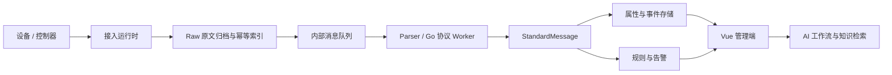

# 炬联 TorchLink

  

<strong>连接设备，感知安全。</strong>

炬联是一套面向消防与设备运维场景的独立 IoT 平台，采用 Go API 和 Vue 3 管理端。平台把设备接入、协议开发、原始报文追溯、规则告警和 AI 辅助运维放在同一条业务链路中，支持本地开发、在线部署和离线交付。

[开始运行](docs/TECHNICAL_DETAILS.md) · [设备接入](docs/UNIFIED_DEVICE_ONBOARDING.md) · [协议开发](docs/GO_PROTOCOL_PACKAGES.md) · [部署维护](docs/DEPLOYMENT.md) · [离线部署](docs/OFFLINE_DEPLOYMENT.md) · [用户权限](docs/USER_ACCESS_CONTROL.md) · [全部文档](docs/README.md)

## 核心功能

| 能力 | 可以完成的工作 |
| --- | --- |
| 设备与产品 | 管理产品、设备、物模型描述和主子设备关系；查看连接详情、最新属性、历史事件及告警 |
| 多协议接入 | MQTT / HTTP 标准上报、Modbus TCP、Modbus RTU over TCP，以及 Go 协议 TCP / UDP；支持 TCP 双向建连与定时查询 |
| Go 协议开发 | 下载函数模板、上传源码、离线编译、样例验证、发布不可变版本、绑定产品及回滚；支持多平台编译 |
| 报文追溯 | 原文归档、解析诊断、下载与回放；保留实际协议版本和帧前状态，定位协议或设备问题 |
| 规则与告警 | 属性规则、设备主动告警、部件级火警与故障；支持确认、恢复和关闭，以及告警关联设备与摄像头 |
| AI 与知识库 | 告警研判、规则草稿、设备巡检、协议资料辅助和对话；支持 Ollama、DeepSeek 与兼容模型接口 |
| 摄像头与视频事件 | 管理摄像头元数据和设备关联，接收外部视频告警；直播服务由外部平台提供 |
| 报文与点表生成 | 从 JSON 报文、Excel / CSV 点表生成协议，在字段对照输入框中编辑映射、预览并发布 |
| 运维与权限 | 用户、角色、菜单和按钮授权；按用户设备范围隔离设备、告警与提醒；审计、健康检查和设备数据备份 |

## 使用流程

1. 在 **协议管理** 上传并发布专用协议；在 **产品管理** 选择内置标准上报或已发布协议创建产品，再到 **设备管理** 对应分组登记设备。TCP / UDP 的连接配置由 **接入网关** 独立管理。
2. 在 **接入测试** 使用测试设备发送模拟报文；HTTP / MQTT 设备使用登记时生成的凭证接入。
3. 设备上报后，在连接详情和原始报文中核对接收、解析及告警，再按需配置规则和 AI 工作流。
4. 在 **系统维护 → 用户与权限** 创建角色和用户，选择设备范围，再配置菜单及操作权限。用户归属当前登录租户，未配置设备范围的普通用户默认看不到设备和告警。

炬联重点保留可追溯原文、可回滚的 Go 协议版本和部件级告警状态。AI 使用租户范围内的设备、告警与知识资料；规则草稿经人工确认后启用。

## 架构与数据链路

- **后端**：Go；业务与原文索引使用 PostgreSQL，原文及遥测按配置分层存储到 ClickHouse，Redis 提供缓存，Kafka / Redpanda 承载内部消息。
- **设备通信**：EMQX 提供 MQTT；中心运行时负责 TCP / UDP、Modbus 采集和会话。MQTT 入站先写本机持久队列，再确认平台收到的投递。
- **文件与 AI**：MinIO 保存备份制品及兼容对象；Ollama、Weaviate 和 Harness 提供模型、知识检索与工作流。

原文先归档再解析，失败保留诊断信息。只有成功解析的数据才对外发布解析结果；Broker 的 PUBACK 不等于平台已完成归档、解析或告警处理。

## 与 JetLinks 等平台的差异

炬联的特点是围绕消防报文追溯、Go 源码协议和 AI 运维组织功能。平台选型应同时考虑已有技术栈、协议资产、现场设备和交付要求。

| 维度 | 炬联 | JetLinks |
| --- | --- | --- |
| 技术路线 | Go API、Vue 管理端；自定义协议采用 Go 源码及 `go-protocol-v2` | 社区版基于 Java 17、Spring Boot 3.x、WebFlux、Netty 等 |
| 协议开发 | 上传源码后编译与样例验证，保存不可变版本，支持产品绑定和历史回放 | 提供统一设备接入、协议适配与 Java 协议开发体系 |
| 业务重点 | 消防控制器与部件告警、原文证据、设备运维和知识辅助 | 通用企业 IoT 基础平台，提供设备管理、规则引擎及数据权限等能力 |
| 部署评估 | 默认包含多种存储、消息与 AI 组件，需按实际业务评估资源 | 社区仓库提供最小运行依赖说明；应按选定组件和版本评估 |

JetLinks 信息依据 [社区仓库](https://github.com/jetlinks/jetlinks-community) 与 [官方协议示例](https://github.com/jetlinks/jetlinks-official-protocol)（资料核对：2026-09-10）。社区版、企业版及行业方案须分别评估，不能把某个版本的范围推为整个产品的能力上限。两者没有在同一环境下进行性能、成本或 AI 准确率对比，本项目不据编程语言推断这些指标。

与通用 IoT 平台相比，炬联把消防接入与排障流程做得更集中；与独立 MQTT Broker、流程编排工具或视频平台相比，炬联负责设备台账、报文处理和告警业务，也可与这些工具集成。

## 使用边界

- HTTP / MQTT 使用受管凭据；TCP / UDP、Modbus 和子设备按协议完成身份识别与认证。
- Go Worker 是服务账户权限下的子进程，上传者应为可信协议开发者；超时和最小环境变量不构成强隔离沙箱。
- 平台保留中心接入与主子设备关系，不提供现场 Agent、独立设备孪生拓扑或设备影子。摄像头只维护元数据和关联。
- 设备数据备份导出原文、解析数据及清单；文件校验不会恢复数据库。完整环境还需单独保护数据库、配置、协议制品与凭据。
- 模拟器和自动化测试不能替代厂商设备、现场网络及生产容量验收。

## 文档导航

| 任务 | 文档 |
| --- | --- |
| 首次运行、IDE 调试、开发检查 | [技术详情](docs/TECHNICAL_DETAILS.md) |
| 配置、端口、升级、日志和备份 | [部署配置与维护](docs/DEPLOYMENT.md) · [离线部署](docs/OFFLINE_DEPLOYMENT.md) |
| 添加设备、凭据、标准上报及命令 | [统一设备接入](docs/UNIFIED_DEVICE_ONBOARDING.md) |
| 主动连接、查询和子设备 | [TCP 与主子设备接入](docs/TCP_CHILD_DEVICE_ACCESS.md) |
| 字段映射、源码开发与消防示例 | [配置驱动协议](docs/CONFIGURABLE_PROTOCOLS.md) · [Go 协议包](docs/GO_PROTOCOL_PACKAGES.md) · [GB26875](docs/GB26875_DAHUA_V103.md) |
| MQTT 接收保障和部件告警 | [接收与告警契约](docs/DEVICE_RECEIVE_RELIABILITY.md) |
| 进程拆分 | [Access Gateway](docs/EDGE_AND_GATEWAY.md) |
| AI 工作流和外部视频事件 | [AI 与知识库](docs/AI_PLUGIN_HARNESS.md) · [视频集成](docs/VIDEO_SDK_ADAPTER.md) |

协作与开发约束见 [AGENTS.md](AGENTS.md)。

## 用户与权限

「系统维护 → 用户与权限」支持创建用户名密码账户、角色、菜单和操作授权，并设置「无设备 / 指定设备 / 当前租户全部设备」。设备、告警、报文、总览和普通用户实时提醒按同一设备范围过滤。主设备与子设备分别授权；巡检、备份等全租户功能另需全部设备范围及对应权限，详见 [用户权限管理](docs/USER_ACCESS_CONTROL.md)。

菜单支持整体及分组折叠，整体折叠状态在当前浏览器保留；用户下拉只保留退出登录。设备管理分为独立设备、主设备、子设备三个标签，并支持设备类型筛选；实时通知提示有新数据，由用户手动刷新列表。协议列表支持分页，操作栏统一提供解析测试、下载源码、下载制品和发布按钮，不适用操作显示禁用提示。
