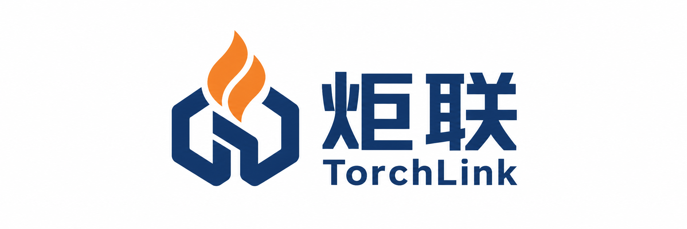

# 炬联 TorchLink

<p align="center">
  
</p>

<p align="center"><strong>连接设备，感知安全。</strong></p>

面向消防与设备运维的独立 IoT 平台，采用 Go API、Vue 3、Naive UI 和 Vite，支持本地开发、在线部署及离线交付。

[平台能力](#平台能力) · [快速运行](#快速运行) · [目录与架构](#目录与架构) · [开发检查](#开发检查) · [文档入口](#文档入口)

## 平台能力

| 模块 | 当前能力与文档 |
| --- | --- |
| 运行总览 | 设备在线、连接与数据活跃状态，告警趋势、等级与处置分布；统计遵守设备授权范围。[统计口径](docs/DEVELOPMENT.md#首页统计) |
| 设备模板 | 产品物模型、已发布协议版本绑定及模板接入点。[模板与接入](docs/INTEGRATION.md#设备接入) |
| 设备管理 | 主子设备、接入向导与预检、凭据、连接诊断、属性历史、命令下发及回执；主子设备分别授权。[设备接入](docs/INTEGRATION.md#设备接入) |
| 平台接入点 | HTTP / MQTT 标准上报，TCP / UDP 共享监听，主动 TCP 连接、Modbus 轮询及串口服务器接入。[接入配置](docs/INTEGRATION.md#tcp-与主子设备接入) |
| 设备通信协议 | Go 源码离线编译、样例校验、不可变版本发布与回滚；JSON / HEX 映射、报文与 Excel / CSV 点表生成。[协议开发](docs/INTEGRATION.md#go-协议) |
| 模拟设备测试 | 发送正常、告警、恢复、事件样例，核对原文和解析；另有演示数据、GB26875 虚拟设备及负载工具。[测试入口](docs/DEVELOPMENT.md#演示数据与功能检查) |
| 原始报文 | 多条件筛选、解析诊断、单条与批量下载；试运行、差异比较和重新投递回放。[筛选与回放](docs/DEVELOPMENT.md#原始报文筛选) |
| 告警中心与规则 | 设备主动告警、规则告警、部件状态、确认/恢复/关闭、实时提醒、邮件通知；点击“开始研判”或“重新研判”发起 AI 任务。支持触发与恢复条件、联动动作和人工审核的 AI 规则草稿。[业务流程](docs/PLATFORM.md#设备与告警) · [手动研判](docs/PLATFORM.md#告警手动研判) |
| 智能巡检 | 在线情况、上报时效和活动告警检查，后台进度、分页报告、AI 建议及 PDF 下载。[巡检报告](docs/PLATFORM.md#智能巡检与报告) |
| 值班管理 | 岗位、班组、排班导入、实际到岗、不可变交接版本、AI 整理、跨班事项、提醒、附件与 PDF/CSV 导出。[值班流程](docs/DUTY.md) |
| 反复报警治理 | 单点位事项、独立现场核实、实际活动覆盖、原因与措施验收、固定观察评价、历史归一化和治理待办。[核查与治理](docs/ALARM_GOVERNANCE.md) |
| 数据质量 | 物理/时间/序列指标、已确认基线、校准附件、固定分析、曲线及人工核实。[分析流程](docs/ANALYTICS.md#数据质量) |
| 监测连续性 | 连接、接收、有效数据时间线、停运资料、历史接入依赖与假设影响。[区间与覆盖](docs/ANALYTICS.md#监测连续性) |
| 告警策略实验台 | 告警规则页内固定数据集、隔离双分支、真实标签、报告及显式发布候选。[实验与发布](docs/ANALYTICS.md#告警策略实验台) |
| 演练与复盘 | 流程版本、演练与真实案例、实际节点、固定复盘、独立整改验收与当班跟进。[演练流程](docs/ANALYTICS.md#演练与复盘) |
| 维护与投入 | 实物资料、维修及独立验收、前后观察、精确费用、透明排序与人工决定。[维护流程](docs/ANALYTICS.md#维护与投入) |
| 智能助手 | 流式对话、运维报告、自定义聊天 Agent、会话记录和运行轨迹；通过 Harness 与受控 MCP 查询授权数据。[AI 功能](docs/PLATFORM.md#ai-与知识库) |
| 模型与 AI 工作流管理 | 统一模型配置、可选连接测试；查看当前租户运行/排队任务，手动刷新、逐条强制停止和停止审计，支持多 Harness 实例。[工作流管理](docs/PLATFORM.md#运行中的-ai-工作流) |
| 知识库 | PostgreSQL + pgvector 持久检索、云端 Embedding、异步索引与重试、原子重建；按租户及 Agent / workflowId 隔离。[知识检索](docs/PLATFORM.md#ai-与知识库) |
| 摄像头映射与直播 | 摄像头资料、位置、设备关联、视频告警；ONVIF / RTSP / GB28181 接入，WebRTC / HLS 播放和可选转码。[摄像头](docs/PLATFORM.md#摄像头) |
| 运维总览 | 全平台组件连接、采集目标和关键指标，限运维租户授权。[运维边界](docs/PLATFORM.md#运维中心) |
| 指标中心 | PromQL 查询、采集目标、查询库、记录与告警规则。[指标与受管配置](docs/PLATFORM.md#运维中心) |
| 日志中心 | LogQL/结构化筛选、日志量分布、查询库、上下文、实时追踪、导出、日志规则及保留/删除请求。[日志与受管配置](docs/PLATFORM.md#运维中心) |
| 仪表盘 | 原生 Grafana 查看/编辑、变量、文件夹、数据源、查询库及导入导出；启动补齐内置仪表盘。[仪表盘边界](docs/PLATFORM.md#运维中心) |
| 监控告警 | Alertmanager 当前/历史告警、静默、路由与邮件/Webhook，与消防业务告警分开。[通知与配置](docs/PLATFORM.md#配置写入与通知) |
| 容量测试 | 页面预设、CLI 与多 Agent 发压，阶梯搜索、长稳、故障注入、ID 核对、续跑、报告及跨运行比较。[容量验证](docs/DEVELOPMENT.md#容量验证) |
| 备份中心 | 每日设备数据备份，FULL 另含知识库、Harness Agent/会话、值班与治理资料、固定分析及业务版本、权限关联和应用附件；制品下载、SHA-256 校验及隔离恢复验证。[备份与隔离恢复](docs/BACKUP.md) |
| 用户与权限 | 租户、用户、角色、菜单/操作权限、角色继承与用户设备范围；开放接口 tab 管理用户绑定密钥，服务端、实时通知和 AI 工具统一执行授权。[权限边界](docs/PLATFORM.md#权限与设备范围) |
| 对外开放接口 | 绑定平台用户的 API Key，按能力及设备范围查询/上报消息与告警、处置告警及智能问答。[开放 API](docs/INTEGRATION.md#开放接口) |

典型流程：发布协议 → 创建产品 → 登记设备和配置模板接入点 → 上报并核对原文、解析与告警 → 配置规则及用户权限。普通用户需分配设备范围，主设备与子设备分别授权。

## 快速运行

Go 和 Node.js 版本分别以 `go.mod`、`iot_front/package.json` 为准。准备脚本会检查运行依赖、安装 Go/npm 依赖并准备本地环境；Docker 准备行为及虚拟机依赖模式见 [部署与本地调试](docs/DEPLOYMENT.md#本地运行)。以下命令均从本仓库根目录执行。

Windows 首次准备：

```powershell
powershell -ExecutionPolicy Bypass -File .\scripts\setup-local.ps1
```

Linux / macOS：

```bash
bash ./scripts/setup-local.sh
```

准备完成后，在独立终端分别启动 API、前端和备份源码服务：

```bash
go run ./cmd/iot-platform --env-file .env.local
```

```bash
cd iot_front
npm run dev
```

```bash
go run ./cmd/backup-service --env-file .env.local
```

访问 `http://localhost:5173`，使用环境配置中的管理员账户登录；Vite 默认代理 API 到 `http://localhost:8081`。Windows 遇到 npm 执行策略限制时使用 `npm.cmd`。真实环境文件与运行数据不提交到仓库。

本地容量测试默认随源码 API 启停，在“运维中心 → 容量测试”打开；配置见 [本地容量模块](docs/DEVELOPMENT.md#容量测试模块)。

登录“模型管理”，保持预填的 DeepSeek 地址与模型，填写 API Key 并保存即可启用 AI（连接测试可选）；未填密钥可先使用设备接入等功能。在同一页面独立配置知识库 Embedding API。离线包不携带模型权重，AI 与向量计算需要访问外部 API，见 [AI 配置与升级](docs/DEPLOYMENT.md#ai-与工作流)。

| 环境 | 配置与操作入口 |
| --- | --- |
| 本地开发 | `compose.local.yaml`、`.env.local`、`scripts/setup-local.*` |
| 在线部署 | `compose.yaml`、`.env.online`、`scripts/deploy-online.*`；见 [部署维护](docs/DEPLOYMENT.md) |
| 离线交付 | `scripts/package-offline.*` 默认输出完整 `.tar`、SHA256 校验文件及目录；解包后运行 `scripts/deploy-offline.*`，配置为包内 `.env.offline`；见 [离线部署](docs/DEPLOYMENT.md#离线部署) |
| 多机集群 | `scripts/cluster-up.*` 向导，或按清单渲染、分阶段部署与升级；见 [集群部署](docs/DEPLOYMENT.md#集群部署) |

脚本统一使用 `.sh`（Linux / macOS）和 `.ps1`（Windows PowerShell）入口。直播与容量模块的默认部署行为、关闭及重新启用方式分别见 [摄像头部署](docs/DEPLOYMENT.md#摄像头部署) 和 [容量测试模块](docs/DEPLOYMENT.md#容量测试模块)。

## 目录与架构

| 目录 | 内容 |
| --- | --- |
| `cmd/` | API、独立接入网关、GB26875 专用网关与虚拟设备、备份、负载与容量测试/检查、Harness 模拟、集群渲染/初始化/SSH、ClickHouse 迁移与死信恢复入口 |
| `internal/` | 业务与授权、协议运行时、AI/MCP、视频、存储、运维、容量编排和集群清单实现及回归测试 |
| `iot_front/` | Vue 管理端、公共组件和前端行为测试 |
| `protocol-packages/gb26875-dahua/` | 完整 Go 协议 module 示例 |
| `dev/` | 六个独立消防协议包源码与样例测试，见 [协议包说明](docs/INTEGRATION.md#内置协议示例) |
| `scripts/` | 环境准备、部署、打包、演示数据与部署冒烟测试 |
| `deploy/`、`ops/` | DeepSeek Harness、容器与监控配置 |
| `.github/workflows/offline-bundle.yml` | Linux amd64 离线包构建、校验和公开 Release |
| `docs/` | 当前开发、接入和运维指南，见 [文档索引](#文档入口) |

```text
设备 → 接入 → 原文归档 / 幂等索引 → 内部队列 → 解析 → 属性 / 事件 → 规则 / 告警
                                                           ↓
                                                   管理端 / AI 工作流
```

PostgreSQL 保存业务数据和索引，ClickHouse 按配置承载原文及遥测；Redis 提供缓存，Kafka / Redpanda 承载内部消息，EMQX 负责 MQTT。MinIO 保存知识原件和备份制品，外部 API 提供对话、推理及向量计算；PostgreSQL + pgvector 提供持久知识检索，Harness 保留自定义 Agent 与业务工作流。

默认 `combined` 进程可拆分为 `api`、`gateway`、`parser`、`processor`、`jobs`，按角色分配资源；集群工具校验故障域、端口和连接预算，生成各节点配置并部署。默认 Compose 为单节点，集群示例也有单实例组件，具体见 [进程职责](docs/DEPLOYMENT.md#进程职责) 与 [高可用边界](docs/DEPLOYMENT.md#高可用边界)。工具可用不代表目标集群已经通过容量或故障切换验收。

原文先归档再解析，只有成功解析的数据才对外发布结果。Go Worker 以服务账户权限运行，协议源码应来自可信开发者；AI 规则草稿默认禁用，确认后启用。设备数据导出不替代数据库、配置及凭据备份。

## 开发检查

```bash
# 仓库根目录
go test ./cmd/... ./internal/...

# 独立协议 module（根 module 的测试不会覆盖它们）
cd protocol-packages/gb26875-dahua
go test ./...
```

前端在 `iot_front` 中运行 `npm test` 和 `npm run build`；`dev/` 下各协议包需分别运行 `go test ./...`。部署和扩展检查入口见 [开发与测试](docs/DEVELOPMENT.md)。测试与模拟器验证不能替代真实设备和目标环境验收。

协作约定见 [AGENTS.md](AGENTS.md)，专项回归和真实依赖测试条件见 [开发与测试](docs/DEVELOPMENT.md#源码与开发检查)。

## 文档入口

操作细节集中在以下指南，源码目录和测试入口在对应章节维护。

| 指南 | 内容 |
| --- | --- |
| [部署与本地调试](docs/DEPLOYMENT.md) | 本机/虚拟机、在线/离线、集群与角色拆分、模块开关、迁移、维护和备份 |
| [开发与测试](docs/DEVELOPMENT.md) | 源码与脚本入口、前端约定、查询契约、回归、演示工具、容量测试与目标环境验收 |
| [设备接入与协议](docs/INTEGRATION.md) | HTTP/MQTT、TCP/Modbus、Go Worker、点表、部件告警、开放 API 与厂商示例 |
| [平台功能与边界](docs/PLATFORM.md) | 设备/告警使用、权限、AI/知识/Agent、巡检、工作流管理、运维、摄像头直播与视频事件 |
| [值班管理与交接](docs/DUTY.md) | 排班导入、实际责任、固定版本交接、AI、跟进事项、提醒、权限及备份 |
| [五项业务分析](docs/ANALYTICS.md) | 数据质量、连续性、规则实验、演练复盘、维护与投入；固定事实、核实、AI、接口及权限 |
| [反复报警核查与治理](docs/ALARM_GOVERNANCE.md) | 通用模板与场景预设、逐次事实与周期、独立核实、实际活动、措施验收、观察评价与历史归一化 |
| [备份与隔离恢复](docs/BACKUP.md) | 每日/FULL 范围、制品与版本、文件校验、隔离恢复、只读读取与来源覆盖限制 |
