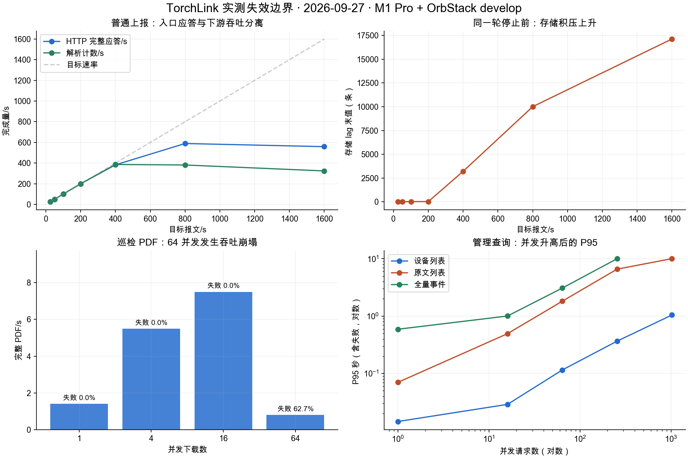
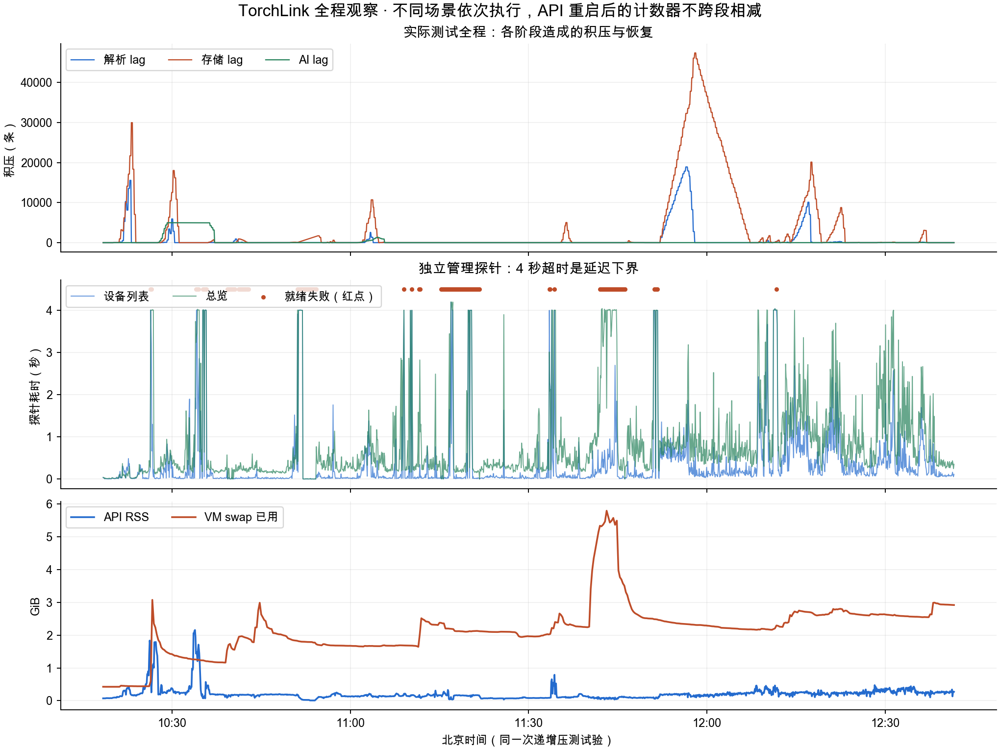

# 全系统破坏性容量压测报告（2026-09-27）

阅读说明：第 1–10 节及附录保留当天上午的原始压测结果。第八节问题已基于后续源码重新核对、修复并复测，当前结果见 [第 11 节](#11-第八节问题的源码复核与修复复测)；不要把历史故障或旧配置当成修复后的现状。

本次已经把现有本地环境压到业务不可操作，并实际触发一次 API 未恢复 panic。**系统容量不是一个“最多多少台设备”的固定数字**：注册设备数、保持连接数、每秒报文数、告警比例、页面查询和 PDF 下载分别消耗不同资源。不能把已注册 10 万台、Broker 返回 PUBACK，或者单个接口峰值理解为全系统可以持续处理这些设备的实时数据。

测试只使用原有 OrbStack `develop` 虚拟机中的基础服务，以及 Mac 上已有的 API、前端与备份进程；未新增容器，未建立集群，未修改业务实现或中间件参数来抬高结果。压测工具的测量缺陷在测试过程中做了修正，见“测量有效性”。

## 1. 主要结论

| 指标 | 本次结论 |
| --- | --- |
| 注册数据规模 | 100,000 台标准测试设备完成注册；不是最大设备总量 |
| 普通 HTTP 写入 | 180 秒独立阶段通过的最高测试速率：50 条/秒 |
| 混合负载 | 通过零错误、入口达标、存储 lag <100 的最高已测组合：10 条/秒 + 1 查询并发 + 1 PDF 并发 |
| 规则 / 故障风暴 | 100 条/秒已有存储积压；AI 完成速度远低于告警生成速度 |
| PDF | 16 并发峰值约 7.5 份/秒，64 并发约 62.7% 超时并拖慢管理操作 |
| MQTT | 发生 API 未恢复 panic；该轮 158,421 次 PUBACK 不能代表成功入库 |
| 集群最高容量 | 没有集群实测；只能给定硬件、分片和业务配比后的条件估算 |



图中为不同功能各自的独立阶梯，不能把吞吐相加；PDF 使用缓存有效期内的同一份巡检报告，查询数据规模见各节说明。

最严重的问题是 MQTT 过载后的进程级故障，而不是吞吐数字偏低。EMQX 将平台接收连接按 `mailbox_overflow` 保护关闭后，平台异步执行 Paho `Message.Ack()`，调试器停在 `paho.mqtt.golang@v1.5.0/net.go:464` 的通道发送处；原生进程采样同时出现 `runtime.gopanic → runtime.fatalpanic`。所有管理 API 随后停止响应。仅停止发送不能解除未恢复 panic，必须重启 API。另一次查询风暴耗尽 Mac 临时端口，造成 Kafka 拨号错误；端口恢复后，空闲消费组仍保留错误，第二次只重启 API 才使就绪检查恢复。后续 5.5 万 MQTT 连接压力造成 VM 资源争用及 Kafka EOF，停止发生器后第三次只重启 API 清除残留消费健康错误；基础容器始终未重启。

当前结果不能支撑“直接加几个 API 副本就达到百万设备实时上报”的结论。多副本还会共享数据库、消息队列、PDF 数据读取和模型配额；MQTT 故障路径也不会因为加副本自动消失。

## 2. 实测环境与版本

| 项目 | 本次环境 |
| --- | --- |
| 宿主机 | Apple M1 Pro，8 个逻辑 CPU，16 GiB 内存，macOS 27.0；负载发生器和 API 共用宿主资源 |
| 依赖环境 | OrbStack `develop`，Ubuntu 24.04 arm64，7 vCPU，约 8,004 MiB 内存，约 9,028 MiB swap |
| 构建工具链 | 实际 Go 1.27.1，仓库 go.mod 最低要求 1.25.5 |
| API / 前端 / 备份 | Mac 原有源码调试进程；API 8081、Vite 5173、备份服务 8092 |
| 初始 API | `bb40a5785654a79c002529f9fdf4530b1fe22128`，`-gcflags=all=-N -l`，Darwin arm64 |
| MQTT 故障恢复后的 API | `b9ba24d7e3153dab03234cca358581fb6e53d62c`，仍为调试构建；源码工作区修改限于压测工具和报告 |
| 两版本差异 | 运维总览加载及前端图表等变动；本次接入、解析、告警业务源码没有随恢复而修复。运维总览数据采用恢复后的版本 |
| PostgreSQL | 17，实际 `max_connections=300`；平台连接池默认 64 |
| Redpanda | v25.2.11，原有 14 个业务主题各 12 分区、复制因子 1；失败时自动产生的 `iot.dlq.storage` 为 1 分区、复制因子 1 |
| ClickHouse | 25.7，现有单节点表；当前 `MergeTree` 不构成分片集群 |
| EMQX | 5.8.8；平台 durable inbox 32 分片、总容量上限 50,000 条；Broker 平台会话队列上限 100,000，inflight 128 |
| 其他服务 | 原有 Redis、MinIO / MinIO DR、Harness、Ollama、Weaviate、Prometheus、Grafana、Loki、Alloy、Alertmanager、node-exporter，共 16 个容器 |
| AI | 真实 Harness + DeepSeek `deepseek-flash`；自动告警研判并发为 1；Ollama 用于知识库嵌入 |
| 接入与消费者限制 | Kafka 每订阅 64 个处理 lane；TCP / UDP 每个监听配置默认最多 1,024 个会话；这些是配置限制，不是性能测量值 |
| 数据隔离 | 同一测试租户内使用 `cap-20260927` 产品、设备、规则与文件名前缀；保留原有 2 台设备和既有规则、告警 |

故障恢复前后、TCP 自动注册后的数据量不同，具体试验以时间戳和阶段记录为准。普通标准设备注册到 100,000 台；TCP / UDP 测试另外自动注册 1,095 台协议设备。注册数量不等于在线连接数，也不等于同时持续上报的数量。

VM 的 vCPU 和内存来自同一宿主机，不能把宿主与 VM 的规格相加。容器 CPU 的 100% 表示一个逻辑核，约 630% 即使用约 6.3 个核。

调试构建、共享 Mac/VM 的 CPU 与内存、压测进程自身负载、真实模型网络延迟、已有 swap 都会影响数字。这里测的是这套实际开发环境，不是独占 Linux 生产服务器的硬件规格承诺。

## 3. 方法、失败定义与覆盖范围

### 3.1 方法

1. 使用真实设备接入凭据；HTTP 上报经过认证、原文归档、Kafka、解析、状态 / 规则、PostgreSQL / ClickHouse，未用直接写库代替业务链路。
2. HTTP / MQTT 采用指定发送速率的阶梯测试；管理 API、PDF、TCP / UDP 采用固定并发、收到响应后再发下一次的方式。后者的“并发”表示同时在途请求或发送方，不是有思考间隔的真实用户人数。
3. 一般阶梯持续 10–30 秒，另外执行 180 秒持续阶段及混合负载。短阶梯用于暴露拐点，不构成 24 小时稳定性证明。所有阶段保留原有后台服务和独立管理探针，“纯 HTTP”指发压器新增的负载类型，不表示关掉整个平台的其他工作。
4. 并行采集管理 API、`/health/ready`、平台计数器、Kafka lag、MQTT inbox、EMQX 会话 / 丢弃计数、API RSS 和容器资源。独立管理探针每约 5 秒一次、超时 4 秒；工具自身探针超时随各测试设置。
5. 用 PostgreSQL 原文索引、标准消息和 ClickHouse 唯一消息数核对完整性；取样消息按 `rawMessageId` 检查 `PARSED`。计数器吞吐受重复消费影响，不能代替唯一消息核对。ClickHouse 遥测表只接收 PROPERTY_REPORT / ALARM_REPORT；STATE_CHANGE 留在 PostgreSQL，最终比较按类型核对，不要求所有标准消息都出现在遥测表。
6. 每轮后停止发送并观察队列回落，再检查连续三次就绪、设备和总览请求均成功且小于 1.5 秒。原始早期 `drain` 只检查解析 / 存储 / 状态 / inbox，不含 AI，也不能单独证明 HTTP 已恢复。

本报告将大量超时、持续积压、目标业务成功吞吐崩塌，或 API panic 视为已达到该负载下的失效边界。错误率超过 50% 或成功吞吐跌至已测峰值的 20% 以下时停止该阶梯。已失效后继续制造更多无效请求不会形成更高的可用容量。



### 3.2 已覆盖与未覆盖

已覆盖：批量注册、设备凭据认证、MQTT 令牌、连接与 QoS 1 上报、HTTP 标准上报、独立 Go 源码协议构建 / 样例试跑 / 发布、GB26875 TCP / UDP 接入、解析与存储、设备来源故障告警、规则告警、确认与恢复、自动 AI 研判、巡检任务去重和报告、PDF 完整下载、设备 / 原文 / 历史 / 告警 / 总览 / 事件快照 / 运维查询、原文打包下载与 DIFF 回放、知识上传、索引与 MCP 检索、设备数据备份及制品读取 / 校验、开放接口与用户认证、摄像头资料及设备关联、AI 运维报告，以及混合负载。

未部署 ZLMediaKit，因此没有测试直播、转码、GB28181 视频带宽；没有真实 Modbus 设备、真实消防硬件、公网弱网 / 丢包仿真、跨节点切换或断电恢复。告警外部通知接收人未配置，没有制造邮件 / 短信风暴。没有用备份覆盖当前数据库，备份“演练”接口当前实现只做制品完整性验证。模型供应商全局配额、全天持续运行和磁盘写满未测。以上不能用其他接口成功来替代验收。

## 4. 设备接入、解析与报警

### 4.1 注册规模

| 累计标准设备 | 本批数量 | 并发 | 最终成功/s | P95 ms |
| --- | --- | --- | --- | --- |
| 5,000 | 5,000 | 64 | 1,597.5 | 220.6 |
| 20,000 | 15,000 | 128 | 1,449.3 | 263.2 |
| 50,000 | 30,000 | 256 | 1,480.5 | 345.1 |
| 100,000 | 50,000 | 512 | 1,559.7 | 499.5 |

最终 100,000 台标准测试设备全部注册成功。最高注册批次出现 72 次连接重置后重试成功，因此“最终成功数”和“每次请求都成功”是不同结论。没有找到数据库的最大注册设备条数，100,000 是本次数据规模；后面的失效来自业务负载，不是宣称第 100,001 台就不能注册。

### 4.2 HTTP 标准上报

初始阶梯使用 5,000 台轮转上报设备，每条包含 temperature、humidity、pressure、smokeDensity、voltage、current 六个数值字段及测试规则字段；每级发送 30 秒。设备从不同请求独立认证，未复用管理员上报捷径。

| 阶梯 | 完整成功数 | 成功/s | 失败率 | P95 ms | 解析/s | 存储 lag 末值 | 总 lag 末值 |
| --- | --- | --- | --- | --- | --- | --- | --- |
| rate=25 | 750 | 25 | 0.00% | 47.7 | 24.9 | 3 | 6 |
| rate=50 | 1,498 | 49.8 | 0.00% | 80.8 | 50 | 11 | 18 |
| rate=100 | 2,993 | 99.7 | 0.00% | 212.7 | 100.4 | 25 | 38 |
| rate=200 | 5,990 | 199.4 | 0.00% | 199 | 199.9 | 30 | 50 |
| rate=400 | 11,996 | 382.9 | 0.00% | 977.2 | 386.3 | 3,213 | 3,327 |
| rate=800 | 21,238 | 589 | 0.00% | 6,365.4 | 381.2 | 10,010 | 20,273 |
| rate=1600 | 21,187 | 558.6 | 33.61% | 9,318.1 | 323.7 | 17,120 | 30,653 |

无告警的初始 200 条/秒阶段，解析基本跟上，存储队列较小。400 条/秒后存储开始持续积压；800 / 1,600 条/秒阶段即使大量 HTTP 202 成功，也不能持续维持同速率落库。1,600 阶段的失败包括压测端 `gen-backlog` 与 HTTP 超时，二者在证据 JSON 中分别记录，不能全部算成服务端拒绝。

初始 HTTP 阶梯停止后约 50 秒消化主要积压。随后检查到 65,828 条原文、65,828 条标准消息及 65,828 条 ClickHouse 唯一消息，未解析 / 未处理 / 未发布均为 0。这个结果证明该轮已经归档的数据完成链路，不意味着客户端超时请求都没有写入，也不能证明 MQTT 未接收的消息没有丢失。

### 4.3 MQTT：连接容量与消息可靠性必须分开

| 场景 | 最高已保持规模 | 结束保持情况 | 后期结果 |
| --- | --- | --- | --- |
| mqtt-connections | held=16014 alive=16014 | alive=16014/16014 | {'ok': 2000}; {'ephemeral-ports': 1986, 'ok': 14} |
| mqtt-connections-vm | held=17791 alive=17791 | alive=17791/17791 | {'eof': 1, 'ok': 7791, 'reset': 2208}; {'reset': 10000} |
| mqtt-connections-direct | held=55000 alive=55000 | held=59022 alive=54882；人工停止，未完成 hold | {'ok': 5000}; {'ok': 5000} |

Mac 单源连接测试首先在 16,014 个保持连接处遇到临时端口不足；这属于负载发生器限制。VM 经发布端口的测试保持 17,791 个连接，随后出现大量 reset，但管理 API 仍正常。后续在 VM 内以两个已有源地址直连原有 Broker，最后一个全部存活的完成阶梯为 **55,000 / 55,000**；下一档累计建立 59,022 次连接，但仅 54,882 个仍存活，并出现拨号失败和超时。约 11:43 起管理查询大量超时、就绪返回 503，VM swap 峰值约 5.79 GiB；达到不可操作边界后人工终止发生器，未完成最终 30 秒保持阶段。压测端与 Broker 共享 VM，两个 Linux 源地址也受临时端口范围限制，因此这是该部署的实测边界，不能归为 EMQX 软件单独的硬上限。全程没有新增容器或扩展网络配置。`max_connections=1048576` 仅是 EMQX 配置上限，不是已实测一百万连接。

| 目标发布/s | PUBACK 次数 | PUBACK P95 ms | 归档/s | 解析/s | 管理探针失败 |
| --- | --- | --- | --- | --- | --- |
| 50 | 1,248 | 8.6 | 49.6 | 50 | 0/49 |
| 100 | 2,497 | 9.8 | 64.8 | 64.9 | 0/49 |
| 200 | 4,996 | 502.9 | 15.2 | 16.3 | 0/47 |
| 400 | 9,952 | 601.6 | 13 | 14.2 | 0/47 |
| 800 | 19,968 | 711.7 | 未知 | 未知 | 35/40 |
| 1600 | 39,952 | 787.4 | 未知 | 未知 | 47/47 |
| 3200 | 79,808 | 5.3 | 未知 | 未知 | 50/50 |

关键故障时间线（北京时间）：

- 10:49:14 开始使用完整的 2,000 个真实设备发布连接，依次发送 50、100、200、400、800、1,600、3,200 条/秒。
- 50 条/秒阶段归档、解析约 50 条/秒；100 条/秒阶段归档约 65 条/秒；200–400 阶段归档下降到约 13–16 条/秒。
- 10:51:11，EMQX 日志记录平台 inbox 客户端 `mailbox_overflow`，阈值 1,000，实际 1,251。平台订阅随后消失。
- 10:51:15 起，API 就绪、设备、告警和总览探针全部超时；进程采样和 VS Code 调试器确认未恢复 panic，停在 Paho 的 ACK 通道发送。源码 [ingress.go](../internal/adapters/mqtt/ingress.go) 的 `persist` 在 durable inbox 保存后调用 `Message.Ack()`，该方法由 inbox 工作协程执行；依赖的 `net.go` 明确要求 ACK 回调只能在通信循环存活时使用。故障路径与关闭通道竞态一致。
- 压测发送结束后，API 仍无法自行恢复；只重启 API 调试会话，未重启或重建基础容器。

该轮累计 **158,421 次 PUBACK**；停止发送并恢复后，试验时间窗口内找到 **13,491 条原文、13,491 条标准消息**。相差 **144,930 条（约 91.48%）**未在平台归档中找到。不能将后几档的 Broker 应答速度标成平台成功吞吐。

这里的“没有找到归档”按唯一试验时间窗口和测试产品统计。EMQX 的 `messages.dropped.no_subscribers` 是 Broker 全局计数，可能还包含平台对外发布等流量，不能直接拿它与上报数一对一相减。应以原文 / 标准消息核对和会话消失证据一起判断。

### 4.4 完整 Go 协议及 TCP / UDP

独立 `gb26875-dahua` 源码包经过真实上传、Darwin arm64 构建、样例试跑与发布，约 1.8 秒完成。创建专用 TCP / UDP 监听配置并使用真实 GB26875 注册帧、部件状态帧及序号匹配 ACK。ACK 之后仍检查异步解析与存储。

**TCP**

| 阶梯 | 完整成功数 | 成功/s | 失败率 | P95 ms | 解析/s | 存储 lag 末值 | 总 lag 末值 |
| --- | --- | --- | --- | --- | --- | --- | --- |
| c=1 | 361 | 18 | 0.00% | 88.6 | 20.9 | 1 | 2 |
| c=8 | 2,393 | 119.4 | 0.00% | 129.7 | 119.7 | 3 | 11 |
| c=32 | 3,371 | 166.1 | 0.00% | 414.2 | 167 | 106 | 145 |
| c=128 | 3,272 | 159.1 | 0.00% | 1,246.5 | 160.4 | 230 | 303 |
| c=512 | 2,707 | 127.7 | 21.08% | 10,000.1 | 145.9 | 612 | 624 |
| c=2048 | 196 | 6.6 | 99.93% | 236.7 | 28.4 | 8 | 12 |

**UDP**

| 阶梯 | 完整成功数 | 成功/s | 失败率 | P95 ms | 解析/s | 存储 lag 末值 | 总 lag 末值 |
| --- | --- | --- | --- | --- | --- | --- | --- |
| c=1 | 205 | 10.2 | 0.00% | 124.2 | 10.3 | 2 | 3 |
| c=8 | 1,269 | 63.1 | 0.00% | 204.2 | 63.1 | 4 | 8 |
| c=32 | 1,207 | 59 | 0.00% | 787.1 | 59.6 | 2 | 2 |
| c=128 | 1,091 | 48.2 | 0.00% | 3,597.9 | 48.3 | 3 | 3 |
| c=512 | 307 | 10.2 | 76.93% | 10,002.4 | 31.7 | 2 | 2 |

TCP 在 32 并发约 166 帧/秒达到本轮峰值；512 并发已出现约 21% 失败，2,048 并发约 99.93% 失败、成功吞吐约 6.6 帧/秒。高档失败包含配置会话上限触发的拒绝和连接重建风暴，不是 2,048 台全部保持在线。

UDP 在 8 并发约 63 帧/秒，512 并发约 77% 超时。本工具每个发送方等待协议 ACK 后继续发送，因此该数字是请求—应答业务能力，不能套用为网络层纯 UDP 包转发上限；没有测试随机丢包与重传模型。

### 4.5 故障告警、规则告警与 AI

**设备主动故障（每条均为故障报文）**

| 阶梯 | 完整成功数 | 成功/s | 失败率 | P95 ms | 解析/s | 存储 lag 末值 | 总 lag 末值 |
| --- | --- | --- | --- | --- | --- | --- | --- |
| rate=25 | 623 | 24.8 | 0.00% | 86.7 | 24.8 | 3 | 466 |
| rate=100 | 2,483 | 97.2 | 0.00% | 922.7 | 99.5 | 476 | 2,770 |
| rate=200 | 4,974 | 181.8 | 0.00% | 1,641.5 | 184.1 | 3,156 | 7,624 |
| rate=400 | 9,964 | 352.5 | 0.00% | 4,931.6 | 253.6 | 6,349 | 14,759 |
| rate=800 | 12,485 | 400.1 | 0.62% | 8,094.5 | 254.2 | 12,540 | 23,443 |

**规则匹配（约 10% 报文触发测试规则）**

| 阶梯 | 完整成功数 | 成功/s | 失败率 | P95 ms | 解析/s | 存储 lag 末值 | 总 lag 末值 |
| --- | --- | --- | --- | --- | --- | --- | --- |
| rate=25 | 743 | 24.7 | 0.00% | 167.9 | 24.8 | 3 | 57 |
| rate=100 | 2,962 | 96.1 | 0.00% | 1,015.4 | 98.4 | 672 | 909 |
| rate=200 | 5,926 | 176.2 | 0.00% | 3,188.7 | 179.6 | 4,823 | 6,043 |
| rate=400 | 7,951 | 211.3 | 0.79% | 8,089.3 | 161.5 | 7,707 | 10,814 |

设备主动故障测试不依赖匹配规则，最终产生 5,000 条设备来源告警。随着 5,000 个设备都已有同类活动告警，后续重复故障被去重，因此后面阶梯“新增告警/秒接近 0”不是告警系统停止工作的证据。

5,000 条告警以 32 并发确认，全部成功，耗时 9.726 秒，约 514 次/秒；随后发送正常恢复报文，确认活动告警归零。确认操作的吞吐不能替代产生新告警时的端到端写入能力。

自动 AI 并发保持真实默认值 1：在首个约 150 秒故障阶梯窗口仅完成 16 份研判，约 0.107 份/秒；队列接近 5,000。最终该批累计 45 份成功、1 份失败，其余 4,954 份在告警恢复后跳过。**跳过不算 AI 研判完成**。模型链路的吞吐必须按工作流、上下文规模、供应商配额另算；若都需要完整研判，这批任务显然无法与报警生成保持实时同步。

## 5. 巡检、PDF 和管理数据操作

### 5.1 巡检与 PDF

128 个并发巡检提交全部返回 202，P95 约 211 ms，被去重为同一个任务；这不代表同时执行了 128 次全量巡检。任务检查 100,002 台设备，服务端执行约 19.945 秒，调用方完成观察约 23.468 秒；包含真实 AI 建议，未返回警告。

首次 PDF 完整下载约 0.808 秒，3,198,431 字节，校验 `%PDF-` 文件头和 SHA-256。PDF 汇总覆盖全部 100,002 台设备，但正文最多展示 2,000 台的明细，见 [health_inspection_pdf.go](../internal/core/health_inspection_pdf.go)。它不是十万行明细 PDF 的性能结果。

| 阶梯 | 完整成功数 | 成功/s | 失败率 | P95 ms |
| --- | --- | --- | --- | --- |
| c=1 | 22 | 1.4 | 0.00% | 718.3 |
| c=4 | 84 | 5.5 | 0.00% | 823 |
| c=16 | 120 | 7.5 | 0.00% | 3,494.3 |
| c=64 | 28 | 0.8 | 62.67% | 20,003.1 |

64 并发时 47 次超时、28 次完整成功，失败率约 62.7%，成功吞吐约 0.8 份/秒；其他管理操作也显著变慢。成功峰值在 16 并发约 7.5 份/秒，但 P95 已约 3.49 秒，不能当成低延迟工作点。

源码和实查发现，每次 PDF 请求先通过 [ai_workflows.go](../internal/httpapi/ai_workflows.go) 中的 `recentHealthInspection → LatestHealthInspectionJob` 从 PostgreSQL 读出并解码整个巡检报告，之后才命中 PDF 缓存。该报告 JSON 约 26.7 MB。已有的两个 PDF 渲染槽位没有限制这一步大对象查询和分配。观测到 PostgreSQL 多核 CPU 接近 630%，以及 API 内存压力。这是本次最明确的跨功能争用点之一。

### 5.2 查询、事件快照与运维

| 功能 | 已测最高成功/s（对应并发） | 峰值档 P95 ms | 最高测试档 / 失败率 | 末档 P95 ms |
| --- | --- | --- | --- | --- |
| 设备状态列表 | c=1024 / 1109.7 | 1,045.1 | c=1024 / 1.25% | 1,045.1 |
| 注册设备列表 | c=256 / 137.7 | 2,587 | c=1024 / 3.03% | 8,769.7 |
| 原文列表 | c=256 / 54.1 | 6,585.5 | c=1024 / 100.00% | 10,019.8 |
| 属性历史 | c=16 / 287.2 | 89.6 | c=1024 / 60.78% | 10,014 |
| 告警列表（5,000 活动告警） | c=256 / 814.3 | 427.1 | c=1024 / 8.67% | 1,982.3 |
| 全量事件快照 | c=16 / 35.8 | 1,004.4 | c=256 / 70.57% | 10,004.5 |
| 总览（就绪恢复后独立测试） | c=32 / 26.3 | 1,947.1 | c=512 / 83.01% | 10,002.3 |
| 轻量元数据轮转（多项初始为空） | c=64 / 4834.9 | 18.8 | c=1024 / 0.57% | 435.9 |
| 运维总览 | c=1 / 39.3 | 42.1 | c=256 / 69.28% | 10,006.2 |
| 备份列表（创建前为空） | c=16 / 2928.8 | 10.9 | c=1024 / 12.34% | 1,983.9 |

事件快照在 5,000 条活动告警下平均响应约 8.6 MiB；本轮故意不发送 `If-None-Match`，测试完整快照成本。64 并发 P95 约 3.08 秒，256 并发约 70.6% 失败。真实页面有条件请求及轮询节奏，不能把这个结果直接换算成“最多多少人在线”。

事件过载后立即执行的第一轮总览测试受前一轮积压影响；第二轮没有业务积压，但就绪检查仍保留空闲 Kafka 消费组的历史拨号错误。这两轮保留为故障传播 / 恢复证据，最终总览容量表采用 API 恢复且就绪正常后的第三轮。

### 5.3 原文下载、回放、知识库、备份、开放接口及摄像头

| 功能 | 并发 | 请求数 | 完成耗时 s | 请求完成/s | P95 ms | 结果状态数 |
| --- | --- | --- | --- | --- | --- | --- |
| 知识上传 | 1 | 2 | 6.35 | 0.3 | 3624.5 | {"201": 2} |
| 知识上传 | 2 | 4 | 9.20 | 0.4 | 5065.8 | {"201": 4} |
| 知识上传 | 4 | 8 | 20.60 | 0.4 | 10626.0 | {"201": 8} |
| 知识上传 | 8 | 16 | 44.06 | 0.4 | 23852.7 | {"201": 16} |
| 知识上传 | 16 | 32 | 60.12 | 0.5 | 30069.9 | {"201": 18, "502": 14} |
| 知识上传 | 32 | 64 | 60.36 | 1.1 | 30288.2 | {"201": 12, "502": 52} |
| MCP 知识检索 | 1 | 2 | 12.20 | 0.2 | 8970.5 | {"200": 2} |
| MCP 知识检索 | 4 | 8 | 23.17 | 0.3 | 11861.6 | {"200": 8} |
| MCP 知识检索 | 16 | 32 | 60.08 | 0.5 | 30043.3 | {"200": 11, "502": 21} |
| 备份创建 | 1 | 1 | 20.07 | 0.0 | 20062.6 | {"200": 1} |
| 备份创建 | 4 | 4 | 19.36 | 0.2 | 19358.1 | {"200": 1, "502": 3} |
| 备份制品校验 | 1 | 1 | 0.09 | 11.3 | 77.8 | {"200": 1} |
| 备份制品校验 | 4 | 4 | 0.18 | 21.8 | 183.3 | {"200": 4} |
| 摄像头资料写入 | 1 | 2 | 0.07 | 30.0 | 45.6 | {"201": 2} |
| 摄像头资料写入 | 8 | 16 | 0.06 | 266.2 | 34.6 | {"201": 16} |
| 摄像头资料写入 | 32 | 64 | 0.33 | 193.4 | 317.2 | {"201": 64} |
| 摄像头资料写入 | 128 | 256 | 0.37 | 686.4 | 329.2 | {"201": 256} |
| 摄像头资料写入 | 512 | 1024 | 0.96 | 1,066.4 | 484.6 | {"201": 1024} |
| AI 运维报告 | 1 | 1 | 0.46 | 2.2 | 457.8 | {"502": 1} |

上表“请求完成/s”包含失败的返回速度，容量判断必须同时看状态数。批次只有 1–2 倍并发量，属于真实链路并发突发验证，不是长稳吞吐上限。MCP 检索中的 502 是压测脚本对 HTTP 200 + isError=true 的失败分类，实际 HTTP 状态在证据 httpStatusCounts 中单独保存；其失败不能算成成功检索。

备份下载：19,886,711 字节，0.047 秒，SHA-256 与清单匹配：True。

| 回放批次 | 总观察 s | 已完成任务 | 总处理消息 | 失败消息 | 任务状态 |
| --- | --- | --- | --- | --- | --- |
| replay-completed-c1 | 1.0 | 1 | 35 | 0 | {'COMPLETED': 1} |
| replay-completed-c16 | 1.1 | 16 | 560 | 0 | {'COMPLETED': 16} |
| replay-completed-c4 | 1.1 | 4 | 140 | 0 | {'COMPLETED': 4} |

| 开放批量请求/s（每批10条） | 请求数 | 接受消息 | 拒绝消息 | 结果未知消息 | 接受消息/s | P95 ms | HTTP 状态 |
| --- | --- | --- | --- | --- | --- | --- | --- |
| 1 | 15 | 150 | 0 | 0 | 10.2 | 1125.0 | {'202': 15} |
| 5 | 75 | 750 | 0 | 0 | 48.2 | 956.9 | {'202': 75} |
| 10 | 150 | 1500 | 0 | 0 | 95.6 | 1477.4 | {'202': 150} |
| 20 | 300 | 2442 | 558 | 0 | 155.1 | 2403.0 | {'202': 122, '207': 178} |
| 40 | 600 | 2859 | 3141 | 0 | 184.3 | 1078.5 | {'202': 17, '207': 552, '429': 31} |
| 80 | 1200 | 2959 | 9041 | 0 | 188.5 | 1417.9 | {'207': 1091, '429': 109} |


原文下载选取 100 条真实归档；DIFF 回放执行原文重读、重新解析及历史标准结果比较。知识库采用很小的单 chunk 中文文本，涉及对象存储、真实嵌入和 Weaviate 索引，这不是大 PDF / OCR 文件的上限。上传 8 并发仍全部完成但 P95 已约 23.9 秒；16 并发出现 14/32 失败，32 并发出现 52/64 失败。检索 16 并发有 21/32 次工具错误。错误信息指向 Weaviate 请求 30 秒超时，上传高压阶段同时观测到 Ollama CPU 约 679%（接近 VM 的全部 7 个核）；没有把该结果归因于模型供应商限额。

`FULL` 备份当前业务范围是“设备原文和解析数据”，不等于 PostgreSQL 整库及所有配置的完整备份。并发创建受到互斥控制；额外请求被拒绝属于现有保护策略。制品下载检查完整字节和摘要；`restore-drill` 当前仅做完整性验证，没有把数据恢复到另一套数据库。

开放接口按临时用户的 100 台设备授权范围测试。轮转查询在目标 10 请求/秒时已有约 49% 超时，30 请求/秒时约 50% 超时，成功返回仅约 3–4.4 次/秒。源码 [device_scope.go](../internal/httpapi/device_scope.go) 的 `CountManagedDeviceChildren` 在受限用户路径调用全租户 `ListManagedDevices` 后才过滤；注册列表主体虽然已经在 SQL 中按授权设备分页，子设备计数仍会加载十万条注册资料。这是与管理员查询不同的性能路径，需要保留权限语义并进一步优化。单 API Key 每秒 100 次请求、单设备上报频率的限流是策略边界；HTTP 207 的批次必须拆开统计 accepted / rejected，不能按整批成功计算。摄像头测试只覆盖资料与单设备关联，没有生成视频流。备份下载发生在宿主机 / VM 本地链路、同一制品的反复读取场景，吞吐不能作为公网带宽或冷磁盘读速承诺。

AI 运维报告在约 6,096 条设备状态的数据规模下，单请求即返回 HTTP 502，错误为 `ops-assistant ... status 413`，因此未继续增加该功能的并发。源码 [ops.go](../internal/core/ops.go) 把全量设备状态及最多 5,000 条告警直接拼入问题文本；[Harness gateway](../deploy/deepseek-harness/gateway.mjs) 的请求体上限默认 32 KiB。当前数据体积与网关约束不匹配，是功能可用性问题，不是模型每秒能生成多少报告的测量结果。

## 6. 混合负载、持续运行和恢复

先用全部 100,000 台标准设备凭据轮转上报 300 秒，扩充实际状态数据：

| 阶梯 | 完整成功数 | 成功/s | 失败率 | P95 ms | 解析/s | 存储 lag 末值 | 总 lag 末值 |
| --- | --- | --- | --- | --- | --- | --- | --- |
| rate=400 | 58,357 | 193.2 | 50.55% | 8,429.9 | 143.7 | 34,473 | 51,055 |

该阶段排空后，测试产品共有 101,095 台注册设备、60,002 条实际设备状态。后续混合测试使用这个规模；没有将仅注册未上报的设备算作已产生状态。

该轮包含不同类型失败：服务端 429、客户端等待超时、以及发生器自身 `gen-backlog`。现有 `IOT_INGEST_MAX_BACKLOG` 默认 50,000；该轮总 lag 越过该量级时触发背压保护，拒绝不能计为已完成上报。成功响应数不等于所有原文数，超时后仍可能完成归档；实际完成情况以排空后的唯一记录核对为准。

| 目标上报/s | 查询并发 | PDF并发 | 上报成功/s / 失败率 / P95ms | 查询成功/s / 失败率 / P95ms | PDF成功/s / 失败率 / P95ms |
| --- | --- | --- | --- | --- | --- |
| 10 | 1 | 1 | 9.8 / 0.00% / 909.1 | 3 / 0.00% / 1194.3 | 0.6 / 0.00% / 2836.5 |
| 25 | 1 | 1 | 24 / 0.00% / 1858.7 | 1.7 / 0.00% / 2089 | 0.4 / 0.00% / 4221.5 |
| 50 | 2 | 1 | 43.1 / 0.00% / 6695 | 1.3 / 0.00% / 3183 | 0.3 / 0.00% / 5314.4 |
| 100 | 4 | 2 | 62.7 / 0.36% / 10608.3 | 2.3 / 0.00% / 3741 | 0.6 / 0.00% / 5223.8 |
| 200 | 16 | 4 | 23.2 / 76.50% / 15002.1 | 2.8 / 0.00% / 10044.4 | 0.5 / 0.00% / 9410.6 |

10 条/秒档连续 180 秒完成 1,784 次上报、545 次轮转查询和 102 次 PDF 下载，均无错误，末值存储 lag=2；25 条/秒档虽然没有请求失败，末值存储 lag=114，未满足本报告的通过条件。该条件用于比较本次阶梯，不是生产 SLA；没有把 10–25 之间每一个速率都测试一遍。低速混合前再次巡检 101,097 台设备，完成观察约 28.56 秒。

混合负载同时执行标准上报（约 1% 命中测试规则）、设备 / 告警 / 原文 / 总览轮转查询和巡检 PDF 下载。高压阶梯每级约 40 秒，同时提高三个分量，成功吞吐与失败率分别统计；低速补测保持 1 个查询并发和 1 个 PDF 并发，连续 180 秒。三组客户端观察的是同一条管道，不能把它们的归档 / 解析计数相加。不存在一个同时适用于“纯上报”“报警风暴”“下载风暴”的统一 RPS。混合表的通过条件只覆盖上报、规则、查询和 PDF，不代表每条告警都完成 AI 研判，也不消除 AI 运维报告的 413 功能故障。

**纯 HTTP 200 条/秒，180 秒**

| 阶梯 | 完整成功数 | 成功/s | 失败率 | P95 ms | 解析/s | 存储 lag 末值 | 总 lag 末值 |
| --- | --- | --- | --- | --- | --- | --- | --- |
| rate=200 | 28,124 | 149.9 | 16.42% | 6,461.6 | 103.8 | 12,843 | 22,933 |

**纯 HTTP 100 条/秒，180 秒**

| 阶梯 | 完整成功数 | 成功/s | 失败率 | P95 ms | 解析/s | 存储 lag 末值 | 总 lag 末值 |
| --- | --- | --- | --- | --- | --- | --- | --- |
| rate=100 | 16,515 | 90.3 | 3.97% | 5,285.7 | 92 | 8,756 | 8,988 |

**纯 HTTP 50 条/秒，180 秒**

| 阶梯 | 完整成功数 | 成功/s | 失败率 | P95 ms | 解析/s | 存储 lag 末值 | 总 lag 末值 |
| --- | --- | --- | --- | --- | --- | --- | --- |
| rate=50 | 8,934 | 49.6 | 0.00% | 526.1 | 50.1 | 17 | 25 |

**MQTT 50 条/秒，180 秒**

| 阶梯 | 完整成功数 | 成功/s | 失败率 | P95 ms | 解析/s | 存储 lag 末值 | 总 lag 末值 |
| --- | --- | --- | --- | --- | --- | --- | --- |
| rate=50 | 8,897 | 49.4 | 0.00% | 28.9 | 49.9 | 10 | 21 |

该轮 MQTT 持续测试在六万条状态扩充之前执行；纯 HTTP 持续测试在扩充之后执行，二者的数据规模不同。

MQTT 持续阶段的 8,897 次 PUBACK，排空后逐窗核对为 8,897 条唯一原文和 8,897 条有标准结果的原文；该窗口未发现归档缺口。

持续阶段后抽样 10 条消息，其中 10 条确认 PARSED；观察到的端到端延迟 P50 620.0 ms、P95 658.6 ms。采用 0.5 秒轮询，含轮询观察误差。


### 数据完整性复核

| 180 秒持续档 | 客户端完整成功 | 客户端失败 | 窗口唯一原文 | 已有标准结果 |
| --- | --- | --- | --- | --- |
| http-sustain-200 | 28,124 | 5,524 | 28,169 | 28,169 |
| http-sustain-100 | 16,515 | 683 | 16,528 | 16,528 |
| http-sustain-50 | 8,934 | 0 | 8,934 | 8,934 |

高压档的归档数高于客户端成功数，与超时后仍可能完成写入的情况一致；50 条/秒一档的 8,934 次成功与唯一归档、标准结果逐窗相符。PARSED 表示解析成功，不等于状态、告警及所有存储副作用都完成。

发现 36 条 PROPERTY_REPORT 在 10:50:17–10:50:51 产生后一直保留 processed_at=0；对应 iot.dlq.storage 中 65 条死信（包含重复投递），均为 `decode clickhouse telemetry existence: json: cannot unmarshal string into Go struct field .total of type int64`。

[ClickHouse 适配器](../internal/adapters/clickhouse/repository.go) 在重试时用 `telemetryExists` 查询 count()，但将 JSON 字符串计数按 int64 解码；[Kafka 消费逻辑](../internal/adapters/kafka/consumer.go) 失败三次后写入死信并推进原主题 offset。因此 lag=0 仍可遗留未完成消息。36 条中 28 条已有 ClickHouse 遥测，8 条缺失；未修改标记或回放来掩盖该缺口，保留供后续修复验证。

最终静默核对：原文 319,193，标准消息 319,193，无标准结果的原文 0，解析错误 0，未发布原文 0；未完成处理标记 36。按类型应有遥测 300,344，ClickHouse 唯一遥测 300,336，差额 8。STATE_CHANGE 不写入遥测表，已从应有数中排除。


大范围状态写入阶段停止发送后，主要队列排空耗时约 629 秒（10 分 29 秒）；该阶段特意延长等待，未携带剩余存储积压开始混合测试。

MQTT panic 从 10:51:15 起停止响应，10:53:58 开始人工恢复，10:54:20 就绪探针首次重新成功；约 185 秒包含取证、人工重启和重新编译时间，不能作为自动故障转移 RTO。其他过载阶段的恢复记录详见阶段证据。

## 7. 集群容量：可以给条件模型，不能给未经实测的最高值

### 7.1 当前部署不能直接线性扩容

- Redpanda 当前 14 个业务主题各 12 分区、复制因子 1（另有 1 分区存储死信主题）。传统消费者组中，一个分区同一时刻由一个组内消费者持有；仅增加同组进程不能无限增加有效消费者。64 个 lane 是进程内部并发，与分区数含义不同。见 [Apache Kafka 消费者设计](https://kafka.apache.org/42/design/design/)。
- PostgreSQL 实际最多 300 个连接；若每个 API / gateway 都保留 64 个连接，4 个进程就可能占 256，5 个就超过 300，还没计入备份、监控和管理连接。需要整体分配连接预算；调大连接数本身会消耗更多资源，也不保证吞吐增加。见 [PostgreSQL 17 连接配置](https://www.postgresql.org/docs/17/runtime-config-connection.html)。
- ClickHouse 当前为普通单节点 `MergeTree`，仅多启动几个应用进程不会自动创建分片。副本提供冗余，数据分片才把数据分配到不同节点；分布式查询需要对应表和路由设计。见 [ClickHouse 分片与副本](https://clickhouse.com/docs/guides/oss/deployment-and-scaling/shards)。
- 仓库已有 `IOT_ACCESS_COORDINATION`、PostgreSQL 执行租约、固定节点转发及 MQTT 共享订阅方向，详见 `docs/DEPLOYMENT.md`。租约解决互斥和接管，不等于一个 TCP 监听自动均分到多台机器，也不迁移已有 TCP 会话。
- MQTT 本地 durable inbox 不会自动复制到其他节点；需要明确磁盘持久性、故障转移和未确认消息责任。当前 ACK panic 及 Broker 订阅中断问题须先解决。
- PostgreSQL 主备主要解决可用性；PDF 全量大对象读取、规则写入和 AI 单并发仍可能是全局瓶颈。增加数据库副本不能直接把单主写入乘以副本数量。

### 7.2 数值估算的适用条件

以下只是**容量规划模型，不是集群实测**。以本次纯 HTTP 180 秒阶段通过上述队列和错误条件的 50 条/秒为一个参考处理单元；假设每个单元都有对应的 CPU、磁盘和独立写入分片，并假设扩容效率 60%–80%。效率是规划假设，不是本次测量结果。不能把一个单元等同于多启动一个共享数据库的 API 进程。

| 独立处理 / 存储单元 | 条件报文率/s | 每10秒1条对应设备 | 每60秒1条对应设备 | 每5分钟1条对应设备 |
| --- | --- | --- | --- | --- |
| 3 | 90–120 | 900–1,200 | 5,400–7,200 | 27,000–36,000 |
| 6 | 180–240 | 1,800–2,400 | 10,800–14,400 | 54,000–72,000 |
| 12 | 360–480 | 3,600–4,800 | 21,600–28,800 | 108,000–144,000 |

若保持本次连续查询和 PDF 下载的混合配比，以通过的 10 条/秒为基准，按同样效率假设，3 / 6 / 12 个独立单元的上报部分分别约为 18–24 条/秒、36–48 条/秒、72–96 条/秒。同时需要把查询、PDF 大对象和存储资源按相同比例分散；若继续共享单个 PostgreSQL，这个模型不成立。AI 研判及运维报告的功能缺陷不包含在该线性估算中。

例如 100 万台设备每分钟各发 1 条，需要约 16,667 条/秒；按这个模型需要约 417–556 个参考单元，而且尚未计入查询、告警、PDF、冗余副本和模型需求。生产服务器与本次调试 Mac 的单位性能差异未测，不能据此直接采购同样数量服务器。对未修复的 MQTT 可靠性路径，不给出线性扩容后的成功吞吐承诺。

全系统必须同时满足：

```text
实际可持续报文率 <= min(接入归档能力, 解析能力, 状态与规则写入能力, 消息队列能力, 数据库能力)
完整自动研判能力 <= AI并发数 / 单次工作流平均耗时，并受模型供应商配额限制
可上报设备数 = 可持续报文率 × 每台设备平均上报间隔（秒）
```

注册数、在线连接数与上述“按指定周期上报的设备数”必须分开给指标。该换算假设设备已经注册并产生状态、协议与报文大小同本次参考负载；首次大批设备上线的成本另算。心跳、属性、故障、恢复、重传若分别发包，都要计入报文率。需要预留告警风暴、管理员查询、备份和单节点故障时的余量。

要得到可用于采购或生产承诺的上限，至少在目标硬件执行多节点端到端压测、持续 24 小时的混合负载，并在负载中终止节点、恢复节点、检查原文 / 标准消息 / 告警一致性。本次没有这些环境和实测，因此不把计算模型写成已验收集群能力。

## 8. 优先处理的瓶颈

| 优先级 | 问题 | 本次证据与建议验证方向 |
| --- | --- | --- |
| P0 | MQTT 过载引发未恢复 panic | 明确 ACK 与连接代际的生命周期，处理关闭 / 重连时仍在 durable 写入的消息；增加 Broker 主动断开下的真实回归；不要仅用 recover 吞掉异常冒充已送达 |
| P0 | PUBACK 与平台归档存在巨大缺口 | 设备侧具备应用级确认 / 重试和幂等依据；监控平台订阅存活、Broker 队列与丢弃、inbox 和唯一归档数；EMQX 管理观测须纳入正式配置 |
| P1 | ClickHouse 重试检查无法解码计数字段 | 36 条标准消息遗留未完成状态，65 条死信均报告将字符串 `total` 解码为 int64 失败；须修正真实 ClickHouse JSON 契约并验证中断重试及死信恢复，不能以 lag=0 宣称完成 |
| P1 | PDF 缓存前读取整个巡检大对象 | 按不可变报告 ID 缓存 / 持久化 PDF；先读取轻量任务元数据；大报告分页，限制整个请求链路的并发，再复测 PDF 与上报同时进行的情况 |
| P1 | 全量事件快照和总览争用 | 限制快照大小、采用增量 / 分页、复用权限正确的缓存；保留用户 / 租户 / 设备范围边界后重新压测 |
| P1 | 有设备范围的注册列表全量子设备计数 | 开放接口 10 请求/秒已有约半数超时；将子设备计数下推为带授权范围的聚合查询，避免每页加载全租户注册表 |
| P1 | 告警、状态写入追不上入口 | 用业务事务和批量写入的实测定位瓶颈；按设备维持顺序和幂等，不能通过取消原文持久化或告警逻辑换取漂亮数字 |
| P1 | AI 报告请求体超过 Harness 上限 | 单请求即收到上游 413；在保留权限约束的前提下使用统计摘要、受控分页工具及输入预算，不能直接把十万设备详情拼进提示词 |
| P1 | AI 研判队列不能实时清空 | 根据模型实测延迟设置并发与预算，区分实时告警处理、后续分析和可取消任务；失败与跳过单独计数 |
| P2 | 集群前置条件 | 分区、连接池预算、存储分片、会话路由、本地队列持久性、模型配额分别验证，再决定节点数 |

原始压测阶段没有修改上述业务实现或中间件保护阈值。后续修复及其验证边界见第 11 节。

## 9. 测量有效性与结果限制

- 修正压测工具：完整读取 HTTP 响应体后才算成功，防止中途截断的 PDF 被记成功；新增 UDP 完整帧检查；支持故障字段；MQTT 令牌部分失败或未连接够指定设备数时拒绝开始发布统计；增加绑定已有源地址的能力；采样缺失 / 计数器重置时将管道吞吐标记为未知；开始负载前完成指标预采样，避免指标超时吃掉负载窗口。
- 早期一轮 MQTT 发布只实际连接 2 个设备，该轮全部排除。另一次只连上 1,973 / 2,000 个发布方，被工具拒绝；没有将其作为有效吞吐数据。
- MQTT 最终故障轮的 1,600 档在旧计时逻辑下只有约 20 秒统计窗口，QPS 出现虚高；只保留其 PUBACK 数和失效现象，不用其 QPS 定容量。故障后的归档 / 解析采样失效，JSON 中零值应按 `metricsValid=false` 解读为未知。
- `gen-backlog`、Mac 临时端口不足、连接 reset、服务器 429、HTTP 超时、响应体截断分别记录；限流拒绝不等于机器崩溃，超时也不等于服务端绝未写入。
- 工具内部探针在阶段结束时可能仍有请求在途；故障持续时间以独立观察器和恢复探针为准。资源每约 15 秒抽样可能漏过瞬时峰值；API 原生采样记录过整个进程生命周期的物理 footprint 峰值约 8 GiB，不能将它精确归到某一个阶梯。
- 查询采用本地 HTTP、关闭压缩、默认 keep-alive；测的是 API 及真实依赖，未模拟同等数量的浏览器渲染、互联网网络或用户思考时间。
- 结果为一次递增压力探索，未做足够重复实验或置信区间；短阶梯峰值不是推荐生产工作点，180 秒稳定也不是长稳验收。

## 10. 交付、复现与测试后状态

2026-09-27 10:18 开始采样，12:37 完成所有发压与告警恢复，12:42 完成清理和检查（北京时间）。所有本次负载发生器、观察器均已停止。

原有 OrbStack develop 的 16 个容器全部运行，RestartCount=0、无 OOM；没有新增、重建、重启任何基础容器。Mac API 因 panic 与残留 Kafka 健康错误共重启 3 次；当前 API、Vite、备份进程分别监听 8081、5173、8092。

最终就绪、设备、总览、告警及原文接口均返回 200；独立恢复检查连续三次成功。浏览器运行总览和设备列表均能显示真实数据；设备列表共 101,097 台。Kafka 解析、存储、状态、AI lag 均为 0；死信遗留的 36 条消息另见完整性复核，不算已恢复处理。

测试产品、TCP / UDP 监听配置、测试规则和临时开放接口用户 / API Key 已停用。60 份测试知识文档与 1,362 个测试摄像头已删除；摄像头先解除本次设备关联再删除。临时登录令牌、设备密钥和 MQTT 令牌副本已清理。

保留 101,095 台测试设备、60,002 条测试设备状态、319,193 条原文和同数标准消息、6,736 条已恢复测试告警，以及测试协议发布、备份制品和死信，供复查。原有 2 台设备和 1 条已关闭告警仍保留；未清理数据库或数据卷。注册记录与历史报表仍会显示这些测试数据。

仓库改动限于 cmd/capacity-test 测量能力、开发说明、报告和脱敏证据，未修改业务服务逻辑。go test ./cmd/capacity-test 与 git diff --check 通过；未运行无关前后端全套测试。

证据文件位于 [capacity/2026-09-27](capacity/2026-09-27/README.md)：阶梯 JSON、独立探针 CSV、各阶段资源摘要、业务核对和环境信息。文件不包含设备秘密、API Key、登录令牌或环境连接串。后续清理已删除 `data/capacity/20260927/` 中的一次性脚本、二进制、Python 环境、日志和重复导出；保留可复用的 Go 压测工具、回归测试和本报告的必要证据。此次文件清理没有删除前述数据库记录或备份制品。

复现从仓库根目录开始，沿用现有环境并重新获取自己的测试令牌和设备凭据；不要使用本次已清理的凭据文件：

```bash
go test ./cmd/capacity-test
go build -o /tmp/torchlink-capacity-test ./cmd/capacity-test
/tmp/torchlink-capacity-test -h
# 既有环境、真实设备凭据；以下只示范一个可复现阶梯
/tmp/torchlink-capacity-test -mode ingest -token @token.txt -devices devices.json -rates 25,50,100,200,400,800 -step 30s -out http.json
/tmp/torchlink-capacity-test -mode ingest -token @token.txt -devices devices.json -kind alarm -data '{"fault":true,"alarmType":"DEVICE_FAULT","alarmLevel":"LOW"}' -rates 25,100,200 -step 25s -out fault.json
/tmp/torchlink-capacity-test -mode http -token @token.txt -method POST -path /api/v1/ai/health-inspection/pdf -body '{}' -levels 1,4,16,64 -step 15s -timeout 20s -out pdf.json
# TCP / UDP 需先发布协议并创建对应监听配置
/tmp/torchlink-capacity-test -mode tcp -network udp -token @token.txt -tcp 127.0.0.1:26875 -levels 1,8,32,128,512 -step 20s -out udp.json
```

以上为原始压测参数，运行会真实写数据。旧版 PDF 在缓存过期后会额外触发巡检；修复后下载只使用已完成报告，不再触发巡检。复杂业务和混合阶段的参数、持续时间以对应证据中的独立记录为准。

## 11. 第八节问题的源码复核与修复复测

### 11.1 版本与结论口径

2026-09-27，先核对干净的 `main` / `76d5d814`，再沿接入、归档、解析、状态/告警、查询、巡检、PDF、Harness 和部署配置逐项检查。部分保护已经存在，例如事件游标增量、PDF 渲染并发限制、自动研判跳过已恢复告警；仍存在的重读全量数据、ACK 生命周期、输入大小和处理中取消等缺口继续修复，没有把历史报告作为当前故障仍存在的唯一依据。

复测继续使用同一 Mac 与 OrbStack `develop`。本次开始时已经有 **17 个**基础容器（比上午记录多一个既有 ZLMediaKit）；没有新增、重建或重启容器。API 使用普通 `go build` 的优化构建，替换本次运行的 API 进程；Vite、备份与现有数据库保留。上午是禁用优化的调试构建，因此不能把前后吞吐比值全部归因于代码修复。

新增 32 台独立前缀测试设备后，注册表共 **101,129 台**。以下是有针对性的回归及短时压力验证，不是重新完成全部功能的极限测试或集群验收。脱敏原始结果见 [remediation.json](capacity/2026-09-27/remediation.json)。

### 11.2 十项问题的处理结果

| 第八节问题 | 对当前基线的复核 | 本次处理及证据 |
| --- | --- | --- |
| MQTT 未恢复 panic | durable 接收仍将 ACK 留给回调返回后的异步写入，Paho 连接断开时存在关闭通道竞态 | 在原投递回调内完成 fsync 和 ACK，后台业务处理保留 32 分片；未添加吞异常的 recover。单测覆盖 ACK 必须发生于回调返回前；真实 EMQX 主动断开本测试客户端、重连及后续投递通过 |
| PUBACK 与归档缺口 | 已有本地持久队列，但设备没有原文归档确认；订阅数仍为固定值，管理观测默认空缺 | 增加按设备隔离的 QoS 1 receipt，以原 ID、正文 SHA-256 和 rawMessageId 关联；压测工具默认等归档确认并重发相同字节。订阅数改为真实成功订阅，管理观测失败显式标未知；本地/在线/离线入口补齐并保留 EMQX 专用凭据，增加订阅丢失、观测失败、丢弃和积压告警规则 |
| ClickHouse 计数字段 | 存在将默认带引号的 UInt64 直接解码为 int64 的问题 | 同时接受字符串及数字整数，拒绝缺失、负数、小数和溢出；查询失败不伪装为零。新增显式 ID 的存储死信恢复工具，经原消费链恢复全部 36 条消息；28 条原有遥测没有重复，另 8 条补齐 |
| PDF 前置大对象读取 | 虽已有 2 个渲染槽及 2000 台 PDF 明细限制，但缓存命中前仍取整份巡检 JSON | 报告元数据与明细事务保存，旧数据原子迁移；不可变报告 ID、最多 100 条/页、轻量进度。整个下载链路最多 8 请求，冷渲染最多 2 个，缓存最多 64 MiB / 16 租户；同 ID 合并并发，过载返回 429。下载不再隐式发起巡检 |
| 全量快照与总览争用 | 已有增量游标，但为生成增量仍全量读取；总览聚合重复执行 | 先按授权范围查最多 100 条告警及 100 条状态，删除通知中的原文 Details；每个租户/用户/权限版本缓存 2 秒，总览同视图合并并发。限制浏览器历史映射；窗口轮转不误报新设备，授权范围内设备总数增长仍提示手动刷新 |
| 受限列表全量子设备计数 | 有范围用户仍加载全租户注册表再过滤计数 | 聚合下推 PostgreSQL，以租户、父设备 ID 与授权子设备 ID 同时过滤；nil 全范围与空范围分开处理。真实库和权限回归通过；101,129 台背景下授权 100 台，50 请求/秒档无超时 |
| 状态/告警写入跟不上 | 同一标准消息先写状态，告警处理后再读写状态，额外查两次活动告警列表 | 保留原文、标准消息幂等、告警/规则及完成标记；进程内按设备串行，最终状态只写一次，用 EXISTS 判断剩余活动告警。普通属性消息回归由 2 次状态写入/3 次状态读取/2 次告警列表查询，降为 1 次写入/1 次读取/1 次 EXISTS；重复已完成消息不再写状态。故障→恢复真实链路通过 |
| AI 报告 413 | 仍把全量状态及大量含原文的告警直接拼入请求 | 使用受授权约束的聚合、最多 10 条告警摘要，明确省略数量；提示词 JSON 预算 20 KB，Harness 最终请求体在发送前检查 32 KiB。大数据回归通过，真实模型生成报告返回 200 |
| AI 队列不能实时清空 | 只在开始前跳过恢复告警，执行中不可取消，缺少明确请求/时间预算 | 自动研判默认并发 2、12 请求/分钟、含额度等待的执行时限 90 秒、事件最长等待年龄 10 分钟；恢复/关闭时取消，超期跳过。成功、失败、超时、各类跳过分别计数并保存状态。真实恢复取消与单测超时/限额通过；模型配额仍限制能完成多少研判 |
| 集群前置条件 | 单节点配置仍不能证明多节点容量 | 增加只读 `cmd/capacity-check`，读取实际 PostgreSQL 连接上限、Kafka 分区/副本、ClickHouse 引擎和 Broker 观测；报告通过、阻塞、未知和条件估算。没有擅自建立集群或扩大存储/模型额度，实际阻塞项见 11.5 |

相关实现入口：`internal/adapters/mqtt`、`internal/core/mqtt_receipt.go`、`internal/adapters/clickhouse/repository.go`、`cmd/dlq-replay`、两种仓储的 `inspection.go`、`internal/httpapi/{event_snapshot,dashboard_cache,inspection_pdf_cache}.go`、`internal/core/{engine,ops,ai_capacity}.go` 与 `internal/deploycheck/capacity.go`。迁移后必须先升级全部 API 实例再恢复流量，旧版 API 不会读取新的巡检明细表。

### 11.3 接入、查询与混合负载复测

| 场景 | 发压窗口 / 规模 | 成功 / 失败 | P95 | 解读 |
| --- | --- | --- | --- | --- |
| MQTT 应用归档确认，目标 50 条/秒 | 32 个发布连接，30 秒；等待 3 秒、最多重试 2 次 | 1,497 / 0，确认 49.7 条/秒 | 893.9 ms | 全部取得应用归档确认，4 条用到重试 |
| MQTT 应用归档确认，目标 100 条/秒 | 同样连接及重试参数；含收尾约 39 秒 | 1,007 确认，918 确认超时；实际发出 1,925 条 | 9,045.4 ms | 未达到目标速率，失败率 47.7%；不是通过档位，也不是全部丢失，后续完整性核对见下文 |
| 有设备范围的开放注册列表 | 授权 100 台，10/30/50 请求/秒，每档 20 秒 | 分别 199/598/998 次，全 200 | 62.0 / 11.5 / 7.6 ms | 原全量计数路径已移除；早期档位与 MQTT 排空重叠，不按延迟递减推断扩容收益 |
| 混合负载：HTTP 属性上报 | 目标 50 条/秒，90 秒 | 4,491 / 0，HTTP 202 | 288.0 ms | 实际 49.8 条/秒；窗口结束存储 lag=3，之后排空 |
| 同时 PDF 下载 | 目标 5 次/秒，90 秒 | 449 / 0，完整读取 PDF | 75.2 ms | 复用同一已完成报告 |
| 同时事件/总览/注册列表轮询 | 合计目标 20 次/秒，90 秒 | 1,797 / 0 | 187.3 ms | 三接口轮询；随上报运行的管理探针 180 次无失败、P95=157.6 ms |
| 真实故障和恢复 | 一台本次测试设备，各发一条报文 | 故障生成 1 个活动告警，恢复后 0 个 | 不作吞吐统计 | 约 0.98 秒观测到告警状态和 AI 开始；恢复后约 0.67 秒观测到 ONLINE 与 AI 取消，记录为 skipped |

MQTT 两档累计 **3,422 条唯一消息**。虽然高档位的设备确认超时，排空后全部具有原文、标准消息、完成标记和唯一 ClickHouse 遥测；不存在以 PUBACK 替代归档完成的统计。确认超时应让设备保留待确认消息并退避重试，不能宣称链路已成功，也不能立即认定丢失。归档确认计数可能因重传增加，不能当成唯一消息数。

50 条/秒的 MQTT 档部分时间与 Go race 编译重叠，因此仅作为功能/压力回归证据，不作为无干扰的稳定容量认证。整个复测没有重新爬升到上午的 5.5 万连接数；32 个发布连接的吞吐结果不能证明大连接数承载能力。

### 11.4 巡检、PDF、AI 与数据完整性

已有 **101,097 台**巡检报告迁移后，进度响应不含设备明细；偏移 99,950 读取 50 条，实测 65.2 ms、25,224 字节。浏览器实际验证第 2 页和最后一页；表格只渲染当前页。随后对当前 **101,129 台**重新巡检，真实 Harness 工作流 **18.087 秒**完成，报告明细总数一致，进度中仍为 0 条内联明细，AI 建议为 2,447 字符。

PDF 全量汇总保留，明细沿用前 2000 台上限，并提示通过页面分页看完整结果。本次文件为 **3,198,188 字节**。每档 10 秒：

| PDF 并发 | 成功下载 | HTTP 429 | 成功份/秒 | 请求 P95 ms | 管理探针 P95 ms |
| --- | --- | --- | --- | --- | --- |
| 1 | 3,068 | 0 | 306.8 | 5.3 | 87.2 |
| 4 | 8,752 | 0 | 875.0 | 6.3 | 56.7 |
| 16 | 7,531 | 128,876 | 752.7 | 8.5 | 81.1 |
| 64 | 1,686 | 189,193 | 168.5 | 9.0 | 1,212.1 |

这是同一文件在本机回环网络上的缓存下载，不能表示不同报告的冷渲染速度或公网用户数。16/64 并发时发生大量 429，**这两档不合格**；快拒绝混入延迟统计，表中 P95 不是成功 PDF 的单独延迟。发压器未按 Retry-After 退避，故产生拒绝风暴。管理探针均无失败，但 64 并发已明显拖慢响应；过载保护不是无限容量。

AI 运维报告在同一数据量下返回 **200，19.502 秒，2,133 字符**，未再出现 413。这是单次真实业务回归，没有测定模型供应商总配额，也不将报告延迟当成告警研判延迟。取消回归中 `ai_analysis_started_total` 增加 1，`ai_analysis_skipped_cancelled_total` 增加 1，成功及失败计数均未增加。

完整性分别核对：

- MQTT 与混合上报共 7,913 条唯一消息；再加故障/恢复 2 条后，本次产品共有 **7,915 条原文、7,915 条标准消息、0 条未完成，ClickHouse 7,915 行且唯一 ID 7,915**。
- 历史死信明确指定 36 个标准消息 ID。执行前 PostgreSQL 36 条未完成、ClickHouse 已有 28 条；65 条重复死信按 ID 合并，经原消费链重发 36 条后，未完成为 0，ClickHouse 行数和唯一 ID 均为 36。没有删除死信、重置 offset 或跳过告警/状态处理；65 条原死信继续保留供审计。
- 修复后实际订阅数为 5，Broker 管理观测成功。复测排空后 Kafka 各消费组 lag=0、inbox pending=0、corrupt=0、Broker dropped=0。`mqtt_inbox_rejected=4` 是复测前已有值，本次没有增加。最终重启会清零进程计数器，不能跨重启做差分。

### 11.5 集群检查的实际结论

只读检查以现有池大小 64、数据库上限 300、预留 32 个连接计算：

| 检查项 | 当前读数 / 结果 | 能说明什么 |
| --- | --- | --- |
| 3 个平台进程的 PostgreSQL 预算 | 3×64+32=224≤300，通过 | 仅连接预算，不代表数据库算力足够 |
| 5 个平台进程的 PostgreSQL 预算 | 5×64+32=352>300，阻塞 | 不能沿用默认池盲目加到 5 个进程；其他应用连接也须计入预留 |
| Kafka 并行与容错 | 相关业务主题最少 12 分区；复制因子 1 | 分区数量支持该副本计划的分配，但单 Broker/单副本不满足多节点容错 |
| 接入协调 | 未启用 PostgreSQL 租约和各节点访问地址 | 多副本会话、TCP/SIP 重连与命令路由仍需按部署文档配置并演练 |
| ClickHouse | 原文/遥测均为 MergeTree | 没有形成分片与副本集群；不能按 API 数量乘算吞吐 |
| MQTT 观测 | 已能读取实际平台会话 | 观测前提通过，节点磁盘失效后的 inbox 接管仍未验收 |
| 模型配额 | 默认每进程 12 请求/分钟，供应商分配额度未提供 | 全部副本加上手动研判、巡检和报告必须共用实际配额；仍为未知 |

连接预算的算术上界为 `floor((300-32)/64)=4` 个同池平台进程，**不是建议节点数或最高业务容量**。模型吞吐的条件上界为 `min(副本数×并发/平均延迟, 副本数×本地RPM/60, 供应商可分配RPM/60)`，还要受到 token 配额与长尾影响。未提供输入时检查器不编造估计值，并始终返回 `clusterCapacityVerified=false`。

本次已经落实代码侧的检查与保护，现有环境仍不具备“最高集群容量已验证”的条件。要给出生产采购数字，仍需目标硬件上的存储高可用/分片、连接接管、节点/磁盘故障恢复及 24 小时相同比例负载测试。

### 11.6 验证与复现

本次通过：`go test ./cmd/... ./internal/...`；受影响 HTTP 包补跑；MQTT、核心业务及 HTTP 缓存的定向 race 检查；现有 PostgreSQL 临时 schema 的迁移/分页/范围聚合；现有 EMQX 主动断开回归；前端 115 项测试及构建；Bash 部署冒烟（真实 Compose 解析、模拟全部部署变更）；现有 Prometheus 的 promtool 检查 11 条规则。前端构建仍有原有大 chunk 提示。环境没有 `pwsh`，PowerShell 入口已同步修改并保留编码，但未宣称实际执行通过。

可从仓库根目录复现关键场景；凭据文件必须由自己的环境重新取得，不能使用本次已撤销的测试密钥：

```bash
go build -o /tmp/torchlink-capacity-test ./cmd/capacity-test
IOT_TEST_EXISTING_MQTT_ENV="$PWD/.env.local" go test ./internal/adapters/mqtt -run TestExistingBrokerDisconnectDuringDurableCallback -count=1
/tmp/torchlink-capacity-test -mode mqtttok -devices devices.json -out mqtt-tokens.json
/tmp/torchlink-capacity-test -mode mqttpub -token @token.txt -mqtt-tokens mqtt-tokens.json -conn-step 32 -rates 50,100 -step 30s -receipt-wait 3s -receipt-retries 2 -out mqtt-confirmed.json
/tmp/torchlink-capacity-test -mode http -token @token.txt -method POST -path /api/v1/ai/health-inspection/pdf -body '{}' -levels 1,4,16,64 -step 10s -stop-err 1 -stop-drop 0 -out pdf.json
go run ./cmd/capacity-check -env-file .env.local -replicas 3 -postgres-reserve 32
```

混合阶段同时运行 `ingest -rates 50 -step 90s`、PDF `http -rates 5 -step 90s` 和 `http -rates 20 -step 90s` 轮询 `/api/v1/events|/api/v1/dashboard|/api/v1/device-registry?page=1&pageSize=20`。三者共用同一环境，只有上报进程启用管理探针；结束后按产品前缀查库和唯一 ID 核对，不能只看 HTTP 成功数或 lag。死信工具及安全使用步骤集中在 [开发文档](DEVELOPMENT.md#容量修复回归与死信恢复)。

### 11.7 测试后状态与剩余边界

发压器均已停止，本次产品已禁用、临时开放接口密钥和用户已删除，故障告警已恢复；保留测试记录、巡检报告和原死信供复查。现有 17 个容器运行正常，RestartCount=0、无 OOM。API 已从本次源码重新构建启动，管理端和备份进程保持运行；没有删除数据库或数据卷。

EMQX 专用管理凭据留在被 Git 忽略的本地配置中供持续观测，未提交任何秘密。新增 Prometheus 规则已通过语法验证并进入部署默认配置；本次未重新部署监控容器，不能声称既有 Prometheus 已加载这些新规则。

本次没有重新测所有功能的最大值：没有重跑大规模 MQTT 连接、专用协议的完整极限阶梯、告警风暴、直播/转码、知识库及备份风暴、跨节点恢复或磁盘写满。设备互斥保证进程内处理不重叠，不等于跨主题/副本的全局 FIFO；MQTT 持久队列的文件排序边界仍见接入文档。已修复第八节定位的代码缺陷和无界操作，并验证代表性路径；MQTT 100 条/秒确认超时、PDF 高并发拒绝、模型配额与单节点存储约束仍须按上述实际边界规划，不能称为“全部性能限制消失”。

## 附录：逐功能阶梯结果

并发 = 同时在途请求 / 连接工作者；成功/s = 客户端完成整个响应；P95 包含失败请求耗时，因此快速拒绝时 P95 可能反而下降。`解析/s` 为计数器差值，`lag` 为全管道监测值，含 AI 时须结合 `storageLagEnd`。缺失采样显示“未知”。

### 设备状态列表

| 阶梯 | 完整成功数 | 成功/s | 失败率 | P95 ms |
| --- | --- | --- | --- | --- |
| c=1 | 1,014 | 101.3 | 0.00% | 14.6 |
| c=16 | 8,656 | 864.5 | 0.00% | 29 |
| c=64 | 10,488 | 1,043.8 | 0.00% | 115.4 |
| c=256 | 10,201 | 1,004.3 | 0.00% | 366.7 |
| c=1024 | 11,904 | 1,109.7 | 1.25% | 1,045.1 |

### 注册设备列表

| 阶梯 | 完整成功数 | 成功/s | 失败率 | P95 ms |
| --- | --- | --- | --- | --- |
| c=1 | 305 | 30.4 | 0.00% | 43.8 |
| c=16 | 1,127 | 111.6 | 0.00% | 229 |
| c=64 | 1,253 | 122.8 | 0.00% | 940.7 |
| c=256 | 1,452 | 137.7 | 0.00% | 2,587 |
| c=1024 | 2,048 | 123.2 | 3.03% | 8,769.7 |

### 原文列表

| 阶梯 | 完整成功数 | 成功/s | 失败率 | P95 ms |
| --- | --- | --- | --- | --- |
| c=1 | 183 | 18.3 | 0.00% | 70.2 |
| c=16 | 524 | 51.6 | 0.00% | 494.9 |
| c=64 | 568 | 53 | 0.00% | 1,820.2 |
| c=256 | 676 | 54.1 | 0.73% | 6,585.5 |
| c=1024 | 0 | 0 | 100.00% | 10,019.8 |

### 属性历史

| 阶梯 | 完整成功数 | 成功/s | 失败率 | P95 ms |
| --- | --- | --- | --- | --- |
| c=1 | 623 | 62.2 | 0.00% | 22.4 |
| c=16 | 2,882 | 287.2 | 0.00% | 89.6 |
| c=64 | 2,201 | 216 | 0.00% | 559.5 |
| c=256 | 1,599 | 134.8 | 0.00% | 3,355.9 |
| c=1024 | 982 | 49.9 | 60.78% | 10,014 |

### 告警列表（5,000 活动告警）

| 阶梯 | 完整成功数 | 成功/s | 失败率 | P95 ms |
| --- | --- | --- | --- | --- |
| c=1 | 1,345 | 112 | 0.00% | 13.4 |
| c=16 | 9,009 | 726.6 | 0.00% | 34.4 |
| c=64 | 6,175 | 507.5 | 0.00% | 297.1 |
| c=256 | 9,888 | 814.3 | 0.00% | 427.1 |
| c=1024 | 9,193 | 730.2 | 8.67% | 1,982.3 |

### 全量事件快照

| 阶梯 | 完整成功数 | 成功/s | 失败率 | P95 ms |
| --- | --- | --- | --- | --- |
| c=1 | 67 | 5.5 | 0.00% | 590.9 |
| c=16 | 435 | 35.8 | 0.00% | 1,004.4 |
| c=64 | 448 | 33.9 | 0.00% | 3,082.6 |
| c=256 | 151 | 7.5 | 70.57% | 10,004.5 |

### 总览（就绪恢复后独立测试）

| 阶梯 | 完整成功数 | 成功/s | 失败率 | P95 ms |
| --- | --- | --- | --- | --- |
| c=1 | 84 | 5.6 | 0.00% | 234.9 |
| c=8 | 383 | 25.1 | 0.00% | 534.9 |
| c=32 | 414 | 26.3 | 0.00% | 1,947.1 |
| c=128 | 395 | 19 | 0.00% | 8,182 |
| c=512 | 266 | 11 | 83.01% | 10,002.3 |

### 轻量元数据轮转（多项初始为空）

| 阶梯 | 完整成功数 | 成功/s | 失败率 | P95 ms |
| --- | --- | --- | --- | --- |
| c=1 | 5,042 | 503.9 | 0.00% | 6 |
| c=16 | 40,827 | 4,078.7 | 0.00% | 7.7 |
| c=64 | 48,748 | 4,834.9 | 0.00% | 18.8 |
| c=256 | 44,505 | 4,418.8 | 0.00% | 94 |
| c=1024 | 41,224 | 3,803.6 | 0.57% | 435.9 |

### 运维总览

| 阶梯 | 完整成功数 | 成功/s | 失败率 | P95 ms |
| --- | --- | --- | --- | --- |
| c=1 | 394 | 39.3 | 0.00% | 42.1 |
| c=16 | 525 | 37.4 | 0.00% | 1,109 |
| c=64 | 316 | 15.8 | 7.87% | 10,001.4 |
| c=256 | 94 | 4.9 | 69.28% | 10,006.2 |

### 备份列表（创建前为空）

| 阶梯 | 完整成功数 | 成功/s | 失败率 | P95 ms |
| --- | --- | --- | --- | --- |
| c=1 | 5,966 | 596.2 | 0.00% | 3.7 |
| c=16 | 29,297 | 2,928.8 | 0.00% | 10.9 |
| c=64 | 15,221 | 1,519.2 | 14.39% | 98.8 |
| c=256 | 10,558 | 1,050.5 | 23.83% | 567.1 |
| c=1024 | 18,272 | 1,777.1 | 12.34% | 1,983.9 |

### 100条原文打包下载

| 阶梯 | 完整成功数 | 成功/s | 失败率 | P95 ms |
| --- | --- | --- | --- | --- |
| c=1 | 17 | 1.1 | 0.00% | 1,573 |
| c=4 | 48 | 3.1 | 0.00% | 1,621.6 |
| c=16 | 64 | 3.7 | 0.00% | 4,793.4 |
| c=64 | 65 | 3.5 | 0.00% | 17,978.7 |

### 备份制品下载

| 阶梯 | 完整成功数 | 成功/s | 失败率 | P95 ms |
| --- | --- | --- | --- | --- |
| c=1 | 516 | 34.4 | 0.00% | 40 |
| c=4 | 665 | 44.2 | 0.00% | 123.1 |
| c=16 | 692 | 45.6 | 0.00% | 536.6 |
| c=64 | 658 | 32.6 | 0.00% | 2,971.6 |

### 临时管理用户登录

| 阶梯 | 完整成功数 | 成功/s | 失败率 | P95 ms |
| --- | --- | --- | --- | --- |
| c=1 | 158 | 13.2 | 0.00% | 81.1 |
| c=4 | 589 | 48.8 | 0.00% | 95.9 |
| c=16 | 859 | 70.5 | 0.00% | 322.8 |
| c=64 | 855 | 68.3 | 0.00% | 1,272.7 |
| c=256 | 944 | 65.1 | 0.00% | 5,757.8 |

### 开放接口查询（单 Key）

| 阶梯 | 完整成功数 | 成功/s | 失败率 | P95 ms |
| --- | --- | --- | --- | --- |
| rate=10 | 75 | 3 | 48.98% | 10,002.5 |
| rate=30 | 109 | 4.4 | 50.23% | 10,003.6 |

### 摄像头资料查询

| 阶梯 | 完整成功数 | 成功/s | 失败率 | P95 ms |
| --- | --- | --- | --- | --- |
| c=1 | 3,428 | 342.7 | 0.00% | 5.5 |
| c=16 | 23,889 | 2,387.2 | 0.00% | 11 |
| c=64 | 27,897 | 2,751.9 | 0.00% | 36.2 |
| c=256 | 27,667 | 2,740.1 | 0.00% | 153.1 |
| c=1024 | 27,592 | 2,687.2 | 3.40% | 568.1 |
