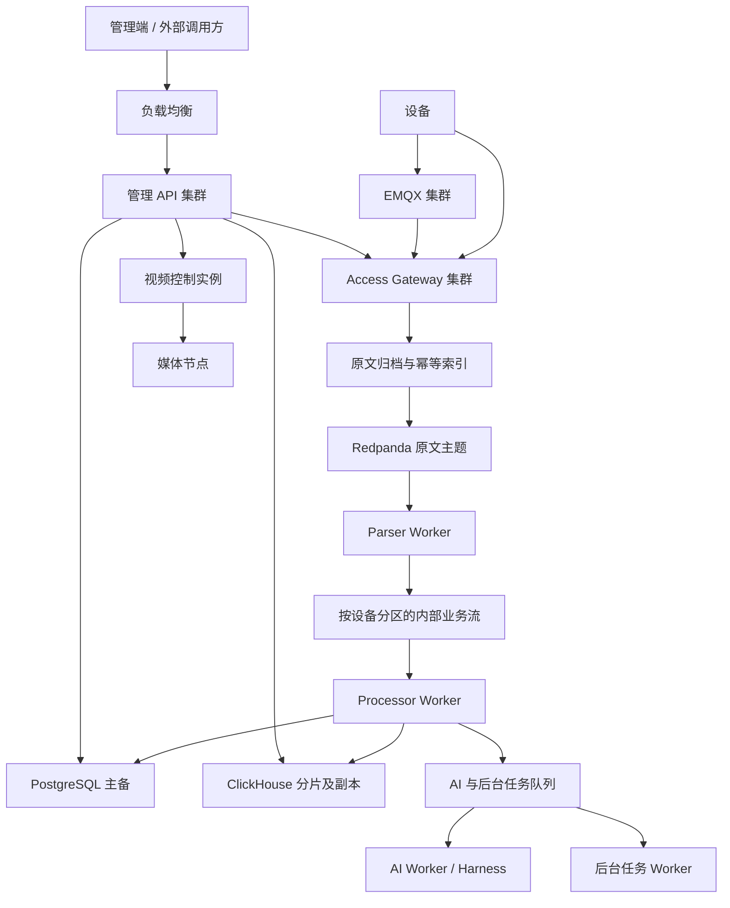
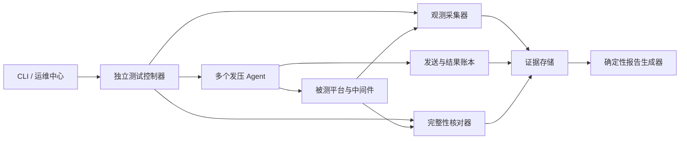

# TorchLink 集群部署与一键全系统容量测试方案

| 项目 | 内容 |
| --- | --- |
| 文档状态 | 设计方案；P1 一键测量闭环已实现，其余阶段待实施 |
| 编制日期 | 2026-09-27 |
| 源码基线 | `main`，`3c273909` |
| 本次工作 | 核对当前源码、配置、既有工具和文档，编写方案 |
| 实施状态 | P1 已实现：`capacity-test plan validate/run/status/stop/report/agent`（`internal/capacity`）与 Gateway `/metrics`，见 [第 17.4 节实施记录](#174-实施记录)。新角色、集群拓扑、存储迁移、故障注入、运维页面仍未实现或验收 |
| 容量数字 | 除明确标为历史记录的数据外，参数均为设计起点或计算示例，不是实测承诺 |

## 阅读导航

- [1. 目标、范围与核心决策](#1-目标范围与核心决策)
- [2. 当前实现与差距](#2-当前实现与差距)
- [3. 目标架构与进程职责](#3-目标架构与进程职责)
- [4. 部署拓扑与资源规划](#4-部署拓扑与资源规划)
- [5. 多节点一致性与接入所有权](#5-多节点一致性与接入所有权)
- [6. 消息与存储集群设计](#6-消息与存储集群设计)
- [7. AI、知识、视频与后台任务](#7-ai知识视频与后台任务)
- [8. 部署、迁移、扩容与回滚](#8-部署迁移扩容与回滚)
- [9. 容量指标与验收口径](#9-容量指标与验收口径)
- [10. 一键压测系统架构](#10-一键压测系统架构)
- [11. 测试计划与操作入口](#11-测试计划与操作入口)
- [12. 场景、数据集与负载模型](#12-场景数据集与负载模型)
- [13. 自动寻找容量边界](#13-自动寻找容量边界)
- [14. 数据完整性、观测与瓶颈定位](#14-数据完整性观测与瓶颈定位)
- [15. 报告、图表与数据格式](#15-报告图表与数据格式)
- [16. 管理界面与访问边界](#16-管理界面与访问边界)
- [17. 实施拆分与验收清单](#17-实施拆分与验收清单)
- [18. 实施前需要冻结的参数](#18-实施前需要冻结的参数)

## 1. 目标、范围与核心决策

### 1.1 交付目标

本项目同时建设两项能力：

1. 在现有 Go/Vue 平台上形成可扩展的集群部署方式，提高满足业务时效、数据完整性和权限要求的持续处理能力。
2. 用一次启动完成测试准备、分布式发压、监测、边界探索、排空核对、报告与图表生成，回答目标环境能承受的报文速率、连接数、业务并发和数据规模。

推荐先建立基准测量能力，再完成集群改造，使用同一计划比较单机、角色拆分和集群部署的结果。报告必须绑定硬件、软件版本、业务配比、数据规模、持久化保证和测量时长。

### 1.2 性能与可用性目标

| 目标 | 拟采用的验收方式 |
| --- | --- |
| 显著提高持续吞吐 | 代表性混合负载下，集群通过档的完整业务吞吐至少达到同版本单机基线的 2 倍；同时报告硬件增量和单位资源吞吐 |
| 独立扩容 | 管理查询、接入、解析、业务处理、AI 可以分别调整实例数与资源预算 |
| 业务正确性 | 已确认数据可追溯；重投不产生重复业务副作用；设备状态、规则触发和恢复符合协议与业务顺序定义 |
| 单节点故障 | 测得各类节点失效后的可持续负载、恢复时间和数据差异；明确哪些模块达到高可用 |
| 可重复测量 | 相同计划、随机种子、数据规模和环境快照能够重复运行，边界有通过档和失败档证据 |
| 可交付报告 | 自动产出 HTML、Markdown、JSON、CSV 和可导出图表，失败或中断也有报告 |

“至少 2 倍”是实施验收目标，不是当前代码或任意三台服务器的性能保证。单机与集群使用不同硬件时，报告必须明确比较条件。若目标未达成，保留结果并定位限制环节，不能以增加入口应答数代替业务吞吐提升。

### 1.3 本方案的边界

- 保留 Go、Vue、EMQX、Redpanda、PostgreSQL、ClickHouse、Redis、Harness 等现有技术栈及业务契约。
- 保留 `RawMessage → 原文归档/幂等索引 → 消息队列 → Parser → StandardMessage → 存储/规则/告警` 的链路职责。
- 不通过跳过认证、原文归档、规则、持久化或权限判断获取漂亮的测试结果。
- 默认单机与本地调试入口继续适用；集群配置通过独立部署清单和角色配置提供。
- 第一版采用固定拓扑的 Linux 多机容器部署，复用现有镜像与在线/离线交付方式。各节点 Compose 由部署清单统一管理，Compose 本身不承担跨宿主调度。已有 Kubernetes 的环境可以承载相同拓扑，新增 Kubernetes 不作为性能改造前提。
- 性能容量、故障容量、恢复能力分别验收。备份成功不能替代高可用或恢复验证。
- 本文中的拟定命令、配置与路径只描述接口设计；除明确列出的现有命令外，不能直接用于当前版本。

## 2. 当前实现与差距

以下结论来自源码基线；未启动目标集群，也未在编写本文时重新压测。

| 项目 | 已有实现 | 集群/自动化差距 | 源码入口 |
| --- | --- | --- | --- |
| 进程角色 | `combined`、`api`、`gateway`；有独立 Gateway 命令 | `api` 仍启动解析、业务消费者、AI、部分任务和视频模块 | [装配入口](../internal/platformapp/app.go)、[角色路由](../internal/httpapi/process_role.go)、[角色配置](../internal/config/config.go) |
| 接入租约 | 以租户、Profile 领取租约，有续租、取消和 fencing token | 同一 Profile 不是多个节点同时接入；会话无透明迁移保证 | [Coordinator](../internal/protocolruntime/coordinator.go) |
| MQTT | 持久 inbox、应用归档确认、共享订阅入口 | 本地队列不跨机复制；需验证共享订阅与持久会话组合、节点身份和断线重投 | [MQTT 适配](../internal/adapters/mqtt/)、[接入契约](INTEGRATION.md#mqtt-接收保障) |
| Kafka 消费 | 固定消费组、按 key 分 lane、连续已完成 offset 提交 | 同设备分属不同主题/消费者时，进程内锁不能提供跨副本串行保证 | [消费者](../internal/adapters/kafka/consumer.go)、[业务引擎](../internal/core/engine.go) |
| 业务去重 | PostgreSQL 唯一键、完成标记、告警事务和 outbox | `ClaimStandardMessage` 对未完成记录的检查不是通用的跨节点独占任务租约 | [PostgreSQL 仓储](../internal/adapters/postgres/repository.go) |
| ClickHouse | `MergeTree` 原文/遥测表；已有批次合并，20ms/1000 行/4MiB 上限条件 | 没有目标分片/副本表迁移与分布式读写路由；批次去重和超时重试需验证 | [仓储](../internal/adapters/clickhouse/repository.go)、[批量写入](../internal/adapters/clickhouse/batch.go) |
| PostgreSQL | 单写入口、每进程连接池；默认 Compose 上限 300 | 主备切换、角色连接预算、读入口与一致性策略待实施 | [部署配置](../compose.yaml)、[仓储](../internal/adapters/postgres/repository.go) |
| Redis | 单地址 `redis.Client` | Sentinel/稳定主节点入口及故障后恢复需适配；不能直接假定支持 Redis Cluster | [Redis 仓储](../internal/adapters/redis/repository.go) |
| Harness/视频 | Harness 有会话缓存和本地 session；视频 manager 持有会话/任务 map | 需明确实例归属和故障恢复；不能直接随机轮询 | [Harness gateway](../deploy/deepseek-harness/gateway.mjs)、[视频 manager](../internal/video/manager.go) |
| 压测 | `provision/ingest/http/mqtttok/mqttconn/mqttpub/tcp/canary/sample`；P1 新增一键编排子命令、Agent 租约、ID 核对、边界搜索与报告 | 故障注入、AI/视频/知识/备份/实时推送场景适配、告警预期序列核对、运维页面 | [capacity-test](../cmd/capacity-test/)、[capacity 包](../internal/capacity/) |
| 容量前置检查 | 读取连接预算、主题分区/副本、部分表引擎和 Broker 观测 | 不能证明完整拓扑、故障容量或生产吞吐；始终输出 `clusterCapacityVerified=false` | [capacity-check](../cmd/capacity-check/main.go)、[预算检查](../internal/deploycheck/capacity.go) |
| 指标采集 | 进程计数器、部分 gauge、消费 lag；Go 堆与 goroutine gauge；Gateway 角色已放行 `/metrics`；一键测量逐实例采集 | 平台侧仍无分阶段直方图与最老消息年龄；`/metrics` 无鉴权，靠网络边界保护 | [指标](../internal/metrics/metrics.go)、[压测采集](../cmd/capacity-test/main.go)、[角色路由](../internal/httpapi/process_role.go) |

已有 [2026-09-27 容量报告](CAPACITY_TEST_REPORT_2026-09-27.md) 包含历史故障、修复及代表性复测。使用时须区分原始章节和第 11 节的后续复测。本文不将其中吞吐、连接数或故障路径视为本次重新验证结果。

## 3. 目标架构与进程职责

### 3.1 逻辑结构



原文归档节点表示逻辑步骤，数据仍按当前 PostgreSQL/ClickHouse 分层规则持久化。图中的内部业务流为拟新增的顺序归属设计，外部解析结果、业务事件和历史回放契约继续保留。

### 3.2 拟定角色

保持单仓库与共同业务实现，不按角色复制业务代码。角色名是设计名称，尚不是可用的 `IOT_PROCESS_ROLE` 值。

| 角色 | 职责 | 扩容依据 | 运行状态 |
| --- | --- | --- | --- |
| `gateway` | 连接、协议 framing、鉴权、Raw 归档、应用确认、命令路由 | 活跃连接、归档时延、inbox 年龄、CPU/磁盘 | 持有连接和独立持久队列 |
| `api` | 管理 HTTP、权限校验、查询、任务提交、实时展示入口 | 请求时延、队列等待、CPU | 业务状态外置；连接关闭支持重连 |
| `parser` | Raw 消费、协议解析、结果持久化和业务流发布 | 原文 lag、最老消息年龄、解析耗时 | 消费组成员；协议制品本地校验缓存 |
| `processor` | 标准消息、规则、设备状态、告警和处理完成标记 | 业务流 lag、数据库等待、规则耗时 | 按设备串行，跨设备并行 |
| `ai` | 告警研判及其他模型任务的执行与结果处理 | 任务年龄、供应商额度、Harness 容量 | 任务有领取、去重、取消与恢复状态 |
| `jobs` | 巡检编排、导出、补偿、索引编排、定时扫描等 | 待执行任务量、资源预算 | 定时触发有所有权；执行有任务租约 |
| `video-control` | SIP、播放会话、媒体任务与撤销 | 摄像头/会话数量、控制请求、媒体健康 | 按媒体节点/摄像头确定执行所有权 |

`combined` 保留本地和单机使用能力。切换 `api` 到新职责时必须连同 Worker 部署一起进行，避免新 API 不再消费而目标 Worker 尚未启动。每个角色只初始化必需依赖，健康检查也按本角色职责判断。

### 3.3 路由与资源隔离

| 请求或任务 | 目标 | 约束 |
| --- | --- | --- |
| 管理查询、登录、权限管理 | API 集群 | 既有用户、租户和设备范围校验继续生效 |
| 设备 HTTP 上报、开放上报 | Gateway 接入能力 | 审核全部入口，确保不会绕过原文链路或因代理丢失身份 |
| MQTT 上报 | EMQX → Gateway 共享订阅 | Broker 授权与平台设备鉴权同时保留 |
| 被动 TCP/UDP 接入 | 当前拥有 Profile 的 Gateway | 负载均衡按监听资源健康选择目标；普通进程存活不代表持有该 Profile |
| 命令下发与回执 | 当前会话所有者 | 转发次数有限，目标节点重新校验原用户权限 |
| 导出/PDF/巡检等重任务 | API 提交 → jobs | 保留现有必要的同步兼容入口，迁移为明确的任务状态与下载流程 |
| AI 请求 | API/事件 → AI 调度 → Harness | 所有模型业务保持 Harness 工作流；不用直连 Provider 替代 |
| 视频媒体流 | 摄像头 ↔ 媒体节点 ↔ 浏览器 | API 只负责控制与授权，容量单独计量 |

角色资源用 CPU、内存、连接池、队列长度和任务并发共同限制。第一版按固定副本数验证；后续弹性伸缩使用 lag、队列年龄与依赖负载，避免仅根据 CPU 扩容放大数据库或模型压力。

## 4. 部署拓扑与资源规划

### 4.1 逻辑实例起点

| 组件 | 建议起点 | 说明 |
| --- | --- | --- |
| 负载均衡 | 2 实例或现有高可用负载均衡 | 覆盖 HTTP 与所需 L4 入口，稳定域名/地址 |
| Gateway / API | 各 3 实例 | 可先各 2 实例验证，再逐级增加 |
| Parser / Processor | 各 3 实例 | 数量受分区、设备热点、数据库能力约束 |
| AI / jobs | 各 2 实例 | 任务去重后多实例执行；定时触发按租约互斥 |
| EMQX | 3 节点 | 连接、消息、管理观测逐节点采集 |
| Redpanda | 3 节点 | 业务主题复制因子 3，所有关联 DLQ 也纳入清单 |
| PostgreSQL | 1 主 + 2 备 | 配自动切换与仲裁，数据库写能力仍以主库为边界 |
| ClickHouse | 验证起点为 2 分片 × 2 副本 | 4 个数据实例、3 个 Keeper；要求失去一个副本后仍维持双副本写确认时，采用每分片 3 副本，见第 6.3 节 |
| Redis | 1 主 + 2 副本及 Sentinel | 先采用非分片形态，匹配现有数据访问方式 |
| Harness | 1～2 实例起步 | 按真实模型预算及会话归属扩展 |
| 视频控制 | 单执行者 + 备用 | 需要补齐所有权后使用；媒体分组独立规划 |
| 知识、对象存储、备份与监控 | 独立资源池 | 是否多副本根据本方案中对应功能的可用性目标验收 |

实例数量不等于服务器数量，也不是采购清单。应用可在计算节点混部；同一份数据的副本、仲裁成员和主备不得集中在同一物理故障域。

### 4.2 两种部署规模

**验证集群**用于确定扩容曲线：至少 3 台独立 Linux 主机，计算与中间件可以按资源限额混部，另配 2 台或更多负载机。初始资源参考每台 16 vCPU / 64GiB 内存 / NVMe / 10GbE，最终以可用预算调整。虚拟机必须说明宿主归属；同一宿主上的多个 VM 不算多个独立故障域。

验证集群可以放置 4 个 ClickHouse 实例，但同分片的两个副本必须跨主机。混部导致的资源竞争是该部署形态的真实限制，不能从结果推算专用节点的容量。

**生产参考拓扑**按资源池分离，不要求一次购齐所有节点：

| 资源池 | 初始节点布局 | 单节点资源候选 | 何时独立扩容 |
| --- | --- | --- | --- |
| 计算池 | 3 台起步，承载 API/Gateway/Worker | 8～16 vCPU，16～32GiB；Gateway 有独立持久盘 | CPU、任务年龄或连接容量成为瓶颈 |
| 消息池 | Redpanda 3 台；EMQX 按测量决定是否同池 | 8～16 vCPU，32GiB，独立 NVMe | 消息写入/复制或连接负载饱和 |
| PostgreSQL 池 | 3 台，1 主 2 备 | 16 vCPU，64GiB 起评估，独立低延迟 NVMe | 主库写入、WAL 或锁/查询成为瓶颈 |
| ClickHouse 池 | 验证档 4 台；严格持续写入档 6 台，2 分片各 3 副本 | 16 vCPU，64GiB 起评估，NVMe | 数据量、写入合并、确认保证或查询资源饱和 |
| 辅助池 | 按实际功能分配 | 知识嵌入、媒体、备份、监控独立计量 | 对应模块压测确定 |
| 发压池 | 2 台起步，可动态增加 | 足够 CPU、网卡、源地址和文件句柄 | 计划到达速率与实发速率出现差距 |

上表只用于资源预算评审。业务数据盘容量应按第 9 节计算；不以“统一 1TB”代替保留期规划。复制、查询返回、备份和重建流量一起计入网络预算。CPU 型号、磁盘持久化特性和云盘限速必须记录，不能只比较核数。

### 4.3 全局连接预算示例

当前默认每进程 64 个 PostgreSQL 连接，多角色直接沿用会很快超过服务端上限。未来需要按角色配置：

| 角色 | 实例数 | 单实例池上限示例 | 合计 |
| --- | ---: | ---: | ---: |
| API | 3 | 12 | 36 |
| Gateway | 3 | 12 | 36 |
| Parser | 3 | 16 | 48 |
| Processor | 3 | 24 | 72 |
| AI | 2 | 4 | 8 |
| jobs | 2 | 4 | 8 |
| 视频控制 | 2 | 4 | 8 |
| 合计 | 18 | — | 216 |

以数据库上限 300、其他服务和管理预留 40 为例，常态预算为 256；一次额外启动一个 24 连接的 Processor 为 280。并行滚动多个角色必须重新计算。实际还应统计部署探针、备份、迁移、导出和报表连接。

这个示例只证明算术不超限；连接等待、CPU、锁、WAL 和存储仍可能先达到边界。连接池最小值、空闲时间、最大生命周期和数据库切换后的重连行为都进入配置清单。

## 5. 多节点一致性与接入所有权

### 5.1 同设备处理顺序

现有 Kafka lane 能在一个订阅内部按 key 串行；不同业务主题、不同进程和再均衡期间不能借此推断全局 FIFO。

目标设计：

1. 内部处理 key 采用无歧义编码的 `(tenantId, deviceId)`，避免同名设备跨租户形成错误归属。
2. 影响设备状态、规则和告警的事件进入同一个按设备分区的内部业务流；原有对外事件主题继续提供各自契约。
3. 同一设备在一个消费分区内顺序处理，不同设备并行；主子设备分别保存身份与授权边界。
4. 协议提供序号时保存设备启动周期/序号/协议版本；定义重复、迟到和过期状态更新规则。不能仅用不可信设备时间戳决定业务新旧。
5. 协议没有可比较序号时，顺序保证限定为规范化内部流的提交顺序，不承诺跨连接、跨协议的真实发生时间顺序。
6. 再均衡和停止时先停止接收新工作，等待已领取工作完成或安全失效，再提交连续已完成 offset。必须验证旧消费者迟到写入的 fencing。

引入新业务流会改变消费路径，需要第 8 节的停写边界/排空/切换流程；禁止新旧业务消费者同时对同一事件产生副作用。

### 5.2 跨节点任务领取与幂等

业务消息处理增加原子领取与执行代次，逻辑状态建议为 `PENDING → PROCESSING → SUCCEEDED/FAILED`，包含所有者、租约期限、重试次数和 fencing token。

- 领取必须是数据库原子操作；检查 `processed_at=0` 后直接运行不能单独构成互斥。
- 租约超时允许接管；旧实例的完成和状态写入须携带代次检查，不能覆盖新实例结果。
- 消息唯一身份继续使用业务消息 ID/原文 ID；告警报告与通知按告警和触发身份去重，不能把多次合法上报合并成一次。
- 复用已有事务 outbox 和 `SKIP LOCKED` 领取能力，补齐并发、超时、重投与提交失败测试。
- 原文/解析结果已经保存但队列发布失败时，保留可恢复的发布状态；新业务流不能因“先标完成、后发布”而漏处理。
- 外部通知和跨 PostgreSQL/ClickHouse 的写入不能描述为一个原子事务。每项记录完成状态、可重试身份和核对结果，保证业务幂等及可恢复。
- 已确认、恢复、关闭等用户操作也参与设备业务一致性设计，不能只串行消费上报而忽略管理 API 的并发修改。

### 5.3 TCP/UDP 与主动采集

一期复用 Profile 租约：每个 Profile 同时只有一个执行节点，多个 Profile 分配到多个 Gateway。主动连接、定时查询和 Modbus 轮询保持单执行者，避免重复采集或重复控制。

被动监听需要资源级健康：负载均衡只能将该监听的新连接交给当前所有者。所有者故障后等待租约接管，旧连接由设备重连；不得承诺现有 TCP 连接在节点间无缝搬迁。

如果单一 Profile 已达到连接或处理上限，再进入二期多活监听：监听资源与设备会话所有权分离，增加设备会话目录、命令定向转发、重新登录和重复连接替换规则。UDP 还要定义源地址变化、设备身份及会话过期的对应关系。

`IOT_ACCESS_NODE_URL` 必须精确指向执行实例。对外入口可以负载均衡，内部所有者地址不能使用随机分流地址。所有转发保留用户授权并在目标节点再次校验；内部节点身份不能替代用户权限。

### 5.4 MQTT inbox 与归档确认

- 每个 Gateway 使用独立目录、持久卷和 client ID；不能共享同一可写 inbox 路径。
- 相同共享订阅组分担接收；订阅者离线时的 Broker 会话保留、队列上限和再投递单独配置和验证。
- inbox 落盘与 Broker ACK、应用归档确认、业务处理完成继续分别记录。
- 应用归档确认的持久性取决于实际归档数据库的复制与写确认策略；本地 inbox fsync 不能代替数据库跨节点持久化。
- 丢失 inbox 卷时，对尚无应用确认的消息依靠设备保留和原文重试；收到应用确认的消息须能从归档链路继续处理。
- 节点身份恢复、重复 client ID、磁盘满、损坏隔离、订阅者永久离线都要有场景测试，不能以队列清空作为补传成功证据。

共享订阅会话的离线积压及消息重新分发语义应按锁定的 EMQX 版本验证；官方说明可作为行为设计参考：[EMQX Shared Subscription](https://docs.emqx.com/en/emqx/latest/get-started/messaging/mqtt-shared-subscription.html)。

### 5.5 权限、缓存和限额

缓存键包含租户、用户及必要的权限版本。权限撤销、设备范围变化、协议发布和规则修改触发跨节点失效，断线实例恢复后重新校验版本。实时订阅、AI MCP、历史查询和视频会话都必须生效。

现有设备/开放接口部分限流按进程计数，多副本会放大额度。目标使用明确的集群总额度与原子扣减；权限撤销和额度存储故障不能默认放宽访问。对于不适合依赖 Redis 的关键额度，使用持久任务领取或数据库预算。Redis 的主备切换可能影响未同步的计数，不能宣称严格配额仅靠异步缓存复制即可保证。

配置、会话与限额的传播时效纳入验收。吞吐测试保留正式额度；因额度触顶的结果标记为“策略限制”，与 CPU/磁盘等资源上限分开。

## 6. 消息与存储集群设计

### 6.1 Redpanda

推荐 3 Broker，生产业务主题和 DLQ 使用复制因子 3，副本跨主机。保留生产者等待可靠写入确认的要求，按所用 Redpanda 版本确认多数派、刷盘和故障语义；不要直接照搬另一种 Kafka 实现的参数含义。

| 项目 | 设计要求 |
| --- | --- |
| 主题管理 | 从正式清单创建所有业务、重试及 DLQ 主题，校验实际分区数、复制与保留策略；运行时自动创建不能产生遗漏的单副本主题 |
| 分区数 | 以已有 12 分区作为基线，24/48 作为有需要时的候选；依据有效消费者数、热点与实测吞吐选择 |
| 消费组 | 每个处理职责保持固定组名；同组共享分区；不能为每个副本随机创建新组造成全量重复消费 |
| key | 使用统一租户/设备编码；告警任务使用稳定的告警/触发身份 |
| 消费并行 | 区分 Broker 分区数、消费进程数和进程内 lane 数，三者不能互相当作相同的并行容量 |
| 存储 | 独立磁盘预算，同时计入复制、多个业务主题、重试、DLQ 和恢复期间的额外保留 |
| 监控 | 各 topic/partition/group lag、最老消息年龄、生产/消费速率、复制健康、磁盘和写入延迟 |
| 扩分区 | 新 key 映射可能变化，旧消息不会自动重分布；有顺序要求的主题按受控切换流程调整 |

分区提高并行度，副本提供数据冗余；复制也消耗网络和磁盘。不能按复制因子将业务吞吐直接乘三。[Redpanda 主题与分区说明](https://docs.redpanda.com/streaming/current/develop/manage-topics/config-topics/)

### 6.2 PostgreSQL

推荐单写主库、两个备用节点，使用具备仲裁和旧主隔离的自动切换机制。自建可选 Patroni 与独立的三成员协调集群，已有托管 PostgreSQL 时复用其可验证的主备能力。最终选择在部署清单中固定，不同时维护两套切换控制者。

目标行为：

- 对已确认归档、权限和业务状态，明确同步复制和可提升副本的策略。若要求单节点失效后已确认数据不丢失，就按该目标配置复制及确认；供应不足时明确拒绝/等待，不能静默降低保证。
- 所有写入走稳定主库入口；发生切换后连接池丢弃失效连接，在限定时间内重试可幂等操作。
- 权限、凭据撤销、写后立即读取、告警确认与恢复走主库或已满足一致性条件的读取路径。
- 允许延迟的历史查询/报表才使用只读副本，并显示或限制复制延迟。若副本落后超过预算，按计划回主库或拒绝重查询，避免失效时查询全部冲击主库。
- 主库可用连接预算按角色、滚动升级和后台任务总量核算。启用 PgBouncer 前验证 pgx 预备语句、事务模式及锁语义；第一阶段可先使用应用池与稳定写入口。
- 查询热点按实际执行计划治理；大规模历史表的时间分区和保留期迁移须保留幂等唯一性、外键、回放及查询语义。不得直接通过删历史或关闭 WAL 抬高数字。
- 原文索引与标准消息仍产生 PostgreSQL 写入。若批次、索引、查询和连接预算优化后仍受写主库限制，再单独评审租户路由和分库；初期不将备库数量视为写吞吐倍数。

PostgreSQL 热备只读且可能存在复制延迟；PgBouncer 事务池对会话级能力有明确限制，实施必须按实际使用特性验证。[PostgreSQL Hot Standby](https://www.postgresql.org/docs/17/hot-standby.html)、[PgBouncer 功能兼容表](https://www.pgbouncer.org/features.html)

### 6.3 ClickHouse

以 2 分片、每分片 2 副本、3 Keeper 作为性能与复制验证起点。生产拓扑还需根据写入确认目标选择副本数，不能把双副本直接解释成任何故障下都可写。每分片的复制表承载数据，分布式表或显式路由提供统一访问。

| 确认策略 | 单个副本不可用时的边界 | 适用定位 |
| --- | --- | --- |
| 每分片 2 副本、只等待本地写入 | 可能继续接收，但尚未复制的数据不能获得相同的跨节点保障 | 性能探索档，必须标注实际保证 |
| 每分片 2 副本、等待 2 副本确认 | 剩余 1 副本不能满足原确认策略，应等待或拒绝新写入 | 保持双份确认，允许故障期间暂停写入 |
| 每分片 3 副本、等待至少 2 副本确认 | 单副本失效后仍有满足确认的数量条件，实际可用性需演练 | 要求单节点失效后持续写入并保持双份确认的生产候选 |

上述数量关系依据 ClickHouse quorum 写入语义推导；仍需验证 Keeper、多分片转发、读取一致性、磁盘持久化和超时重试。严格生产候选使用第三档，数据节点资源由 4 个增加到 6 个。不得在故障时静默降低 quorum 后仍按原保证报告通过。[ClickHouse insert_quorum](https://clickhouse.com/docs/reference/settings/session-settings/insert-quorum#insert_quorum)

| 设计项 | 要求 |
| --- | --- |
| 分片键 | 根据 `(tenantId, deviceId)` 稳定分片，保证同设备历史查询可定位；处理大租户和热点设备倾斜 |
| 表与查询 | 迁移原文/遥测表为合适的复制表；保留按时间分区、租户/设备过滤、原文 ID 定位能力 |
| 写入确认 | 明确本地接受、分布式转发和副本写入的区别；不能将仅写入异步转发缓冲解释为归档已满足跨机持久性 |
| 批次 | 复用已有批量写入，补充在途批次/字节上限、关闭时 flush、超时状态与实际批次大小指标 |
| 重试去重 | 固定消息身份与批次身份；验证重放 token/去重窗口的条件；不能把复制表当作全局 UNIQUE 约束 |
| 完整性 | 超时可能写入成功，业务完成账本与物理行数/唯一 ID 分别核对；发现缺失或重复有可定位补偿流程 |
| 查询隔离 | 历史大查询、导出与核心写入分别设置资源预算，记录内存、扫描量与并发限制 |
| 维护 | 监控 parts、合并积压、复制队列、分布式发送队列及 TTL 执行；将副本重建计入容量 |

当前建表是单节点 `MergeTree`，上线前要完成迁移和一致性验收，不能仅修改连接地址。自建分片/副本拓扑与 Distributed 路由可参考 [ClickHouse 两分片两副本部署](https://clickhouse.com/docs/guides/oss/deployment-and-scaling/examples/2-shards-2-replicas)。

迁移要求：先建新表及集群定义，用稳定切分范围回填并核对；在维护边界停止新写入并排空旧链路，补齐最后增量，再切换读写。历史原文索引必须仍能正确找到归档。保留旧数据到验证完成。无完整双写账本和冲突处理之前，不以临时双写代替迁移方案。

### 6.4 EMQX

部署 3 节点并提供稳定 MQTT/TLS/WebSocket 入口。连接建立、持有连接和持续发布分别测试；同一 source IP 的端口限制、负载均衡连接跟踪与 TLS 开销需要单独观测。

冻结以下配置：客户端最大连接、文件句柄、keepalive、会话过期、订阅组策略、inflight、消息队列上限、消息大小与鉴权/授权回调预算。标准设备短期 token 的签发、到期、续期和撤销也属于连接容量测试。

对共享订阅可以评估按发布者身份的稳定分配，但 Broker 分配策略不能单独保证跨协议、跨重连和本地 inbox 的业务顺序。顺序依据仍由第 5 节确定。应用归档确认超时记为结果未知并允许同字节重试，不能立即认定丢失，也不能算成功。

### 6.5 Redis、对象存储与协议制品

Redis 第一阶段采用主备加 Sentinel 或经过验证的稳定主地址，客户端增加对应接入与重连能力。现有跨 key 的事务/集合操作须保留语义；若以后引入 Redis Cluster，另行核对 hash slot、事务和脚本约束。

缓存可以从持久仓储恢复；缓存失效时用并发预算和短期合并请求保护数据库。权限相关缓存不能在数据库/版本未知时扩大范围。

MinIO 使用独立分布式部署或现有可靠对象存储。备份制品与协议源码/二进制制品按用途隔离，验证下载、校验、恢复和版本保留。协议制品以不可变版本及摘要为身份，各节点从统一来源取得只读副本并校验；原文存储继续沿当前 PostgreSQL/ClickHouse 路由，不恢复逐条上传 MinIO。

## 7. AI、知识、视频与后台任务

### 7.1 AI 全局预算与 Harness 会话

所有模型业务保持 Harness 工作流。模型管理连接测试和配置同步继续使用 Provider 既有职责。AI 调度同时管理自动研判、手动研判、聊天、巡检、运维报告、协议助手与规则草稿的预算，不能只限制自动研判。

任务身份至少包含租户、工作流、业务资源与触发身份。领取、执行、取消、超时、成功、失败和跳过分别记录；告警恢复时取消研判，过期任务不挤占新任务，跳过不算成功。

全局模型能力受以下较小值限制：可用执行并发、请求额度、token 额度、Harness 资源和提供方实际响应。估算可以用 `并发/平均耗时`、`RPM/60` 与 token 预算推算，但结果标为估算，长尾、一次工作流多次调用、工具请求和重试必须进入实测。

Harness 的会话按租户/用户/会话身份路由到确定实例；会话锁、持久会话记录与恢复策略要先明确。新实例能处理新任务不等于可以继续旧实例正在运行的会话。故障时对可安全重试的工作流重试，对不可确认执行结果的任务保留未知状态。

真实 AI 测试设置请求数、token、时间和费用上限。供应商额度未知时不输出“AI 最大吞吐已验证”。模拟 Provider 可以测平台调度上限，报告单独列出模拟方式，不能替代真实 Harness/DeepSeek 端到端结果。

### 7.2 知识库

上传、解析、分块、嵌入、索引、检索分别观测。索引任务有独立并发和 CPU/内存预算，避免与实时设备处理争用。保留租户、Agent/workflowId 范围，不允许无范围检索回退。

Weaviate 与嵌入实例根据文档量、向量数量、更新速率、检索 P95 和恢复要求单独规划。Ollama 继续用于嵌入，不将本地对话模型引入当前方案。仅在完成对应存储与副本测试后，将知识库列为高可用模块。

### 7.3 视频

摄像头资料与设备关联始终由正常管理链路提供。视频控制先采用单执行者加备用，以媒体节点/摄像头确定任务所有权，持久会话恢复后重新校验权限。

SIP 注册、INVITE 与播放会话具有状态。控制节点故障后的重新注册/点播、媒体 hook 路由和权限撤销分别验收。现有 SIP 连接不能被描述为透明跨节点迁移。多媒体节点按摄像头或流归属分配，API 不搬运视频数据。

视频容量包含源流数、观看人数、码率、首帧、卡顿、丢包与控制时延。若配置允许转码，单独记录转码模式及资源；摄像头清单查询成功不能替代播放验收。未部署媒体模块的报告必须标记视频未覆盖。

### 7.4 后台任务与备份

周期性调度由租约或唯一计划键保证只触发一次，任务执行允许多个 Worker 领取。已具有事务领取的 outbox 继续复用；未具备所有权的扫描、报告和同步任务逐项改造。

备份保留专用任务预算，记录备份期间对上报和查询的影响。恢复验证必须使用独立目标库/桶/目录，不覆盖当前被测业务库。报告分开列出备份生成、制品下载与校验、实际恢复、恢复后业务检查结果。

### 7.5 可观测性

Prometheus 逐实例采集，服务标签至少包含环境、集群、角色和实例。Gateway、Worker 和其他角色都提供受控健康与指标端点；指标端点不可因业务路由裁剪而不可达。

监控部署应能在被测 API 不可用时继续记录。关键原始指标和控制器日志保存在负载侧，避免系统故障同时抹去压测证据。监控组件的高可用和保留期单独配置；被测数据与历史测试数据可以区分。

## 8. 部署、迁移、扩容与回滚

### 8.1 交付物

以下均为后续实施拟交付内容，本次仅提供设计：

| 交付物 | 内容 |
| --- | --- |
| 集群清单 | 节点、物理故障域、角色、端口、磁盘、服务地址、镜像摘要、凭据引用 |
| 角色配置 | 单节点/拆分/集群模板，角色连接池和资源预算，敏感值外置 |
| 中间件初始化 | 主题、分区、副本、表、路由、缓存及协调配置的幂等初始化与核验 |
| 部署入口 | 复用在线/离线交付方式，由清单对明确节点执行准备、启动、健康与回滚 |
| 迁移说明 | 旧新拓扑的停写、排空、回填、校验、切换、回滚边界 |
| 运维说明 | 单角色扩容、滚动更新、故障接管、制品恢复、连接预算检查 |

本地、在线、离线配置继续独立；集群是在线/离线的部署形态，不混用 `.env.local`。离线包包含选定版本镜像与工具，但真实 AI 仍需要可达的 DeepSeek API 和有效密钥。

### 8.2 部署顺序

1. 冻结版本与资源清单，校验主机时间、网络、磁盘、节点地址和凭据引用。
2. 建立数据库/消息/协调服务，确认副本健康与持久化保证。
3. 运行一次受控 schema/主题迁移，记录版本；普通角色启动不并发执行重量级数据迁移。
4. 分发并校验协议制品，准备每节点独立 inbox 和任务目录。
5. 启动 Parser、Processor、AI/jobs 与需要的视频控制者，确认组成员和执行所有权。
6. 启动 API/Gateway，先用少量测试设备验证原文、解析、状态、告警和权限，再开放正式流量。
7. 运行容量前置检查和快速回归，保存部署快照。

readiness 仅表示角色已满足接收工作的条件；业务成功另由小流量链路验证。依赖短时不可用时应有明确退避和健康状态，避免频繁重启扩大故障。

### 8.3 旧系统迁移

推荐第一版使用明确维护窗口：停止或限制新上报并让设备保留未确认消息，排空业务队列，保存一致的数据库/offset/制品检查点，完成数据迁移后切换入口，再逐步放量。

回滚必须依据检查点和新环境已接收的数据：切换后产生新写入时，不能仅把负载均衡切回旧库。先停止接入，核对增量去向，执行已验证的回迁/重放或继续修复新环境。消息 offset 不随意重置，DLQ 不删除，保留原文 ID 与协议快照。

### 8.4 扩缩容与升级

| 操作 | 关键步骤 |
| --- | --- |
| API 扩容 | 计算额外连接预算，预热必要缓存，加入负载均衡，观察时延与主库负载 |
| Gateway 扩容 | 新 client ID/独立卷；共享订阅加入；按计划分配 Profile，不迁移既有连接冒充平滑接管 |
| Worker 扩容 | 检查分区/消费者关系，稳定 consumer group，限制再均衡期间的重复处理 |
| Worker 缩容 | 停止领取，处理或释放任务，提交安全 offset，保证租约和旧写入失效 |
| Broker/存储扩容 | 按组件流程复制/重分布并限制重建流量；业务容量测试包含重建期间 |
| 协议版本更新 | 各节点先取得并校验制品，保留帧/命令边界及历史快照 |
| 角色滚动升级 | 保证契约兼容、预留 surge 连接和内存；分角色推进，保留回滚镜像 |

自动弹性伸缩作为后续能力，在固定副本 1/2/3/6 的扩容曲线与再均衡测试通过后引入。不得在同一次容量测量中无记录地改变副本数。

## 9. 容量指标与验收口径

### 9.1 容量是带条件的向量

结果绑定以下条件：硬件 H、拓扑 T、软件版本 V、数据集 D、业务比例 W、确认保证 G、时效目标 S、测试持续时间 L。

`C(H,T,V,D,W,G,S,L)` 至少包含：

| 维度 | 单位 | 定义 |
| --- | --- | --- |
| 接收能力 | 请求/秒、消息/秒 | 入口完成的速率，需注明具体确认阶段 |
| 持续业务吞吐 | 唯一业务消息/秒 | 达到该类型应完成的持久化、规则和状态结果 |
| 数据处理量 | 字节/秒、字段值/秒 | 记录原始载荷大小、字段数及消息派生数量 |
| 连接能力 | 在线连接数、建连/秒 | 实际存活且经过保持期的连接，重连另计 |
| 用户并发 | 用户数、在途请求数 | 真实操作组合与思考时间；在途请求数不直接称为用户数 |
| 告警/AI 能力 | 触发/秒、任务/分钟 | 业务告警生成、通知、AI 完成分别计量 |
| 历史数据规模 | 设备数、记录数、字节 | 在该规模上满足指定查询/写入要求的最高已验证档 |
| 突发能力 | 倍率、秒、排空秒数 | 可接受突发及恢复时间，不替代持续容量 |
| 故障容量 | 同上各维度 | 指定一类节点失效后的剩余能力 |

单项最大值不能相加形成综合容量。混合测试按固定比例整体放大负载，形成混合场景的可行边界；可对几种有意义的比例分别测量，不做无预算的所有参数笛卡尔积。

### 9.2 建议初始 SLO

以下为测试计划默认候选值，需结合实际消防业务时效冻结。它们不是当前实测结果，端到端延迟从预定发送时刻开始计算时须包括发压端等待。

| 项目 | 候选通过条件 |
| --- | --- |
| 有效业务请求 | 成功率 ≥99.9%；HTTP 429、超时和业务失败分别报告 |
| 普通管理查询 | P95 ≤500ms，P99 ≤1500ms |
| 普通报文业务完成 | P95 ≤2000ms，P99 ≤5000ms |
| 告警产生 | 接入至持久化告警 P95 ≤2000ms；通知和 AI 使用独立目标 |
| 数据正确性 | 无已确认消息缺失；无重复业务副作用；状态与预期一致 |
| 管道稳定 | 有效窗口内队列无显著持续增长，最老消息年龄在预算内 |
| 恢复 | 停止加压后在计划 drain 时限内完成对账并恢复管理 SLO |
| AI 综合场景 | 成功率、任务年龄和完成延迟均符合独立 AI SLO；跳过/超时不计成功 |
| 故障场景 | 按节点类型规定重连、接管和恢复时限；数据完整性要求保持 |

预期的无效凭据、畸形帧和权限拒绝属于独立负向用例，不混入有效业务成功率。过载保护返回 429 可以证明保护生效，但该档不能因为拒绝迅速而通过正常业务容量验收。

### 9.3 “最大”的报告规则

报告必须同时给出：最高重复通过档 L、最低重复失败档 U、失败原因、测试时长和搜索精度。输出形式为“本次条件下，稳定通过 L，在 U 失败，边界位于两者之间”。

如果未触达失败档，输出“至少达到 L，尚未找到上限”。如果因负载机、观测、费用、时间或预设限额停止，明确停止原因。存在证据缺失时输出 `inconclusive`，不能填 0 或标记通过。

零丢失是本次观察结论，不代表永远不会丢失；关键完整性用例使用全量 ID 核对。仅抽样的结果必须标记抽样数量和覆盖范围，不得等同全量数据证明。

### 9.4 设备数、存储量与建议运行值

设已验证混合负载中的持续业务吞吐为 R 条/秒，每台活跃设备每 T 秒上报一条：

- 每日业务报文数：`R × 86400`。
- 吞吐对应的活跃设备数：`R × T`，还须受已验证活跃连接、建连和每设备额度限制。
- 如果只有 p 比例设备活跃，注册设备数不能仅按 `R × T / p` 直接宣称验证；仍需相应规模的数据集与实际连接分布测试。
- 平均在途请求可用 Little 定律 `L = λ × W` 检查一致性；W 使用平均响应时间，不把 P95 代入并称为并发用户数。

各存储系统分别计算：`数据盘需求 ≈ 实测逻辑增长字节/秒 × 保留秒数 × 数据副本数 + WAL/索引/合并/重建/备份余量`。若采集的是全副本物理增长，则不再乘副本数。Kafka 计算全部相关主题，ClickHouse 在后台合并达到稳定状态后测压缩占用；PostgreSQL 计入索引、膨胀、WAL 与归档。

算术示例：若某次 R=1000 条/秒、T=60 秒，则对应 60000 台活跃设备及 8640 万条/日；这只演示换算，不是 TorchLink 当前容量。

上线建议在固定业务比例下取健康容量与已测故障容量的较小值，再保留明确余量，例如 `0.7 × min(R健康, R故障)`。0.7 是可调整的运行策略，不是测量值；没有故障容量证据时，不输出有 N−1 保证的建议值。

## 10. 一键压测系统架构

### 10.1 组件分工



| 模块 | 设计职责 |
| --- | --- |
| Controller | 校验计划、生成 runId、调度阶段、分配速率/设备、判断边界、停止/恢复、维护任务状态 |
| Agent | 运行现有协议发压能力、按计划配速、保存发送账本、采集自身资源和调度延迟 |
| Collector | 逐实例拉取指标、资源、Broker 和数据库状态；不通过随机负载均衡采同一计数器 |
| Verifier | 按消息/任务身份核对原文、解析、落库、规则和预期状态 |
| Reporter | 按固定规则生成结论、表格和图形；同一证据可离线重新生成报告 |

优先复用现有 `capacity-test` 模式及 `capacity-check`，将场景执行抽成可组合能力。避免为 HTTP/MQTT/TCP 再建立不同统计口径。必要的新浏览器或媒体测试适配器与原工具共享 runId、时间窗口和报告格式。

### 10.2 运行与结果状态分开

运行状态建议：`QUEUED → PREFLIGHT → PREPARING → WARMUP → RUNNING → DRAINING → VERIFYING → REPORTING → FINISHED`，另有 `CANCELLING/CANCELLED/FAILED`。

容量结论单独记录 `passed/failed/inconclusive/not_covered`。正常完成的探索任务可以包含失败档；控制器任务执行失败也不能把已经保存的有效结果全部丢弃。

每次阶段切换持久化事件。runId 全局唯一，phaseId/attemptId 区分重复运行与恢复。Agent 使用分配代次，控制器切换后旧代次不得继续发压。

### 10.3 失联和停止

Controller 与 Agent 在被测 API 之外通信。Agent 持有短期发压租约；控制器失联后到期停止发送新请求，保存本地结果。被测 API 不可用时停止按钮仍可通过控制器生效。

停止分为：停止新负载、等待有限在途请求、观察排空、核对和输出部分报告。强制退出也尽量先保存阶段数据，不无限等待模型或请求。Controller 重启先协调现存 Agent 和代次，不盲目重新发送上一批消息。

故障注入动作另有恢复步骤和超时。控制器只针对清单中的节点与资源执行预定义动作，不提供任意远程 shell 或 URL。测试环境与生产环境分配不同凭据、目标清单和权限。

### 10.4 分布式配速与协调

Controller 给 Agent 分配不重叠的设备/逻辑消息序号范围，以及明确的速率份额、连接数、随机种子和阶段代次。各 Agent 的目标速率相加必须等于本阶段总目标，不能每台机器都运行一份全量计划。

阶段先准备，再通过共同起始时间进入测量；时钟不满足误差预算的 Agent 不参与跨节点时延计算。小数速率按确定性配速分配，保留预定发送时间。设备热点场景可按计划集中分配，不能被自动均摊抹去。

心跳/租约可从 5 秒/20 秒起评估，失联后的最大继续发压时间由租约限定。Controller 主动停止可立即下发，不必等待到期。Agent 中途失效时，默认将本档标为负载不完整；重新分配后开始新档，不能悄悄降低总负载还沿用原目标。

控制与产物通道验证双方身份，任务下发带 runId、代次和范围。传输中断可续传证据；重复上报按记录身份去重。控制器预先估算账本/指标增长，避免证据盘先满却误判被测系统。

### 10.5 独立数据与证据存储

测试计划、状态、发送账本、指标快照和报告存在控制器侧的专用目录或数据库。大批量发送账本按 Agent/阶段分片、顺序写入和压缩，设置保留期与磁盘预算。

共享部署的数据库发生故障时，控制器仍需保存本地证据；否则不能完成全系统故障测试。HTML/CSV/JSON 报告不包含设备密钥、登录令牌、真实连接串或原始敏感业务内容。

## 11. 测试计划与操作入口

### 11.1 使用方式

第一次配置目标清单、测试身份、预算和功能范围；随后一次启动自动执行所有已配置步骤。认证失效时在前置检查阶段指出具体缺项，不运行一半才发现没有业务权限。

CLI 语义如下，P1 已实现（另有 `capacity-test agent` 启动远程 Agent），用法见 [开发与测试](DEVELOPMENT.md#一键容量测量)：

| 拟定入口 | 行为 |
| --- | --- |
| `capacity-test plan validate --plan <计划>` | 只校验计划、目标、预算与必要观测，不创建测试资源 |
| `capacity-test run --plan <计划>` | 创建任务，完成准备、发压、验证与报告 |
| `capacity-test status --run <runId>` | 显示真实阶段、负载、Agent、已完成量和当前限制 |
| `capacity-test stop --run <runId>` | 停止加压并进入有限排空、核对和报告流程 |
| `capacity-test report --run <runId>` | 从已有证据重新生成报告，不重新发压 |

CLI 和管理页提交相同的计划对象；Linux Agent 承担主要发压，Windows/macOS 可以作为控制端。后续脚本入口应兼顾 PowerShell/Bash。管理页尚未实现。

### 11.2 预设模式

| 预设 | 建议时间预算 | 内容 | 可以输出的结论 |
| --- | --- | --- | --- |
| `quick` | 15～30 分钟 | 必要链路、低档混合负载、上一次通过档的短回归 | 回归通过/失败，不认证最大容量 |
| `capacity` | 由场景数与搜索阶段估算，通常数小时 | 分项探索、边界细测、混合负载与候选复测 | 当前环境的通过档、失败档及边界区间 |
| `soak` | 6～24 小时 | 在已选持续负载下观察增长、资源泄漏和积压 | 该负载和时长内的长稳结果 |
| `resilience` | 按故障矩阵与恢复预算 | 明确节点的失效、重连、接管和重建 | 对应故障的剩余容量与恢复结果 |

时间预算是用户控制项。容量探索预算耗尽时出具部分结果，不缩短关键稳定阶段后仍宣称完成。预设可以串联，例如先探索、再长稳、最后故障测试。

测试范围与预设独立，拟提供 `suite=full/core/custom`。一键全系统入口默认 `full`：根据已登记拓扑发现模块，再与计划要求的模块核对，生成完整场景清单。未部署、未配置或缺少真实 fixture 的模块明确为 `not_covered`，不静默降为核心测试后宣称全系统通过。需要快速隔离瓶颈时显式选择 `core` 或 `custom`。

### 11.3 计划对象

计划至少包含以下字段组：

| 字段组 | 必需内容 |
| --- | --- |
| 身份与版本 | schemaVersion、计划名、随机种子、计划摘要 |
| 目标 | 清单引用、部署形态、指定模块、业务入口和观测入口 |
| 凭据 | secretRef，不内联真实令牌/密码 |
| 数据 | 测试租户、产品/协议 fixture、设备量、历史数据档、测试资源前缀 |
| 负载 | 协议比例、报文大小/字段、连接、上报周期、规则和告警比例、用户行为 |
| 阶段 | 预热、步进、边界搜索、复测、长稳、排空 |
| SLO | 各接口/消息类型的成功率、延迟、积压年龄、正确性要求 |
| 预算 | 时间、设备数、速率、存储、模型请求/token/费用 |
| 故障 | 是否启用、目标、动作、恢复方式及最大影响时长 |
| 产物 | 目录、格式、保留期、敏感内容脱敏规则 |

下面是设计阶段的结构示例；已实现的字段名以 `cmd/capacity-test/examples/` 和 `internal/capacity/plan.go` 为准（例如 `fixtures.tenant/product`、`load.mqttConnections`，暂不支持 `rulesPerProduct`、`activeConnections`）。它描述核心 IoT 混合测试，AI/视频没有启用，因此不得以此生成全功能覆盖结论：

```yaml
schemaVersion: 1
name: core-mixed-capacity
suite: core
seed: 20260927
target:
  inventoryRef: cluster-under-test
  environmentClass: dedicated-test
  deployment: clustered
credentials:
  operatorSecretRef: capacity-operator
  observerSecretRef: capacity-readonly-observer
fixtures:
  tenantRef: capacity-tenant
  productTemplate: standard-six-fields
  deviceCount: 10000
  messageBytes: 1024
  rulesPerProduct: 5
  alarmFraction: 0.01
load:
  ingressShare: {mqtt: 0.70, http: 0.20, tcp: 0.10}
  initialMessagesPerSecond: 100
  activeConnections: 10000
  queryRequestsPerSecond: 20
  queryMix: {devices: 0.40, alarms: 0.20, history: 0.20, dashboard: 0.20}
  scaleTogether: [messagesPerSecond, queryRequestsPerSecond]
search:
  rampFactor: 1.5
  warmup: 2m
  measure: 10m
  boundaryRelativeWidth: 0.05
  candidateHold: 30m
  repeats: 3
  drainTimeout: 10m
slo:
  successRatio: 0.999
  queryP95: 500ms
  queryP99: 1500ms
  businessP95: 2s
  businessP99: 5s
  maximumUnaccountedConfirmedMessages: 0
budget:
  maximumWallTime: 8h
  maximumMessagesPerSecond: 20000
  maximumDevices: 100000
  maximumEvidenceGiB: 50
  minimumTargetFreeDiskRatio: 0.20
modules:
  ai: {enabled: false}
  video: {enabled: false}
  backup: {enabled: false}
faults:
  enabled: false
outputs:
  formats: [html, markdown, json, csv, svg, png]
```

计划解析器校验比例之和、协议适配器、设备/源地址分配、现有每设备限额、目标总速率与时间预算是否一致。TCP fixture 必须对应真实发布且通过样例校验的 Go 协议；不存在适配器时不能改用普通 HTTP 冒充覆盖。

真实 AI 预设需额外提供模型身份、请求/token/费用预算、可用额度及每工作流 SLO。视频需要源流、码率、媒体节点与播放器方案。备份恢复必须提供独立恢复目标。计划可以保存这些模块为 `not_covered` 并继续独立场景，但最终总览要显示缺项。

### 11.4 测试资源生命周期

Controller 保存 manifest，列出自己创建的租户内资源、关联关系和原始状态。只操作本次资源；不接管或删除用户原有测试数据。测试规则、协议包、设备和通知接收器由计划显式声明，避免向真实业务自动添加测试规则。

结束时停止 Agent、撤销临时凭据、恢复本次创建的告警状态并输出清理清单。大规模历史数据可以按计划保留供复测。清理只匹配 manifest 中的资源身份，保留报告与证据；失败的清理单独报告，不影响既有测量事实。

## 12. 场景、数据集与负载模型

### 12.1 场景矩阵

| 编号 | 场景 | 自变量 | 主要观察与完成条件 |
| --- | --- | --- | --- |
| S01 | 注册与凭据 | 注册速率、设备总量、token 签发 | 最终成功/每次尝试分别统计，设备和权限记录完整 |
| S02 | HTTP 设备上报 | 消息/秒、大小、字段、设备数 | 真实设备认证、归档、解析、业务完成及全部落库 |
| S03 | MQTT 连接保持 | 在线数、建连/秒、keepalive、TLS | 实际存活、保持期、token 到期、断连原因及管理影响 |
| S04 | MQTT QoS 1 上报 | 连接数、消息/秒、重试比例 | PUBACK、应用归档确认与最终完成分别测量 |
| S05 | TCP/UDP 协议 | Profile 数、连接数、帧率、帧型 | 真实 framing、注册、解析、协议应答与下游业务 |
| S06 | 协议处理成本 | JSON、HEX、Go 协议，字段/帧大小 | 解析耗时、进程/Worker 资源、版本快照及错误隔离 |
| S07 | 规则与告警 | 规则数、命中比例、告警风暴、恢复 | 预期触发身份、持久化告警、确认/恢复和设备最终状态 |
| S08 | 管理用户 | 活跃用户、操作比例、思考时间 | 登录、设备/告警/历史/总览组合，真实范围与成功时延 |
| S09 | 实时展示 | 订阅人数、事件速率、断线重连 | 实际消息送达、权限撤销及客户端处理压力 |
| S10 | 历史规模 | 设备数、历史行数、时间跨度、冷热缓存 | 时间查询、深分页、聚合、原文定位及写入影响 |
| S11 | 导出/PDF/巡检/回放 | 任务并发、数据范围、文件大小 | 冷生成与缓存下载分开；完整文件/任务结果；回放业务正确 |
| S12 | 开放 API 与权限 | 多 key、用户范围、请求速率 | 继承用户权限与设备范围，业务限额及负向访问检查 |
| S13 | AI 工作流 | 各工作流比例、并发、任务速率 | 真实 Harness、排队、调用、token、结果及取消/超时 |
| S14 | 知识库 | 文档/向量规模、上传与检索速率 | 分块、嵌入、索引完成、检索时延及范围隔离 |
| S15 | 视频直播 | 源路数、观看人数、码率、接入方式 | 首帧、连续播放、卡顿、带宽、重连与权限撤销 |
| S16 | 备份与恢复 | 业务负载、备份规模、下载并发 | 制品完整、独立目标实际恢复及业务检查 |
| S17 | 混合稳态 | 固定业务比例与整体倍率 | 所有启用模块同时满足 SLO，无隐性持续积压 |
| S18 | 突发/重连 | 峰值倍率、持续时间、同步重连比例 | 入口保护、可靠重试、管理可用性与排空时间 |
| S19 | 节点故障 | 目标角色、故障类型、背景负载 | 所有权接管、完整性、RTO/RPO 观察和剩余吞吐 |

每个场景显式列出依赖。协议/模块缺失记录原因和未覆盖范围。负载接口测试不能替代页面交互；管理端另外使用少量真实浏览器会话检查渲染、滚动、刷新与实时展示，浏览器本身不承担主要后端发压。

### 12.2 数据规模与分布

建议预设可选择的档位，而不是默认全部跑到最高：

| 变量 | 候选档位/分布 |
| --- | --- |
| 注册设备 | 1 万、10 万、100 万 |
| 历史业务记录 | 100 万、1000 万、1 亿；更高档按时间和磁盘预算扩展 |
| 在线比例 | 10%、50%、100%，另外测纯连接保持 |
| 上报周期 | 1s、10s、60s、300s；须符合协议/设备额度 |
| 载荷 | 256B、1KiB、4KiB、16KiB；同时记录实际字节分布 |
| 属性数 | 6、20、100，区分大字段与多字段 |
| 告警比例 | 0%、0.1%、1%、10%，独立风暴场景另设 |
| 规则规模 | 每产品 0、5、20、100；覆盖持续条件和恢复条件 |
| 热点 | 均匀分布、少量设备产生多数流量、大租户、多小租户 |
| 查询范围 | 单设备、多设备范围、租户汇总；时间跨度和分页深度固定 |

这些档位是测试范围，不表示平台已支持相应规模。设备记录、在线连接、活跃上报设备必须分别统计。

历史查询数据可通过独立、受控的 fixture 导入工具构造，保留真实字段和分布；该准备速度不计为平台接入吞吐。端到端写入场景全部经过正常接入。规模档切换记录数据库统计、索引、缓存和后台合并状态。

对比测试尽量使用相同数据快照和随机种子。若不能恢复相同快照，记录新增数据量和顺序，并安排重复/交叉顺序测试，不能将缓存预热或数据量差异当作性能改进。

### 12.3 开环、闭环与设备行为

设备上报默认使用开环配速，按预定时刻发送；系统变慢时仍记录应该产生的负载，避免响应越慢、发生器自动越少发的测量偏差。记录 `scheduledAt/dispatchAt/responseAt`，将调度等待和网络/服务时间分开。

管理用户使用闭环行为模型：登录/进入页面/查询/操作/思考/刷新。固定并发请求只标记为在途请求场景，不转换成相同数量的真实用户。HTTP 业务响应必须解析状态，下载必须读完并校验；200 或 207 不能自动代表业务完整成功。

MQTT 连接保持、QoS 发布、应用确认和业务完成分开测。设备重传使用相同 ID、正文和时间戳；重试消耗额外网络与请求预算，分别报告原始消息数与尝试数。

TCP/UDP 保留实际协议序号和帧校验，不给真实协议包随意添加测试字段。通过设备、协议序号、载荷摘要、接入时间范围和原文 ID 建立可核验映射；不能映射的场景只输出对应层级的证据。

### 12.4 故障矩阵

| 故障 | 观察重点 | 恢复验收 |
| --- | --- | --- |
| API 实例退出 | 请求重试、实时连接重连、权限一致性 | 剩余实例恢复目标 SLO |
| Gateway 退出 | MQTT 分流、Profile 接管、未确认消息重传 | 队列和应用确认可追溯，命令不误路由 |
| Processor 退出/再均衡 | 已领取任务、fencing、offset、重复副作用 | 最终状态和告警与预期一致 |
| Redpanda 单节点退出 | 分区可用、生产确认、消费恢复 | 数据完整、积压回落 |
| PostgreSQL 主节点退出 | 旧主隔离、提升、连接恢复、提交不确定性 | 已确认数据核对及业务事务重试 |
| ClickHouse 副本退出 | 读写路由、确认策略、复制及重建 | 原文可查、无未核对差异 |
| Redis 主节点退出 | 缓存回源、额度和权限传播 | 不扩大权限，数据库未被回源压垮 |
| Harness/模型不可用 | 任务等待、超时、取消、恢复与费用 | 设备告警链路独立可用，AI 不伪造成功 |
| 视频控制/媒体退出 | SIP、播放会话与媒体归属 | 明确重连/重新点播耗时 |
| Controller/Agent 失联 | 发压租约、账本落盘、部分报告 | 无失控发压或隐性继续发送 |

限盘、磁盘丢失、网络分区等更强故障需要独立计划和可恢复测试资源。常规 `capacity` 不自动执行这些动作。对任何故障都记录注入和恢复时间，单独区分进程退出、节点退出与物理断电的证据范围。

## 13. 自动寻找容量边界

### 13.1 搜索过程

1. **校准发生器**：验证 Agent 的调度能力、源地址、端口、文件句柄、网络与本地账本写入能力。发压能力不足则加 Agent 或降低本轮目标，不能判定服务端上限。
2. **低档验证**：固定设备、协议、规则、数据规模和功能开关，确认低负载可完成全链路、指标和对账。
3. **粗阶梯**：从计划初值以约 1.5～2 倍提高速率；每档预热后进入固定有效窗口，逐阶段保存状态。
4. **确定失败档**：首次 SLO 失败进入停止加压、排空、核对流程；区分业务容量失败、测试基础设施失败与证据不足。
5. **区间细测**：在最高通过档与最低失败档之间二分或采用更小步长；保持业务比例、数据基线和确认保证一致。
6. **候选复测**：达到目标精度后，对最高通过档进行更长持有并至少重复 3 次；短期上下跳动时降低推荐值或标记边界不稳定。
7. **混合、长稳与故障验证**：单项探索完成后测固定组合；候选混合容量进入长稳，按计划测单节点失效容量。

相对搜索宽度可定义为 `(U−L)/max(L,1)`，默认候选 5%。二分只在相同条件下且结果近似单调时使用；冷热缓存、后台合并或恢复阶段造成非单调时重新稳定环境并复测。整数连接数或实例数使用合适的最小步长。

### 13.2 时间窗口与排空

建议探索阶段预热 2～5 分钟、有效测量 10～15 分钟；候选阶段至少 30～60 分钟。时间可以按场景缩短，但报告必须相应降低结论范围。最终生产候选执行 6～24 小时长稳。

每档结束停止新负载，等待网络在途、MQTT 应用确认、parser/storage/state、业务 outbox 和该计划启用的 AI/jobs 全部结算。原 `canary` 只观测到 `PARSED`，不能作为完整 drain 的实现。

排空超时保留未完成集合并将本档判失败或证据不足，不靠重启服务、删队列、跳过 offset 恢复后继续当作相同环境。恢复到就绪且管理 SLO 连续满足一段时间后才能进入下一档。硬件/副本/配置变化应开始新的对比子运行。

### 13.3 稳定性判断

同时使用持续时间序列与最终核对：

- 实际发送达到目标速率的计划容差，例如 ±2%；单独确认差额来自配速、服务拒绝还是重试。
- 完整业务完成速率与应处理输入匹配，按消息类型和派生关系核对。
- 各队列长度和最老消息年龄在多个窗口内稳定；持续同方向增长即失败，即使尚未触碰队列上限。
- 趋势无法与采样抖动区分时延长窗口；不凭起止两点判断稳定。
- 管理请求、业务完成与启用模块的 SLO 均通过。
- 不发生 panic/OOM、无法恢复的死信或数据差异；资源峰值、swap 和后台维护情况完整记录。

CPU 高使用率是定位信息，不单独定义容量失败；相反，CPU 很低但排队/锁等待和业务时效失败，同样不能通过。

### 13.4 提前停止与停止原因

提前停止条件包括持续 SLO 失败、已确认数据不一致、进程退出、关键观测缺失、负载机无法配速、磁盘安全余量不足、费用/时长上限和用户停止。

停止原因结构化为：`service_limit/policy_limit/generator_limit/observability_gap/data_integrity_failure/budget_limit/manual_cancel/infrastructure_failure`。只有充分证据的 `service_limit` 可以构成系统容量上界；其他情况保留最高已验证档和未决事项。

### 13.5 扩容收益实验

固定负载模型，至少保留以下比较：

| 比较 | 目的 |
| --- | --- |
| 同总资源：combined 与角色拆分 | 判断资源隔离和调度变化的收益 |
| 同数据服务：1/2/3/6 个 Parser 或 Processor | 找到计算扩容曲线及共享存储拐点 |
| 同应用：单存储与目标分片/副本拓扑 | 判断数据层改造效果，记录确认保证变化 |
| 健康集群与单节点失效 | 得到故障情况下的容量与恢复影响 |

扩容效率使用 `E(n)=R(n)/(n×R(1))`，只用于相同节点规格、相同数据面条件下的同角色扩容；更换数据库硬件或分片数后另开比较组。报告同时给出单位 CPU/内存/存储成本的吞吐，明确扩容开始收益递减的位置。

## 14. 数据完整性、观测与瓶颈定位

### 14.1 消息账本与核对

发压端为每个逻辑消息记录 runId、Agent、设备、逻辑序号、载荷摘要、协议身份、预定/实际发送时间、尝试次数、入口结果与得到的原文 ID。发送尝试和唯一消息分别统计；重试不得生成新业务身份。

服务端核对至少包含：

| 阶段 | 核对对象 | 判定边界 |
| --- | --- | --- |
| 计划到实发 | 计划消息集合与实际发送账本 | 未按时发出的消息是发生器/调度差额，不计入服务成功数 |
| 实发到确认 | 响应、PUBACK、应用确认 | 不同确认等级单独保存；超时可能已写入 |
| 原文归档 | Raw 索引、实际正文与摘要、协议快照 | 仅有索引或确认计数不足以证明正文可读取 |
| 解析 | 原文对应的标准消息/失败状态 | 合法样本须有符合协议的解析；负向样本保留可追溯失败 |
| 存储 | PostgreSQL、ClickHouse 及处理完成标记 | 按类型确定应存在的位置，不能要求所有消息进入遥测表 |
| 业务 | 规则触发、告警报告、确认/恢复、设备状态 | 根据 fixture 的预期序列核对，不能简单按告警比例乘报文数 |
| 异步任务 | outbox、通知、AI、导出/索引任务 | 提交、执行、最终成功/失败/跳过分别核对 |

一条原文可能产生不同数量或类型的业务结果，核对规则由协议 fixture 定义。用“唯一身份集合差异 + 正文/结果摘要 + 最终状态”判断，不能仅比较三张表的行数相等。

排空期限内未完成记为 pending；证据不足记为 unknown；确认应存在且核对缺失记为 missing。unknown 不视为成功，也不直接称为永久丢失。报告展示各集合数量和经过脱敏的定位样例。

ClickHouse 物理重复行与重复业务副作用分别记录。跨存储没有全局事务时，测试必须覆盖“写入成功但响应丢失/完成标记失败”的重试；修复或去重前的数据差异不能被合并总数掩盖。

### 14.2 核对本身的负载

吞吐窗口内使用有界、分层采样的追踪或轻量完成事件，采样按协议、消息类型、设备热点和告警类型覆盖；最终全量对账在 drain 后批量进行。

复用现有 canary 时限制频率和并发，记录其额外查询开销。当前 canary 轮询原文直到 `PARSED`，只证明解析阶段。新端到端测量要能观测业务处理完成，不能用该时间替代入库或告警完成时间。

大规模对账使用按 runId/设备集合/时间分区的受控查询和有界批次，避免全库逐条扫描。只读观察身份只访问本次测试所需数据；观察接口不能接受用户提供的任意 SQL。

### 14.3 指标清单

| 层次 | 必采指标 |
| --- | --- |
| 发生器 | 计划/实际速率、调度迟到、未发数量、请求尝试/唯一消息、CPU/RSS、FD、端口、网卡、账本写入延迟 |
| HTTP/实时 | 按端点类别与结果的请求量、成功/失败时延直方图、在途、限流、连接数、断线与重连 |
| Gateway | 认证、归档和应用确认时延、连接与会话、inbox 条目/字节/最老年龄、隔离/拒收、磁盘 fsync |
| Kafka/Redpanda | 逐组/主题/分区 lag、最老消息年龄、生产/消费速率、再均衡、重试、DLQ、复制健康 |
| Parser/Processor | 各阶段处理时延、活跃 lane、规则成本、领取等待、重试、完成量、旧代次拒绝 |
| PostgreSQL | 池使用/等待、活跃连接、事务/锁等待、主要查询、WAL、复制延迟、I/O、表/索引占用 |
| ClickHouse | 写入行数/字节、批次大小、查询时延、扫描量、parts/merge、复制/分布式发送队列、磁盘 |
| Redis | 延迟、命中、内存、eviction、复制、切换、回源、预算扣减失败 |
| EMQX | 各节点连接、会话队列、inflight、publish/deliver/drop、订阅者健康、鉴权时延 |
| AI/知识 | 各状态任务数、年龄、执行时延、RPM/TPM、token/费用、超时/跳过、索引与检索 |
| 视频 | 源流/观众、码率、带宽、首帧、卡顿、丢包、媒体任务及 SIP 重连 |
| 主机/容器 | CPU、throttling、RSS/working set、GC、swap、磁盘延迟/吞吐/空间、网络、OOM/重启 |

业务 Prometheus 标签保持低基数，例如 role、instance、protocol、message_type、result。不要为每个设备、用户或消息 ID 生成常驻时间序列；runId 放在独立测试证据或短期受控采集上下文中。

### 14.4 聚合与时间正确性

- Counter 逐实例处理重启和缺测，再合计；原始累计值不能跨节点/跨重启直接做差。用于吞吐趋势的计数器可能包含重投，最终唯一量以账本和核对为准。
- 当前 Kafka lag 是全消费组观察值，同一个值可能由多个进程暴露。聚合按 cluster/group/topic/partition 去重后求和，不能对 API 实例再求和。
- 队列条目与队列年龄分别记录。pipeline 包含多阶段队列时，求和是未完成工作量，不是唯一业务消息数。
- Broker 全局 drop 可能包含其他主题；按节点、会话、主题和来源分类后解释，不能直接与设备发送总数相减。
- 时延用相同桶边界的直方图或可合并分布合并，再计算 P95/P99；不平均节点 P95。
- 成功、失败、快速拒绝和全部尝试分别报告分位数。未发出的计划请求没有服务时延，应保留在计划达成率和调度延迟统计中。
- 多节点时间同步误差单独测量并写入证据；本地持续时间使用单调时钟。时间误差影响 SLO 判断时，端到端时延标记无效。
- P99 显示样本数；样本少或抽样不均时不显示过度精确的小数。对不同采样比例按设计权重解释，避免简单混合导致偏差。
- 指标无权限、端点故障或字段缺失记为缺测；零是有效观测值，二者不能混用。

### 14.5 瓶颈分类与扩容建议

报告使用确定性规则生成“证据支持的候选原因”，必要时建议后续剖析；仅凭 CPU 或一条慢请求不能断言根因。

| 现象组合 | 候选限制 | 后续动作 |
| --- | --- | --- |
| 目标速率未达、Agent CPU/端口/调度等待饱和 | 发压能力 | 增加 Agent、源地址或提高账本效率后重测 |
| PUBACK 很快，应用确认慢，Gateway inbox/Broker 队列增长 | 归档/接收处理 | 检查 fsync、归档仓储、共享订阅分配和网关资源 |
| 原文正常、parser lag 增长、解析 CPU 饱和 | 解析 | 调整 Parser 资源/副本和协议 Worker，检查分区与热点 |
| 解析正常、业务 lag 增长、PG 锁/WAL/池等待升高 | 业务存储/事务 | 定位 SQL/锁与单位消息往返，先解除共享瓶颈再扩 Worker |
| CH parts/merge/复制队列增长 | 分析存储 | 调整有界批次、存储能力、分片与维护预算 |
| 查询延迟上升、写入仍稳定 | 查询或缓存 | 优化过滤/索引/聚合，按一致性要求分担读负载 |
| 业务告警及时、AI 队列持续增长 | 模型/Harness 预算 | 独立报告 AI 上限，调配工作流额度与并发 |
| 所有资源不满但持续 429 | 配额/保护策略 | 记录策略上限，按正式约束评估，不自动移除限流 |

## 15. 报告、图表与数据格式

### 15.1 产物布局

以下是拟定输出布局。真实凭据放在独立受保护工作目录，不能打进报告：

```text
capacity-results/<runId>/
  report.html
  report.md
  summary.json
  environment.json
  plan.sanitized.yaml
  manifest.json
  phases.csv
  observations/
  ledgers/
  verification/
  charts/
    throughput.svg
    latency.svg
    backlog.svg
    resources.svg
    scaling.svg
    recovery.svg
  checksums.txt
```

HTML 自包含或携带本地静态资源，可离线打开，不依赖 Grafana 在线状态或公共 CDN。Markdown 用于仓库/工单评审；JSON/CSV 用于机器比较；SVG/PNG 用于分享。P1 实现 SVG（HTML 内联），PNG 与 PDF 作为后续可选导出，需验证中文字体、分页和图表清晰度。

生成报告不依赖模型。可选 AI 解读只能引用已经形成的结构化结果，不修改通过/失败结论，也不能补造缺测数据。

### 15.2 报告内容

报告顺序固定为：

1. 本次结论：最高通过档、最低失败档、推荐运行值、验证时长、覆盖缺项。
2. 环境与比较条件：提交、镜像摘要、构建参数、硬件/宿主、拓扑、数据规模、配置和确认保证。
3. 场景与负载：实际业务比例、载荷分布、连接、用户行为、规则、AI/视频/备份开关。
4. 容量表：持续吞吐、连接、业务并发、数据规模、突发与故障结果。
5. 图表：负载、时延、积压、资源、扩容和恢复。
6. 数据完整性：唯一消息集合、差异、业务结果、未知/失败原因。
7. 瓶颈候选与下一步：证据、影响模块、建议变更及预期验证方法。
8. 复现方式：计划摘要、工具版本、场景/阶段、所需秘密引用名称，禁止真实秘密。
9. 测试后状态：发压停止、资源/凭据处理、保留数据、未恢复动作。

清晰区分 `measured`、`estimated`、`historical` 和 `not_covered`。所谓“全系统通过”要求计划中所有必需模块都完成真实验证；未部署、模拟、跳过或证据不全都不能隐藏。

### 15.3 图表规格

| 图表 | 横轴 / 纵轴 | 必须表达的内容 |
| --- | --- | --- |
| 负载与吞吐 | 目标速率 / 各阶段消息/秒 | 计划、实发、入口确认、唯一业务完成；通过/失败区间 |
| 时延拐点 | 目标速率或并发 / 毫秒 | 成功请求与完整业务的 P50/P95/P99、SLO 线 |
| 错误与限流 | 压力或时间 / 比例及次数 | 429、超时、业务错误、发生器未发，不能合并成单一“失败” |
| 管道积压 | 时间 / 条目及年龄 | parser、processor、AI/jobs、inbox 分开，标注阶段与停止时刻 |
| 主机资源 | 时间 / CPU、内存、磁盘、网络 | 各角色/实例，支持识别混部竞争与发压机限制 |
| 数据库等待 | 时间 / 等待、延迟、队列 | PG 连接/锁/WAL，CH 合并/复制/写入批次 |
| 连接保持 | 时间 / 实际存活连接 | 建立、失败、断线、重连、token 更新与保持结束状态 |
| 数据规模 | 设备/历史行数 / 查询时延及占用 | 明确已测档位，预测用虚线并注明模型与假设 |
| 扩容收益 | 副本数 / 业务吞吐及效率 | 测量值与参考线、硬件条件、重复实验范围 |
| 故障恢复 | 时间 / 吞吐、时延、积压 | 注入、接管、恢复、重建完成时刻及数据差异 |
| AI 与视频 | 时间 / 任务或媒体指标 | 模型排队/配额/费用，视频首帧/码率/卡顿分别显示 |

图例、单位、时间范围、样本数和数据有效性必填。缺测显示空段/灰区，不填零；被预算截断的区间有明确标记。错误快拒绝不能使整体 P95 下降后看起来更健康。所有图表可追溯到原始阶段和观察数据。

### 15.4 结构化结果

拟定 `summary.json` 的核心结构如下。示例使用空值，不包含虚构测试结果：

```json
{
  "schemaVersion": 1,
  "runId": "<run-id>",
  "executionStatus": "FINISHED",
  "verdict": "inconclusive",
  "evidenceComplete": false,
  "planHash": "<sanitized-plan-hash>",
  "sourceCommit": "<commit>",
  "capacity": {
    "mixedBusinessMessagesPerSecond": {
      "lowerPassedBound": null,
      "upperFailedBound": null,
      "recommendedOperatingValue": null,
      "classification": "unmeasured",
      "healthyVerifiedSeconds": 0,
      "failureMode": null
    }
  },
  "coverage": [],
  "integrity": {
    "verificationMode": "not_run",
    "uniqueSent": null,
    "uniqueArchiveConfirmed": null,
    "uniqueBusinessCompleted": null,
    "missing": null,
    "unknown": null,
    "duplicateBusinessEffects": null
  },
  "stopReason": null,
  "evidenceRefs": []
}
```

阶段记录包含目标与实际速率、并发/连接、预热与有效时间、尝试/唯一量、成功及失败分布、延迟分位数与样本量、队列起止/趋势/年龄、指标有效性、核对差异和判定理由。

环境文件仅保存脱敏配置及其摘要。哈希在移除秘密后计算，避免报告意外承载秘密的可猜测摘要。证据清单标注文件大小与内容校验，便于下载后确认完整性。

### 15.5 跨版本比较

报告比较前检查硬件、数据规模、负载配比、确认保证、SLO 和采样方法。条件一致时计算吞吐与时延变化，并附重复实验离散程度；条件不一致时并列展示差异，不输出“性能提高 X%”的单一结论。

回归阈值可配置，例如完整业务吞吐下降超过 10% 或关键 P95 增长超过 20% 触发关注；阈值只用于回归提醒，不能替代绝对 SLO 与数据正确性判断。

## 16. 管理界面与访问边界

### 16.1 页面流程

运维中心增加“容量测试”入口，复用现有 Vue、Naive UI、图表及页面风格。所有请求经平台运维 API，浏览器不持有数据库/Broker/Agent 凭据或直接访问其地址。

流程为：选择已登记环境 → 选择预设/业务比例 → 显示预计范围和预算 → 开始 → 查看真实阶段/指标 → 停止或等待完成 → 查看报告与对比。

进度展示当前阶段、已运行时间、已完成档位、实际速率、Agent 状态和已核对数量。搜索次数和长稳剩余时间可显示估计范围；不能以估算百分比冒充已完成量。

任务详情同时展示业务健康与测试基础设施健康。提供停止按钮、失败原因、未知结果、未覆盖模块和报告导出。窄屏表格可横向滚动，弹窗正文独立滚动；大规模数据分页而非全部渲染。

### 16.2 拟定 API 与持久化对象

下列为后续设计接口，当前尚不存在：

| 拟定接口 | 职责 |
| --- | --- |
| `GET /api/v1/ops/capacity/environments` | 可使用的已登记目标环境及能力 |
| `POST /api/v1/ops/capacity/plans/validate` | 校验计划、权限、资源和预算 |
| `POST /api/v1/ops/capacity/runs` | 幂等提交测试任务 |
| `GET /api/v1/ops/capacity/runs` | 按范围分页查看任务 |
| `GET /api/v1/ops/capacity/runs/{id}` | 当前状态、阶段和脱敏摘要 |
| `POST /api/v1/ops/capacity/runs/{id}/stop` | 幂等停止并进入结算流程 |
| `GET /api/v1/ops/capacity/runs/{id}/report` | 经授权读取报告和产物清单 |

逻辑持久对象为环境、计划、运行、阶段、Agent 分配、产物清单和事件日志。高频原始观察与发送账本存文件/专用存储，不把全部指标点塞进管理 API 的业务数据库。实现时沿现有 ports/adapter 分层，并提供所选存储的可执行迁移。

### 16.3 权限与审计

- 仅 `IOT_OPS_TENANTS` 中具有相应运维权限的用户操作；查看、运行、停止、故障演练、产物下载分别授权。
- 目标环境、Agent 与恢复目标由受信任运维登记，提交计划不能自选任意网络地址或执行任意脚本。
- 测试账户只访问本次租户和设备范围；跨范围负向测试验证 403/404 等既有契约，不为压测添加绕过权限的业务入口。
- 任务开始、停止、预算变更、故障注入和产物下载保存操作者、目标和结果；中间件凭据只由控制器/采集器使用。
- 外部通知吞吐优先使用专用测试接收器；真实邮件/短信等通道只在计划指定的测试接收人范围验证，报告说明实际覆盖。
- 人工取消或权限撤销后禁止创建新阶段，Agent 通过租约停止；报告读取和下载每次重新校验权限。

## 17. 实施拆分与验收清单

### 17.1 阶段与依赖

| 阶段 | 交付结果 | 必须满足的进入下一阶段条件 |
| --- | --- | --- |
| P0 基线与冻结 | 当前版本基线、场景/SLO/确认语义、清单与观测缺口 | 正常低档能完整核对；负载机与被测机边界清楚 |
| P1 一键测量最小闭环 | CLI 编排、Agent、指标、对账、HTML/JSON/图表 | 可自动完成 HTTP/MQTT 混合测试；失败/取消也出报告 |
| P2 集群适配 | 角色拆分、顺序归属、跨节点幂等、任务与会话所有权 | 重投、再均衡、旧实例迟到写入和权限撤销用例通过 |
| P3 集群部署 | 消息/存储拓扑、角色配置、连接预算、迁移/回滚 | 目标集群低档业务与单节点故障验证通过 |
| P4 全场景与管理页 | 全模块适配、自动边界搜索、报告对比、运维入口 | 计划覆盖声明准确，完整性与测量有效性受自动判定 |
| P5 容量验收 | 扩容曲线、候选长稳、故障容量、资源与上线建议 | 目标负载满足 SLO，性能目标有证据，所有未验证范围列明 |

P1 给出测量基础；P2/P3 使用 P1 持续比较。界面不能早于可独立工作的测试控制器成为唯一入口。每个阶段交付可复用能力，不用临时手工统计作为最终一键方案。

### 17.2 工作包与源码落点

下表为实施任务清单，新增模块位置为建议位置，不表示当前文件已存在。

| 编号 | 工作包 | 当前入口/拟新增位置 | 完成证据 |
| --- | --- | --- | --- |
| W01 | 角色配置与依赖装配 | `internal/platformapp/`、`internal/config/` | 各角色仅启动指定职责，combined 行为回归 |
| W02 | 角色路由与健康/指标 | `internal/httpapi/process_role.go`、`internal/metrics/` | Gateway/Worker 指标可采，权限和 readiness 正确 |
| W03 | 内部业务流与顺序 | `internal/core/`、`internal/adapters/kafka/` | 同设备混合消息、重平衡、迟到事件顺序用例 |
| W04 | 原子领取与 fencing | `internal/ports/`、`internal/adapters/postgres/` | 并发重投、租约接管、旧完成拒绝、业务幂等 |
| W05 | 接入所有权与卷 | `internal/protocolruntime/`、`internal/adapters/mqtt/` | Profile 接管、会话重连、独立 inbox 与节点恢复 |
| W06 | 全局权限与预算 | `internal/httpapi/`、`internal/core/ai_capacity.go`、Redis 适配 | 多副本额度不膨胀，权限撤销跨节点生效 |
| W07 | 后台任务与模型调度 | `internal/core/`、Harness gateway | 定时去重、任务恢复/取消、会话归属 |
| W08 | CH 集群存储 | `internal/adapters/clickhouse/`、迁移配置 | 分片查询、原文定位、写确认与重试核对 |
| W09 | PG/Redis 高可用接入 | 对应 adapter、部署配置 | 主备切换、连接恢复、读一致性和回源预算 |
| W10 | 制品/视频归属 | 协议制品入口、`internal/video/` | 版本一致、摄像头控制所有权与播放撤销 |
| W11 | 集群部署清单 | `deploy/`、`scripts/` 与独立覆盖层 | 幂等部署/更新、预算检查、迁移/回滚演练 |
| W12 | 控制器与协议场景 | `cmd/capacity-test/`、拟新增 `internal/capacity/` | 计划执行、Agent 租约、幂等任务和可恢复阶段 |
| W13 | 观测与正确性核对 | `internal/metrics/`、拟新增 capacity collector/verifier | 多实例指标正确聚合、唯一 ID 全量核对 |
| W14 | 边界搜索与统计 | 拟新增 capacity planner/analyzer | 已知模拟边界、非单调、预算中止、负载机限制正确分类 |
| W15 | 报告与图表 | 拟新增 capacity reporter | 离线重生成、图表值可追溯、缺测不变零 |
| W16 | 运维 API/UI | `internal/httpapi/`、`internal/opscenter/`、`iot_front/` | 真数据操作、服务端权限、停止与下载、窄屏交互 |

具体实现文件名由对应模块现有结构决定。保持一份正式 schema、一个统计口径和一个报告生成入口，避免 CLI 与页面各做一套容量算法。

### 17.3 必须覆盖的验收用例

| 类别 | 核心验收用例 |
| --- | --- |
| 处理正确性 | 同消息同正文重投、不同正文冲突、重复触发与合法再次上报、告警/恢复交错、主子设备范围 |
| 并发与接管 | 两 Worker 争抢、处理超时后接管、旧节点迟到完成、consumer rebalance、在途任务退出 |
| 可靠性 | 原文落盘后发布失败、CH 写入成功但响应超时、outbox 重投、DB 切换、Broker/网关退出 |
| 文件/协议 | 独立 inbox 身份、队列满与损坏、制品缺失/摘要不符、版本切换、历史回放 |
| 测量有效性 | Agent 饱和、时钟偏差、counter reset、缺失指标、重复全组 lag、多节点直方图合并 |
| 搜索算法 | 已知容量边界、快拒绝、长尾、非单调、预算耗尽、未找到失败档、临界档重复失败 |
| 报告 | 没有结果也出部分报告、unknown 保留、数值单位正确、图表断点、脱敏、证据校验 |
| 权限与 UI | 非运维租户拒绝、查看/运行/停止/下载权限、目标白名单、身份切换、窄屏和中断恢复 |
| 真实业务 | 目标环境协议接入、告警、AI、知识、视频、备份按声明范围实际执行 |

算法与业务缺陷使用有意义的定向测试；测试固定文字或样式不能代替上述场景。真实中间件、真实设备、模拟故障和生产验收分别记录。

### 17.4 实施记录

2026-09-27，P1（W02 部分、W12–W15 的单机/多 Agent 最小闭环）：

| 项目 | 状态 | 源码 |
| --- | --- | --- |
| 计划 schema 与校验、受信任清单、secretRef | 已实现；未知字段、未实现模块与故障注入被拒绝 | `internal/capacity/plan.go`、`inventory.go` |
| 控制器状态机、事件、停止/强制停止、部分报告 | 已实现；控制器重启后不续跑，只能 `report` 重新生成 | `controller.go` |
| Agent：确定性开环配速、租约与代次、gzip 账本、远程 HTTP 通道 | 已实现；HTTP 标准上报、MQTT QoS1 + 归档回执、GB26875 TCP、管理查询 | `agent.go`、`agent_http.go`、`scenario.go` |
| 逐实例采集与聚合 | 已实现；counter 重置、全组 lag 去重、缺测不记 0 | `collector.go` |
| 按原文 ID 全量核对与业务完成时延 | 已实现；`processed_at` 改为毫秒完成时间 | `verifier.go`、`internal/adapters/postgres/repository.go` |
| 判定、边界搜索、报告与图表 | 已实现；SVG 图表，瓶颈候选按固定规则生成 | `judge.go`、`search.go`、`report.go`、`charts.go` |
| Gateway `/metrics` 与进程资源 gauge | 已实现 | `internal/httpapi/process_role.go`、`internal/metrics/metrics.go` |

验证：`go test ./internal/capacity`（含 race 检测）覆盖计划校验、直方图合并、计数器重置、判定分类、搜索（已知边界、不稳定、首档失败、预算与发压受限）、Agent 租约到期停发、核对分类，以及用模拟平台、进程内与远程 Agent 完成的端到端运行（正常、完整性失败、中途停止）。真实 PostgreSQL 核对查询测试需设置 `IOT_TEST_POSTGRES_DSN`，未在本次运行。未对真实平台、中间件集群或设备执行容量测量，本文不因此给出新的容量数字。

仍待实施：P2–P5 全部内容；P1 范围内的告警预期序列核对、实时推送/导出/AI/视频/备份场景、PNG/PDF、主机资源采集、Controller 重启续跑。

### 17.5 最终完成标准

- 单命令或管理页一次启动，可在已配置环境完成准备到报告的自动流程。
- 测得代表性混合负载的边界区间，并完成候选长稳；预算截断时明确部分完成。
- 单机和集群使用同一工具与计划，有可复查的扩容曲线和新增资源说明。
- 数据完整性、协议版本、告警状态和权限在多节点及故障场景下通过。
- 各组件故障能力按实际覆盖列出；“全平台高可用”只有所有必需组件达到要求时才使用。
- HTML/Markdown/JSON/CSV 和图表完整，离线可复查与重新生成。
- 部署、扩缩容、升级、迁移与回滚步骤有目标环境执行证据。
- 文档区分已实现与待实现；实现后将稳定操作细节归入部署/开发/接入/平台指南，本文保留设计决策与追踪状态。

## 18. 实施前需要冻结的参数

这些参数影响最终服务器清单和容量目标；缺少时可以完成测量框架与角色设计，但不能形成生产采购或承载承诺。

| 参数 | 本文采用的暂定方向 | 冻结后影响 |
| --- | --- | --- |
| 部署条件 | 自建 Linux 多机容器，支持在线/离线交付 | 编排、网络、磁盘和交付包 |
| 可用机器与预算 | 逻辑拓扑明确，硬件规格为候选 | 混部比例、资源池和扩容路径 |
| 设备与连接目标 | 分开度量注册、在线与活跃设备 | 连接/源地址预算、设备 fixture |
| 真实上报 | 协议比例、周期、字段与载荷由现场样本确定 | 解析、存储、带宽及保留期 |
| 规则/告警配比 | 常态与风暴单独测试 | Processor、通知和 AI 预算 |
| 管理用户行为 | 多用户真实设备范围与操作组合 | API、缓存和查询容量 |
| 数据保留期 | PostgreSQL/ClickHouse/Kafka/备份分别定义 | 磁盘、分区、归档与恢复时间 |
| 业务 SLO | 使用第 9 节候选值开展评审 | 通过档、告警时效和推荐容量 |
| 故障目标 | 指定单节点失效，不自动承诺跨机房容灾 | 同步复制、仲裁、RPO/RTO 与成本 |
| AI 预算 | Harness + DeepSeek，额度未知时不估定容量 | 全局调度、真实测试时长与费用 |
| 视频/知识规模 | 按启用模块和实际数据量测试 | 媒体带宽、嵌入与向量资源 |
| 版本与授权能力 | 固定镜像摘要，核对选定版本支持的集群能力 | 避免把最新文档特性当成当前版本已支持 |

官方文档用于核对组件设计原理和限制，不代表当前仓库锁定版本已经具备文档中的所有新特性。实施时按最终版本重新确认配置、支持期和实际功能，升级作为单独可验证变更管理。

编写本方案时的验收仅包括文档完整性、源码入口/链接核对和内容一致性。之后 P1 的实现与验证范围见第 17.4 节；新角色、集群配置和部署拓扑仍未实施，也没有测得新的性能数字。
